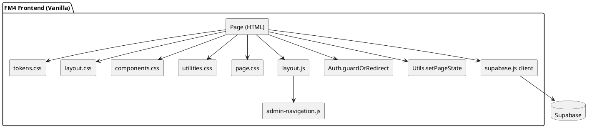

# SPEC-1-Estandarización de Layouts

## Background

El proyecto tiene **44 pantallas** y **5 roles**. Sin una base común de layouts, aumenta el costo de diseño/desarrollo, se multiplican inconsistencias visuales y se vuelve más difícil mantener accesibilidad, responsive y QA. Esta especificación busca **estandarizar layouts** para acelerar la entrega, reducir retrabajo y hacer el producto más coherente para los usuarios.

## Requirements

### Must (imprescindible)
- **Sistema de layout base**: grid (columnas), breakpoints, espaciados, contenedores y reglas de alineación (p. ej., `Container`, `Stack`, `Grid`, `Section`).
- **Tokens de diseño**: escala de spacing, tipografías, tamaños, radios, sombras, z-index y colores (modo claro/oscuro si aplica).
- **Templates de pantalla**: 3–6 plantillas reutilizables (p. ej. `AppShell + Sidebar`, `TopNav`, `Master-Detail`, `Form Wizard`, `Dashboard`, `List+Filters`).
- **Componentes layout-aware**: encabezados de página, breadcrumbs, toolbar de acciones, panel de filtros, tablas/listas, formularios, modales, drawers.
- **Estandarización por rol**: navegación y permisos consistentes (RBAC) sin duplicar pantallas innecesariamente.
- **Estados y vacíos**: loading/skeleton, empty states, error states, y comportamiento de overflow/scroll.
- **Accesibilidad mínima**: focus visible, orden de tab, tamaños de toque/click, contrastes, roles ARIA donde corresponda.
- **Documentación + governance**: guía de uso, “do/don’t”, checklist de revisión de UI, y proceso para introducir excepciones.

### Should (debería)
- **Guías de responsive**: reglas claras para reflow (p. ej., cuándo colapsar sidebar, cómo apilar filtros, truncado/line-clamp).
- **Soporte i18n**: layouts tolerantes a textos largos, monedas/fechas.
- **Herramientas de control**: linters/CI para tokens, convenciones de naming y verificación de uso de componentes.

### Could (podría)
- **Theming multi-marca** (si hay white-label).
- **Catálogo interactivo** (Storybook / equivalente) con ejemplos por template.

### Won’t (por ahora)
- Pixel-perfect por pantalla sin usar templates (se acepta solo como excepción documentada).

## Method

### 1) Estándar de “Layout System” (CSS-first)
**Objetivo:** que las 45 pantallas se construyan con el mismo set de piezas, evitando CSS “por pantalla”.

**Capas (recomendado con CSS Layers):**
1. **tokens.css** (Design Tokens): variables CSS en `:root`.
2. **reset.css** / base tipográfica.
3. **layout.css** (primitives): container, grid, stack, sidebar, header, footer, panels.
4. **components.css** (UI reutilizable): buttons, inputs, table, card, modal, toast, tabs.
5. **pages/*.css** (excepciones justificadas): reglas mínimas y siempre “encima”.

> Esto encaja con lo que ya tienen (tokens.css + components.css + módulos), pero agrega **layout.css** como contrato común + orden fijo de carga.

### 2) Design Tokens mínimos (contrato)

#### Auditoría rápida del CSS que pegaste (riesgos de inconsistencia)
En tu snippet ya hay una base fuerte, pero hoy está “mezclado” (tokens + componentes + layout + utilidades) y aparecen varios **tokens referenciados que no están definidos** y **duplicaciones**:
- Variables usadas pero no definidas en `:root`: `--input-font`, `--input-fs`, `--input-lh`, `--input-h`, `--fs-lg`, `--lh-relaxed`, `--z-sticky`, `--z-panel`, `--z-toast`, `--z-dropdown`, `--topbar-h`, `--space-lg`, `--space-md`, `--space-sm`, `--space-xs`, `--radius-*`, `--control-h(-sm)`, `--transition-*`, `--accent-info-bg`, `--white-alpha-05`, `--white-alpha-10`, `--border-active`, `--shadow-*`, `--neutral-*`, `--purple-500`, `--yellow-400`.
- **Inconsistencia de naming**: definís `--topbar-height` pero usás `--topbar-h`; `--container-width` ok, pero `--space-*` a veces numérico (`--space-6`) y a veces semántico (`--space-lg`).
- **Conflictos por duplicación de clases**: `.card` y `.toast` aparecen **dos veces** con definiciones distintas (la última gana, y eso rompe coherencia entre pantallas).

#### Refactor recomendado (sin frameworks, compatible con tu estructura)
1) **Unificar naming de tokens** (elegir 1 estilo):
   - Opción A (recomendada): **numérico** tipo `--space-1/2/3/4/6/8...` y crear aliases semánticos opcionales (`--space-sm: var(--space-2)` etc.).
   - Estandarizar: `--topbar-h` (y eliminar `--topbar-height`) o viceversa.
2) **Definir el set mínimo faltante** (para evitar “variables huérfanas”):
   - Tipos: `--fs-*`, `--lh-*`, `--fw-*`.
   - Radios: `--radius-sm/md/lg/full`.
   - Z: `--z-header`, `--z-dropdown`, `--z-modal`, `--z-toast`, `--z-overlay`.
   - Transiciones: `--transition-fast/base`.
   - Sombras: `--shadow-soft/md/lg`.
   - Alphas: `--white-alpha-05/10`.
3) **Separar por capas** para que no haya colisiones:
   - `tokens.css` (solo variables)
   - `layout.css` (solo `.l-*`)
   - `components.css` (solo `.c-*`)
   - `utilities.css` (solo `.u-*`)
   - `pages/*.css` (solo excepciones)
4) **Renombrar clases a prefijos** (cambia poco HTML, pero ordena muchísimo):
   - Layout: `.l-container`, `.l-shell`, `.l-grid`, `.l-stack`
   - Componentes: `.c-card`, `.c-toast`, `.c-table`, `.c-input`, `.c-topbar`
   - Estados: `.is-loading`, `.is-open`, `.is-disabled`
5) **Regla anti-duplicación**: una clase base, un lugar. Si querés variantes, usar modificadores:
   - `.c-card` + `.c-card--transparent`
   - `.c-toast` + `.c-toast--success`

**Tokens obligatorios** (todos en `:root`):
- Spacing scale: `--s0, --s1, --s2...` (ej. 0/4/8/12/16/24/32/48)
- Tipografía: `--font-sans`, `--fs-1..`, `--lh-1..`
- Radios: `--r1..`
- Elevación: `--shadow-1..`
- Colores semánticos: `--c-bg`, `--c-surface`, `--c-text`, `--c-muted`, `--c-primary`, `--c-danger`, etc.
- Z-index: `--z-header`, `--z-modal`, `--z-toast`
- Layout: `--container-max`, `--sidebar-w`, `--header-h`, `--safe-bottom` (para móviles)

**Tokens obligatorios** (todos en `:root`):
- Spacing scale: `--s0, --s1, --s2...` (ej. 0/4/8/12/16/24/32/48)
- Tipografía: `--font-sans`, `--fs-1..`, `--lh-1..`
- Radios: `--r1..`
- Elevación: `--shadow-1..`
- Colores semánticos: `--c-bg`, `--c-surface`, `--c-text`, `--c-muted`, `--c-primary`, `--c-danger`, etc.
- Z-index: `--z-header`, `--z-modal`, `--z-toast`
- Layout: `--container-max`, `--sidebar-w`, `--header-h`, `--safe-bottom` (para móviles)

### 3) Breakpoints (alineado al uso real)
- **Admin (desktop-first):** optimizar para ≥ 1024px; mantener degradación aceptable a 768px.
- **Staff/Encargados (mobile-first):** optimizar 360–430px; soportar landscape.

Recomendación: definir breakpoints por variable y usarlos consistentemente:
- `--bp-sm: 640px; --bp-md: 768px; --bp-lg: 1024px; --bp-xl: 1280px;`

### 4) Templates de pantalla (4 + 2 patrones)
Con tu mapa, alcanza con **4 shells** y **2 patrones** para cubrir casi todo:

**Shell A — Desktop Admin (Sidebar + Topbar)**
- Usado por: `pages/admin/*`, `pages/operativo/*` (si corre en desktop), `pages/logistica/*`, `pages/gerencia/*`.
- Estructura: sidebar fija + topbar + main con scroll interno.

**Shell B — Desktop “Data Management” (List + Filters + Detail)**
- Usado por maestros: proveedores, categorías, tarifario, nómina, pos, sku.
- Patrón: columna izquierda filtros/lista, derecha detalle/edición.

**Shell C — Mobile Operativo (Top App Bar + Content + Sticky Action Bar)**
- Usado por: `pages/encargados/*`, `pages/staff/*`, `scanner.html`.
- Patrón: header compacto + contenido scroll + acciones primarias siempre accesibles.

**Shell D — Mobile Member (Una sola acción principal)**
- Usado por: `my-qr.html`.
- Patrón: vista “hero” centrada, sin navegación compleja.

**Patrón 1 — Dashboard Tiles**
- Cards con KPIs + acciones rápidas (admin/operativo/logística/encargados).

**Patrón 2 — Wizard / Cierre (stepper)**
- Para cierres de noche (barra/caja) y workday: pasos con validación y CTA fijo.

### 5) Primitives de layout (reutilizables, sin framework)
Implementar como clases “de composición” (estilo CUBE):
- `.l-container` (máximo ancho + padding)
- `.l-stack` (apila con gap)
- `.l-cluster` (fila con wrap + gap)
- `.l-grid` (grid 12 col desktop / 4 col mobile por data-attr)
- `.l-sidebar` (sidebar + content)
- `.l-split` (dos columnas 30/70 ajustable)
- `.l-panel` (panel derecho: filtros/ayuda)

Regla clave: **las páginas no definen márgenes globales**, solo usan primitives + componentes.

### 6) Contrato HTML (para estandarizar todas las pantallas)
Todas las páginas deberían seguir un esqueleto uniforme (aunque cambie el shell):
- `body[data-context][data-shell][data-allowed-roles]`
- `header.app-header` (título, breadcrumbs, acciones)
- `nav.app-nav` (según contexto/rol)
- `main.app-main` (contenido)
- `footer.app-footer` (solo si aplica)

**Render del shell:**
- Opción simple: cada HTML incluye el mismo markup.
- Opción más mantenible: `layout.js` inyecta header/nav desde `partials/*.html` o templates string, usando tu `admin-navigation.js`/`data-go`.

### 7) Estados estándar (QA-friendly)
Basado en `window.Utils.setPageState()`:
- `loading` → skeleton
- `empty` → empty state con CTA
- `error` → mensaje + retry
- `ready` → contenido

Definir un set único de componentes: `<div class="c-state c-state--empty">…`.

### 8) RBAC y navegación consistente (sin duplicar layout)
Ya usan `data-allowed-roles + Auth.guardOrRedirect()`.
Completar el estándar:
- `navigation.config.js`: menú por `context` + flags por rol.
- `layout.js`: construye nav + resalta activo + breadcrumbs.
- Prohibición: links hardcodeados dispersos; usar `data-go="admin-solicitudes"` siempre.

### PlantUML — Componentes principales


### 9) Tools y Resources (con links)

#### Referencias de diseño (para patrones y consistencia)
- GOV.UK Design System (patrones + accesibilidad): https://design-system.service.gov.uk/
- Shopify Polaris (incluye Web Components, útil para vanilla): https://polaris-react.shopify.com/ y https://shopify.dev/docs/api/app-home/polaris-web-components
- IBM Carbon Design System (guías + componentes): https://carbondesignsystem.com/
- Material Design (layout/adaptive): https://m3.material.io/

#### CSS / arquitectura (para estandarizar sin “pelearte” con especificidad)
- CSS Cascade Layers `@layer` (para ordenar tokens/layout/components):
  - https://developer.mozilla.org/en-US/docs/Web/CSS/Reference/At-rules/%40layer
  - https://developer.mozilla.org/en-US/docs/Learn_web_development/Core/Styling_basics/Cascade_layers
- CUBE CSS (ideal si vas a `.l-` + `.c-` + `.u-` + excepciones): https://cube.fyi/
- BEM (si preferís naming por componentes): https://getbem.com/

#### Tokens (si quieren formalizar intercambio / build de tokens)
- Design Tokens Community Group (W3C CG): https://www.w3.org/community/design-tokens/
- Design Tokens Format Module (spec): https://www.designtokens.org/tr/drafts/format/
- Style Dictionary (build/generación de tokens): https://styledictionary.com/ (repo: https://github.com/style-dictionary/style-dictionary)

#### Tooling recomendado (Vanilla + HTML)
**Dev/build**
- Vite (dev server + build): https://vite.dev/
- PostCSS (plugins como autoprefixer, etc.): https://postcss.org/
- Lightning CSS (minify/transform rápido, opcional): https://lightningcss.dev/ (npm: https://www.npmjs.com/package/lightningcss)

**Calidad de código**
- Stylelint (CSS): https://stylelint.io/ (VS Code: https://marketplace.visualstudio.com/items?itemName=stylelint.vscode-stylelint)
- ESLint (JS): https://eslint.org/ (VS Code: https://marketplace.visualstudio.com/items?itemName=dbaeumer.vscode-eslint)
- Prettier (format): https://prettier.io/
- Lint HTML:
  - Opción moderna: ESLint HTML plugin: https://eslint.org/blog/2025/05/eslint-html-plugin/
  - Alternativa simple: HTMLHint: https://htmlhint.com/

**Testing (regresiones de layout incluidas)**
- Playwright (E2E + mobile emulation): https://playwright.dev/
- Storybook (catálogo para componentes/layouts; usar `@storybook/html`): https://storybook.js.org/docs/api/new-frameworks
- Visual regression opcional: Chromatic: https://www.chromatic.com/

**Accesibilidad / performance**
- axe-core (motor a11y): https://github.com/dequelabs/axe-core
- axe DevTools (extensión): https://chromewebstore.google.com/detail/axe-devtools-web-accessib/lhdoppojpmngadmnindnejefpokejbdd
- Pa11y (CI a11y): https://pa11y.org/
- Lighthouse (perf/a11y): https://developer.chrome.com/docs/lighthouse/overview

#### Opcional: Web Components como “component model” sin frameworks
- Guías MDN Web Components: https://developer.mozilla.org/en-US/docs/Web/API/Web_components

## Implementation

### Fase 0 — Inventario y clasificación (rápido)
- Crear una lista: **pantalla → template (A/B/C/D) + patrón (dashboard/wizard/list)**.
- Definir “excepciones” permitidas (máx. 1–2 por módulo).

### Fase 0.5 — Tooling (opcional pero recomendado)
Si hoy todo es “static + supabase” igual podés agregar tooling sin cambiar runtime.

**Dependencias sugeridas (Node):**
- Lint/format: ESLint + Prettier + Stylelint + (HTML lint opcional)
- Tests: Playwright + axe-core (o Pa11y)
- Dev/build: Vite (opcional)

**Scripts ejemplo (package.json):**
```json
{
  "scripts": {
    "dev": "vite",
    "build": "vite build",
    "lint:js": "eslint .",
    "lint:css": "stylelint \"assets/css/**/*.css\"",
    "lint:html": "eslint \"**/*.html\"",
    "format": "prettier . --write",
    "test:e2e": "playwright test",
    "test:a11y": "pa11y-ci"
  }
}
```

**Configs mínimos (referencia):**
- Stylelint: https://stylelint.io/user-guide/get-started/
- ESLint: https://eslint.org/
- Prettier: https://prettier.io/docs/
- Playwright: https://playwright.dev/docs/intro

> Nota: `lint:html` puede implementarse con el plugin oficial de ESLint para HTML.

### Fase 1 — Base del sistema (1 vez)
1. Consolidar `tokens.css` (si ya existe, normalizar nombres y escalas).
2. Crear `layout.css` con primitives (`l-container`, `l-stack`, `l-grid`, `l-sidebar`, etc.).
3. Establecer **orden estándar** de `<link>` CSS en todas las páginas.
4. Definir el contrato HTML mínimo (`data-context`, `data-shell`, `app-header/nav/main`).

**Estructura de carpetas sugerida (robusta para 45 pantallas):**
```text
assets/
  css/
    tokens.css
    reset.css
    layout.css
    components.css
    utilities.css
    pages/
      admin-workdays.css
      encargado-barra-noche.css
  js/
    core/
      auth.js
      layout.js
      navigation.js
      state.js
      supabase-client.js
    pages/
      admin-workdays.js
      staff-barra.js
partials/
  header.html
  nav-admin.html
  nav-mobile.html
pages/
  admin/
  operativo/
  logistica/
  encargados/
  staff/
  gerencia/
  members/
```

**CSS Layers (opcional, recomendado para evitar guerras de especificidad):**
```css
/* en un entrypoint (o al inicio de cada archivo si no tenés bundler) */
@layer tokens, reset, layout, components, utilities, pages;

@layer tokens { /* tokens.css */ }
@layer reset { /* reset.css */ }
@layer layout { /* layout.css */ }
@layer components { /* components.css */ }
@layer utilities { /* utilities.css */ }
@layer pages { /* pages/*.css */ }
```

### Fase 2 — Shells
- Implementar **Shell A** (desktop) y **Shell C** (mobile) primero.
- `layout.js`:
  - Lee `data-context` + `data-shell`
  - Inyecta nav/header comunes
  - Aplica active state y breadcrumbs

### Fase 3 — Migración por “rutas críticas”
Orden recomendado:
1) Encargados + Staff (mobile)
2) Admin Operaciones (workdays/solicitudes/semanal)
3) Logística
4) Maestros (Shell B)
5) QR + Members

### Fase 4 — Calidad + Gobernanza
**Objetivo:** que el estándar se sostenga con el tiempo (no solo “migrar y listo”).

**Checklist obligatorio de PR (UI/Layout):**
- Usa primitives `.l-*` (no “padding/margin global” en `.page-shell` por pantalla)
- Header consistente (título + subtitle opcional + actions)
- Estados: `loading/empty/error/ready` con componentes estándar
- Scroll definido (una sola región principal con scroll; modales/drawers no rompen el body)
- Mobile: CTA principal accesible (sticky bar) + `env(safe-area-inset-bottom)` si aplica
- A11y base: focus visible, labels, aria en icon buttons, orden de tab correcto

**Reglas de exceptions (para evitar “CSS spaghetti”):**
- Si una pantalla necesita un layout especial:
  1) se crea un **nuevo primitive** o **nuevo patrón** reutilizable, o
  2) se documenta como excepción con un mini-ADR (`docs/adr/ADR-xxx-layout-exception.md`).

**CI recomendado (mínimo viable):**
- `lint:css` + `lint:js` + `format --check`
- `playwright test` en 2 viewports:
  - Desktop: 1440×900 (admin)
  - Mobile: 390×844 (staff/encargados)
- A11y gate (una muestra de pantallas críticas) con Pa11y o axe

**Documentación viva (para acelerar onboarding):**
- Un catálogo (Storybook HTML o `/docs/ui.html`) que incluya:
  - Shells A/B/C/D
  - Patrones (dashboard / list+filters / wizard)
  - Componentes (tabla, form, modal, toast)
  - Estados (loading/empty/error)

## Milestones

- **M1 (Base):** tokens normalizados + `layout.css` primitives + contrato HTML.
- **M2 (Shells):** Shell A (desktop) + Shell C (mobile) funcionando con `layout.js`.
- **M3 (Mobile listo):** todas las pantallas de Encargados y Staff migradas.
- **M4 (Admin/Logística listo):** pantallas operativas/admin principales migradas.
- **M5 (Maestros + QR + Members):** migración completa + documentación.
- **M6 (QA & A11y):** checklist pasado, fixes y estabilización.

## Gathering Results

Medir antes/después (2–4 semanas):
- **Tiempo para crear una pantalla nueva** (desde HTML vacío hasta lista/form funcionando).
- **Bugs UI por sprint** (inconsistencias, scrolls rotos, padding, etc.).
- **Cobertura de estados**: % pantallas con loading/empty/error estándar.
- **Tamaño de CSS** total y CSS duplicado (reglas repetidas por pantalla).
- **A11y básico**: focus visible, labels, contraste, navegación por teclado (al menos en Admin).

## Implementation

_TBD en la siguiente iteración: pasos concretos de implementación, migración pantalla por pantalla._

## Milestones

- **M1 (Base):** tokens normalizados + `layout.css` primitives + contrato HTML.
- **M2 (Shells):** Shell A (desktop) + Shell C (mobile) funcionando con `layout.js`.
- **M3 (Mobile listo):** todas las pantallas de Encargados y Staff migradas.
- **M4 (Admin/Logística listo):** pantallas principales migradas.
- **M5 (Cobertura total):** maestros + QR + members migrados + documentación.
- **M6 (QA & A11y):** checklist pasado, fixes y estabilización.

## Gathering Results

Medir antes/después (2–4 semanas):
- **Lead time de UI:** tiempo para crear una pantalla nueva usando templates.
- **Retrabajo UI:** cantidad de PRs de “ajuste visual” por sprint.
- **Bugs de layout:** issues de scroll, padding, sticky bars, tablas, overlays.
- **Consistencia:** % pantallas que cumplen contrato (header, nav, estados).
- **Performance:** LCP/CLS (especialmente en mobile) y peso total de CSS/JS.
- **Accesibilidad básica:** focus visible, labels, contraste, navegación por teclado (Admin).

## Need Professional Help in Developing Your Architecture?

Please contact me at [sammuti.com](https://sammuti.com) :)
 in Developing Your Architecture?

Please contact me at [sammuti.com](https://sammuti.com) :)

