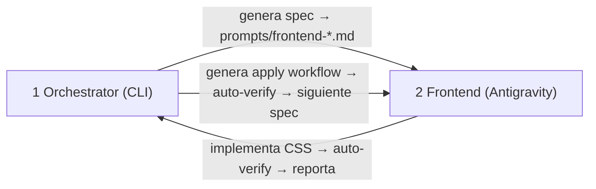

# Multi-Chat Architecture — Design System Redesign

> 2 chats interactivos + verificación automática.

---

## Chats y Roles

| #   | Chat             | Dónde                       | Rol                                                    | Output                          |
| :-- | :--------------- | :-------------------------- | :----------------------------------------------------- | :------------------------------ |
| 1   | **Orchestrator** | CLI terminal                | Planifica, genera specs, decide, auto-verifica         | `docs/_generated/orchestrator/` |
| 2   | **Frontend**     | Antigravity (chat separado) | Diseña en Stitch + implementa CSS/HTML + auto-verifica | `swiss-style.css`, páginas HTML |

## Modelo de Interacción

El usuario **solo habla con 2 chats**:

- **Orchestrator** → Seguimiento, decisiones, aprobaciones
- **Frontend** → Diseño visual, revisión de componentes

La verificación es **automática**: cada agente corre `scripts/ds-verify.ps1` después de sus cambios y reporta el resultado. No hay "CLI Runner" manual.

## Prompts de Invocación

| Chat         | Prompt                  | Path                                    |
| :----------- | :---------------------- | :-------------------------------------- |
| Orchestrator | `PROMPT-ds-redesign.md` | `docs/_generated/orchestrator/`         |
| Frontend     | `PROMPT-frontend.md`    | `docs/_generated/orchestrator/prompts/` |

## Flujo



## Protocolo de Comunicación

La comunicación entre chats es **via archivos del repo**, nunca copy-paste verbal:

| De → A                      | Mecanismo                                                        |
| :-------------------------- | :--------------------------------------------------------------- |
| Orchestrator → Frontend     | Genera `prompts/frontend-{component}.md` con brief               |
| Frontend → Orchestrator     | Reporta resultado en `docs/_generated/orchestrator/CHANGELOG.md` |
| Orchestrator → Orchestrator | Corre scripts de scan/verify directamente                        |
| Frontend → Frontend         | Corre `ds-verify.ps1` después de implementar                     |

## Reglas

1. Orchestrator **no escribe código** — planifica, escanea, genera prompts
2. Frontend **diseña (Stitch) e implementa (CSS + HTML)** — lee specs del orchestrator
3. **Verificación automática** — Cada agente corre scripts de verificación sin pedirle al usuario
4. **Un step a la vez** (R7) — no avanzar al siguiente step sin aprobación
5. **Gate entre steps** — Orchestrator valida resultado antes de generar siguiente spec

## Secuencia de Arranque

```text
1. Abrir CLI terminal → pegar PROMPT-ds-redesign.md → Orchestrator arranca Step 0
2. Orchestrator verifica docs contra archivos reales, corrige si hay discrepancias
3. Orchestrator genera briefs en prompts/frontend-{toggle,dropdown,...}.md
4. Abrir Antigravity chat → pegar PROMPT-frontend.md → Frontend busca briefs
5. Frontend verifica docs, diseña en Stitch → implementa CSS → corre ds-verify.ps1 → reporta
6. Orchestrator lee resultado → aprueba o pide fix → siguiente componente
```
