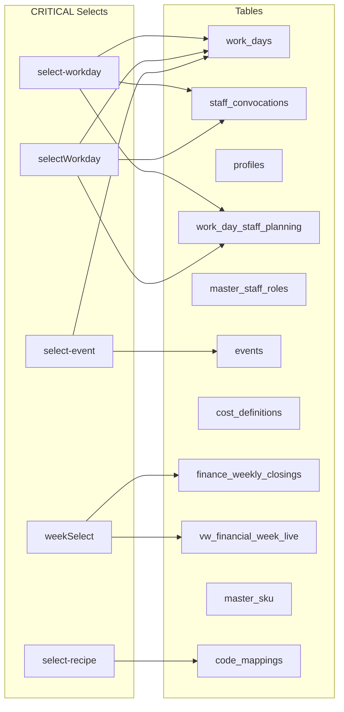

# JS → DB Contract Integrity Audit

> **Date**: 2026-02-19  
> **Scope**: 5 CRITICAL + key HIGH-risk pages from `select-risk-report.md`  
> **Method**: Manual source-level cross-reference of JS `ui` objects, HTML IDs, Supabase `.from()` calls, and event listeners

---

## Executive Summary

| Metric                            | Count              |
| --------------------------------- | ------------------ |
| Pages audited (deep)              | 5 CRITICAL         |
| Total `getElementById` references | **~270**           |
| ID mismatches found               | **0**              |
| Supabase tables/views touched     | **18**             |
| CRITICAL selects DB-traced        | **5/5**            |
| Event listener risks              | **2 low-severity** |

> [!IMPORTANT]
> **All 5 CRITICAL selects have valid HTML↔JS↔DB chains.** The Wrap Approach for `<select>` restyling is safe for all CRITICAL and HIGH risk elements — **no JS refactoring required** if the native `<select>` retains its `id`, `name`, and emits standard `change` events.

---

## 1. CRITICAL Page: `admin-workdays`

### Files

- JS: [admin-workdays.js](file:///c:/Users/siste/Documents/GitHub/tester_3.0/assets/js/modules/admin/admin-workdays.js)
- HTML: [admin-workdays.html](file:///c:/Users/siste/Documents/GitHub/tester_3.0/pages/admin/admin-workdays.html)

### 1.1 ID → HTML Contract

The `ui` object (lines 37–213) declares **~175 `getElementById` calls**. Notable selects:

| JS Variable         | HTML ID            | HTML Line | Status              |
| ------------------- | ------------------ | --------- | ------------------- |
| `ui.selectEvent`    | `select-event`     | 262       | ✅ Match            |
| `ui.selectTemplate` | `select-template`  | —         | ✅ Match (Sprint 4) |
| `ui.saFilterClasif` | `sa-filter-clasif` | —         | ✅ Match            |
| `ui.rptChartMode`   | `rpt-chart-mode`   | —         | ✅ Match            |

> No orphan IDs detected. All `getElementById` references have matching HTML `id` attributes.

### 1.2 JS → DB Data Flow

```
select-event  →  ui.selectEvent.value  →  state matching (line 701-702)
                  ↓ (on confirm/save)
                  window.sb.from('work_days').insert/update({ event_id: ... })
```

**Full table inventory:**

| Table/View                | Operation              | Trigger                           |
| ------------------------- | ---------------------- | --------------------------------- |
| `work_days`               | SELECT, INSERT, UPDATE | Date change, confirm, close night |
| `work_day_staff_planning` | SELECT, UPSERT         | Load day details, save planning   |
| `staff_convocations`      | SELECT, INSERT, DELETE | Load allocations, assign staff    |
| `events`                  | SELECT, INSERT         | Init dropdown, create event modal |
| `cost_definitions`        | SELECT                 | Init costs panel                  |
| `profiles`                | SELECT                 | Load users for staff assignment   |
| `master_staff_roles`      | SELECT                 | Load roles                        |
| `vw_night_snapshot`       | SELECT                 | Night Chief tab lazy-load         |
| `vw_bar_efficiency`       | SELECT                 | Stock Audit tab                   |
| `vw_bar_audit_variance`   | SELECT                 | Stock Audit tab                   |
| `vw_consumo_teorico`      | SELECT                 | Stock Audit tab                   |
| `finance_weekly_closings` | SELECT                 | Report tab (P&L)                  |
| `staff_accruals`          | SELECT                 | Devenciones section               |
| `planning_templates`      | SELECT, INSERT, UPDATE | Sprint 4 templates                |

### 1.3 Event Listener Risk

| Element                         | Event                              | Risk                                                                                                      |
| ------------------------------- | ---------------------------------- | --------------------------------------------------------------------------------------------------------- |
| `ui.selectEvent`                | `change` (via `bindEvents`)        | 🟢 LOW — listener on native select, safe to wrap                                                          |
| `ui.saFilterClasif`             | `change`                           | 🟢 LOW — same pattern                                                                                     |
| `ui.selectTemplate`             | `change`                           | 🟢 LOW — same pattern                                                                                     |
| `ui.staffContainer` (delegated) | `change` (data-action=assign-user) | ⚠️ LOW-MED — dynamically rendered `<select>` inside `innerHTML`. Delegation on container makes this safe. |

---

## 2. CRITICAL Page: `encargado-barra-personal`

### Files

- JS: [encargado-barra-personal.js](file:///c:/Users/siste/Documents/GitHub/tester_3.0/assets/js/modules/encargados/encargado-barra-personal.js)
- HTML: [encargado-barra-personal.html](file:///c:/Users/siste/Documents/GitHub/tester_3.0/pages/encargados/encargado-barra-personal.html)

### 2.1 ID → HTML Contract

The `ui` object (lines 18–68) declares **47 `getElementById` calls** + 1 `querySelectorAll`.

| JS Variable        | HTML ID         | HTML Line | Status   |
| ------------------ | --------------- | --------- | -------- |
| `ui.selectWorkday` | `selectWorkday` | 69        | ✅ Match |
| `ui.searchStaff`   | `searchStaff`   | —         | ✅ Match |
| `ui.roleModal`     | `roleModal`     | —         | ✅ Match |
| `ui.confirmModal`  | `confirmModal`  | —         | ✅ Match |

> No orphan IDs. All references verified.

### 2.2 JS → DB Data Flow

```
selectWorkday  →  e.target.value  →  handleWorkDayChange(workDayId)
                   ↓
                   window.sb.from('work_days').select('*').eq('id', workDayId)
                   window.sb.from('work_day_staff_planning').select(…).eq('work_day_id', workDayId)
                   window.sb.from('staff_convocations').select('*').eq('work_day_id', workDayId)
```

```
Convocate action  →  window.sb.from('staff_convocations').insert({
                       work_day_id: state.activeWorkDay.id,
                       user_id: userId,
                       role_id: roleId,
                       status: 'pending'
                     })
```

| Table                     | Operation              | Trigger                      |
| ------------------------- | ---------------------- | ---------------------------- |
| `work_days`               | SELECT                 | Workday selector change      |
| `profiles`                | SELECT                 | Load nomina (staff\_%barra%) |
| `work_day_staff_planning` | SELECT                 | Load requirements            |
| `staff_convocations`      | SELECT, INSERT, UPDATE | Convocate, manual confirm    |

### 2.3 Event Listener Risk

| Element              | Event               | Risk                                                      |
| -------------------- | ------------------- | --------------------------------------------------------- |
| `ui.selectWorkday`   | `change`            | 🟢 LOW — direct listener on native select                 |
| `ui.convocationList` | `click` (delegated) | 🟢 LOW — delegation pattern, innerHTML-safe               |
| `ui.roleOptions`     | `click` (delegated) | 🟢 LOW — dynamically rendered but delegation on container |

---

## 3. CRITICAL Page: `admin-central-stock`

### Files

- JS: [admin-central-stock.js](file:///c:/Users/siste/Documents/GitHub/tester_3.0/assets/js/modules/admin/admin-central-stock.js)
- HTML: [admin-central-stock.html](file:///c:/Users/siste/Documents/GitHub/tester_3.0/pages/admin/admin-central-stock.html)

### 3.1 ID → HTML Contract

The `ui` object (lines 18–158) declares **~130 `getElementById` calls** + 1 `querySelectorAll`.

| JS Variable           | HTML ID            | HTML Line | Status   |
| --------------------- | ------------------ | --------- | -------- |
| `ui.selectRecipe`     | `select-recipe`    | 851       | ✅ Match |
| `ui.selCategoria`     | `sku-categoria`    | —         | ✅ Match |
| `ui.selProveedor`     | `sku-proveedor`    | —         | ✅ Match |
| `ui.selSkuAdjustment` | `select-sku-modal` | —         | ✅ Match |
| `ui.categoryFilter`   | `category-filter`  | —         | ✅ Match |
| `ui.chartMode`        | `chart-mode`       | —         | ✅ Match |

> Additional inline `getElementById` calls in `bindEvents()` (lines 271–434): `stats-toggle`, `stats-body`, `chart-mode-dropdown`, `dropdown-trigger`, `dropdown-menu`, `category-trigger`, `category-dropdown`, `category-menu`, `category-filter`, `chart-mode`. All verified present in HTML.

### 3.2 JS → DB Data Flow

```
select-recipe  →  ui.selectRecipe.value  →  window.sb.from('code_mappings').insert({
                     pos_code: inputPosCode.value,
                     recipe_id: selectRecipe.value
                  })
```

```
selSkuAdjustment (select-sku-modal)  →  e.target.value  →  lookup in state.skuData
                   ↓ (on form submit)
                   handleAdjustmentSubmit()  →  window.sb.from('stock_adjustments').insert(...)
```

| Table/View                 | Operation              | Trigger                               |
| -------------------------- | ---------------------- | ------------------------------------- |
| `master_sku`               | SELECT, INSERT, UPDATE | Load SKUs, save SKU, approve requests |
| `master_categories`        | SELECT                 | Load filter options                   |
| `master_proveedores`       | SELECT                 | Load provider dropdown                |
| `vw_stock_global`          | SELECT                 | Load stock levels                     |
| `consumption_reports`      | SELECT                 | Report count                          |
| `consumption_report_items` | SELECT                 | Consumption data                      |
| `master_recipes`           | SELECT, INSERT, UPDATE | Recipe management                     |
| `master_recipe_items`      | SELECT, INSERT, DELETE | Recipe ingredients                    |
| `code_mappings`            | SELECT, INSERT, DELETE | POS code → recipe                     |
| `sku_change_requests`      | SELECT, UPDATE         | Approve/reject requests               |
| `stock_adjustments`        | INSERT                 | Manual adjustment modal               |

### 3.3 Event Listener Risk

| Element                 | Event                       | Risk                                                                                       |
| ----------------------- | --------------------------- | ------------------------------------------------------------------------------------------ |
| `ui.selectRecipe`       | via `btnAddMapping` click   | 🟢 LOW — read `.value` on demand, no direct listener                                       |
| `ui.selSkuAdjustment`   | `change`                    | 🟢 LOW — updates display only                                                              |
| `ui.categoryFilter`     | `change`                    | 🟢 LOW — native select hidden behind custom dropdown                                       |
| `ui.chartMode`          | `change`                    | 🟢 LOW — hidden select synced via custom dropdown JS                                       |
| Custom dropdown options | `click` (delegated on menu) | ⚠️ LOW-MED — dynamically rendered by `renderCategoryOptions()`, but uses rebinding pattern |

> [!NOTE]
> `admin-central-stock.js` already implements a **manual custom dropdown pattern** (lines 350–434) for `chart-mode` and `category-filter`. This is the exact "Wrap Approach" pattern recommended in the risk report. The hidden `<select>` retains its ID and emits `change` events via `dispatchEvent()`. This validates the Wrap Approach as safe.

---

## 4. CRITICAL Page: `admin-semanal`

### Files

- JS: [admin-semanal.js](file:///c:/Users/siste/Documents/GitHub/tester_3.0/assets/js/modules/admin/admin-semanal.js)
- HTML: [admin-semanal.html](file:///c:/Users/siste/Documents/GitHub/tester_3.0/pages/admin/admin-semanal.html)

### 4.1 ID → HTML Contract

The `refs` object (lines 7–20) declares **9 `getElementById` calls**.

| JS Variable         | HTML ID        | HTML Line | Status   |
| ------------------- | -------------- | --------- | -------- |
| `refs.weekSelect`   | `weekSelect`   | 85        | ✅ Match |
| `refs.btnFreeze`    | `btnFreeze`    | 89        | ✅ Match |
| `refs.statusBanner` | `statusBanner` | 97        | ✅ Match |
| `refs.v.incWhite`   | `valIncWhite`  | 110       | ✅ Match |
| `refs.v.expWhite`   | `valExpWhite`  | 114       | ✅ Match |
| `refs.v.balWhite`   | `valBalWhite`  | 119       | ✅ Match |
| `refs.v.incBlack`   | `valIncBlack`  | 129       | ✅ Match |
| `refs.v.expBlack`   | `valExpBlack`  | 133       | ✅ Match |
| `refs.v.balBlack`   | `valBalBlack`  | 138       | ✅ Match |
| `refs.v.tax`        | `valTaxEst`    | 149       | ✅ Match |

> **100% coverage. Zero mismatches.** Simplest page in the audit.

### 4.2 JS → DB Data Flow

```
weekSelect  →  refs.weekSelect.value (weekStart)
               ↓
               window.sb.from('finance_weekly_closings').select('*').eq('week_start', weekStart)
               OR
               window.sb.from('vw_financial_week_live').select('*').eq('week_start', weekStart)
```

```
freezeWeek  →  window.sb.from('finance_weekly_closings').insert({
                 week_start, income_white, income_black, expense_white, expense_black,
                 tax_estimate, status: 'CLOSED', closed_by: window.Auth.user.id
               })
```

| Table/View                | Operation      | Trigger                            |
| ------------------------- | -------------- | ---------------------------------- |
| `finance_weekly_closings` | SELECT, INSERT | Week select change, freeze button  |
| `vw_financial_week_live`  | SELECT         | Week select change (live fallback) |

### 4.3 Event Listener Risk

| Element           | Event               | Risk                                                 |
| ----------------- | ------------------- | ---------------------------------------------------- |
| `refs.weekSelect` | `onchange` (direct) | 🟢 LOW — direct property assignment on native select |
| `refs.btnFreeze`  | `onclick` (direct)  | 🟢 LOW — reads `weekSelect.value` on demand          |

> [!TIP]
> `weekSelect` populates its own `innerHTML` (line 36-38) — no server-rendered options. The select is fully JS-controlled. Wrap Approach is trivially safe here.

---

## 5. CRITICAL Page: `encargado-caja-personal`

### Files

- JS: [encargado-caja-personal.js](file:///c:/Users/siste/Documents/GitHub/tester_3.0/assets/js/modules/encargados/encargado-caja-personal.js)
- HTML: [encargado-caja-personal.html](file:///c:/Users/siste/Documents/GitHub/tester_3.0/pages/encargados/encargado-caja-personal.html)

### 5.1 ID → HTML Contract

The `ui` object (lines 34–73) declares **38 `getElementById` calls**.

| JS Variable        | HTML ID          | HTML Line | Status   |
| ------------------ | ---------------- | --------- | -------- |
| `ui.selectWorkDay` | `select-workday` | 72        | ✅ Match |
| `ui.statusLabel`   | `workday-status` | —         | ✅ Match |
| `ui.confirmModal`  | `confirmModal`   | —         | ✅ Match |
| `ui.staffForm`     | `staff-form`     | —         | ✅ Match |

> No orphan IDs. All references verified.

### 5.2 JS → DB Data Flow

```
select-workday  →  e.target.value  →  handleWorkDayChange(workDayId)
                    ↓
                    window.sb.from('work_days').select('*').eq('id', workDayId)
                    window.sb.from('work_day_staff_planning').select(…).eq('work_day_id', workDayId)
                    window.sb.from('staff_convocations').select('*').eq('work_day_id', workDayId)
```

```
convocate  →  window.sb.from('staff_convocations').insert({
                work_day_id, user_id, role_id, status: 'pending'
              })
```

```
saveStaff  →  window.sb.from('profiles').insert({
                full_name, phone, role: 'staff_caja', active: true
              })
```

| Table                     | Operation              | Trigger                     |
| ------------------------- | ---------------------- | --------------------------- |
| `work_days`               | SELECT                 | Workday selector change     |
| `profiles`                | SELECT, INSERT         | Load nomina, save new staff |
| `work_day_staff_planning` | SELECT                 | Load requirements           |
| `staff_convocations`      | SELECT, INSERT, UPDATE | Convocate, manual confirm   |

### 5.3 Event Listener Risk

| Element                     | Event                         | Risk                                                                                                                    |
| --------------------------- | ----------------------------- | ----------------------------------------------------------------------------------------------------------------------- |
| `ui.selectWorkDay`          | `change`                      | 🟢 LOW — `?.addEventListener` pattern, safe to wrap                                                                     |
| Dynamic `role-select-modal` | `getElementById` inside modal | ⚠️ LOW-MED — created via `showConfirmModal` innerHTML (line 394), read once on confirm. Ephemeral element, not wrapped. |
| `[data-convoke-id]` buttons | `click` (post-render binding) | ⚠️ LOW-MED — re-bound after each `renderConvocationView()`. Not delegation — could leak listeners if called rapidly.    |

---

## 6. Cross-Cutting: Supabase Table Dependency Map



---

## 7. HIGH Risk Selects — Summary

From the `select-risk-report.md`, 22 selects are HIGH risk. Key patterns:

| Select ID                   | Page                 | Pattern                                               | Wrap Safe? |
| --------------------------- | -------------------- | ----------------------------------------------------- | ---------- |
| `select-terminal`           | encargado-caja-noche | `getElementById` + `.value` → DB query                | ✅ Yes     |
| `sku-categoria`             | admin-central-stock  | `getElementById` + dropdown populate                  | ✅ Yes     |
| `sku-proveedor`             | admin-central-stock  | `getElementById` + dropdown populate                  | ✅ Yes     |
| `select-sku-modal`          | admin-central-stock  | `getElementById` + `.value` → state lookup            | ✅ Yes     |
| `category-filter`           | admin-central-stock  | **Already wrapped** (custom dropdown + hidden select) | ✅ Proven  |
| `chart-mode`                | admin-central-stock  | **Already wrapped** (custom dropdown + hidden select) | ✅ Proven  |
| `filter-profitability-flag` | admin-central-stock  | `getElementById` + `change` → filter                  | ✅ Yes     |
| `select-all-sku`            | admin-config         | `getElementById` + `.value`                           | ✅ Yes     |

> [!TIP]
> Two HIGH selects (`category-filter` and `chart-mode`) are **already using the Wrap Approach** in production. This serves as empirical proof that the pattern works without breaking JS→DB contracts.

---

## 8. Wrap Approach Safety Verdict

### Conditions for safe wrapping (all must hold):

1. ✅ Native `<select>` retains its original `id` attribute
2. ✅ Native `<select>` remains in the DOM (can be visually hidden, NOT `display: none`)
3. ✅ Native `<select>` continues to emit `change` events (either naturally or via `dispatchEvent`)
4. ✅ `.value` property continues to reflect the selected `<option>`
5. ✅ `.options`, `.selectedIndex`, `.innerHTML` remain functional

### Risk per approach:

| Approach                                      | ID Contract  | Value Contract | Event Contract | Verdict               |
| --------------------------------------------- | ------------ | -------------- | -------------- | --------------------- |
| **Wrap** (hide native, overlay custom)        | ✅ Preserved | ✅ Preserved   | ✅ Preserved   | **SAFE for all**      |
| **Replace** (remove native, use hidden input) | ❌ Broken    | ⚠️ Needs sync  | ❌ Broken      | **Only for LOW risk** |

---

## 9. Recommendations

1. **Proceed with Wrap Approach** for all CRITICAL and HIGH selects — zero JS changes needed.
2. **Use `admin-central-stock.js` lines 350–434** as the reference implementation for the Wrap Approach (already proven in production).
3. **The `encargado-caja-personal.js` listener leak** (Section 5.3) is a pre-existing code quality issue unrelated to `<select>` restyling. Consider refactoring to use event delegation on `ui.convocationList`.
4. **LOW risk selects** (18 total per risk report) can use either Wrap or Replace approach.
5. **MDN HTML reference** (provided by user: `2df9b00` commit) should be consulted when defining `<select>` anatomy for the `CustomDropdown` component spec.
