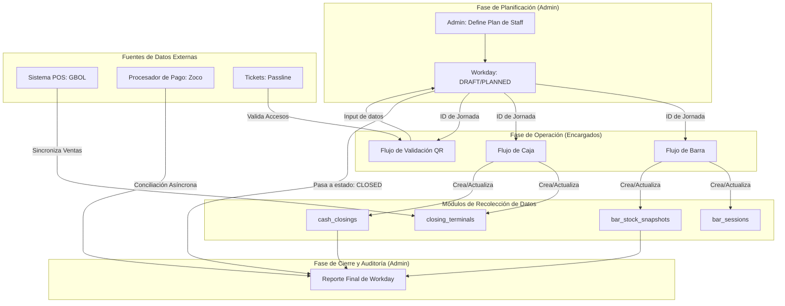

# Reporte de Síntesis: Lógica de Negocio y Arquitectura de Control

---

## 1. Visión Estratégica: El Ecosistema de Control

El objetivo principal del sistema no es simplemente registrar datos, sino **optimizar la operación a través de un ecosistema de control con datos confiables y accionables**. El sistema debe concentrar, normalizar y cerrar cada jornada con total trazabilidad para permitir una auditoría rápida y la toma de decisiones.

- **Consumidor Principal:** Rol de `admin`.
- **Datos Críticos:** Desvío de caja, auditoría de stock y reporte de pérdidas/errores.

El sistema conecta herramientas de **prevención** (Calculadora de Precios, Stock Ideal) con mecanismos de **detección** (Auditoría de Flujos) para atacar las causas raíz de las inconsistencias y no solo sus síntomas.

---

## 2. El `Workday` como Contenedor Operativo Central

El `Workday` es la entidad que aglutina toda la actividad de una jornada. Su ciclo de vida (`DRAFT` → `PLANNED` → `ACTIVE` → `CLOSED`) actúa como el proceso maestro que orquesta los demás flujos.

### Diagrama Conceptual del Flujo de Datos

---

## 3. Ciclos de Vida de las Entidades Clave

### 3.1. Ciclo de Vida del Personal (Staffing)

El sistema gestiona el personal desde la demanda hasta el pago.

1.  **Demanda (Planner):** En el `Workday Planner`, el `admin` define la **dotación** necesaria por rol/área (ej: "3 bartenders"). Se guarda en `staff_plan`.
2.  **Asignación (Encargados):** Los encargados de área reciben esta demanda y convocan al personal, asignando **personas concretas** de su nómina. Se registra en `staff_convocations` y `staff_assignments`.
3.  **Devengado (Nómina):** Al cierre, el sistema calcula el pago por rol basándose en un `Tarifario` centralizado, generando los registros en `staff_accruals`.

### 3.2. Ciclo de Vida Financiero (Cash Closing)

La reconciliación de caja es un proceso de dos fases para manejar la asincronía de los proveedores de pago.

1.  **Cierre Preliminar (Noche):**
    -   El `encargado de caja` registra los montos **declarados** manualmente (efectivo, Zoco manual).
    -   El `admin` sincroniza los datos del POS (GBOL) para obtener los montos del **sistema**.
    -   Ambos valores (`declared_*` y `system_*`) se guardan en `closing_terminals`. El estado es `pending`.
2.  **Cierre Definitivo (Semanal):**
    -   Días después (ej. lunes), llega el reporte oficial de Zoco.
    -   Un proceso de `Balance Semanal` cruza el preliminar contra el oficial.
    -   El estado cambia a `matched`, `mismatch`, o `resolved`.

### 3.3. Ciclo de Vida del Inventario (Stock)

El control de stock es fundamental para la auditoría de costos.

1.  **Apertura de Sesión:** El stock inicial de una sesión de barra se basa en: `Cierre de la Sesión Anterior + Reposiciones Intermedias`.
2.  **Cierre de Sesión:** Se registra el stock físico final.
3.  **Auditoría:** El sistema compara el **Consumo Real** (`Apertura - Cierre`) con el **Consumo Teórico** (calculado por las recetas de los productos vendidos en el POS).

---

## 4. Gaps de Control y Reglas de Negocio a Implementar

La combinación de los análisis de código y los documentos estratégicos revela los siguientes puntos críticos a modelar en el sistema:

| Gap / Punto Crítico                                    | Regla de Negocio a Implementar                                                                                                                                                             |
| ------------------------------------------------------ | ------------------------------------------------------------------------------------------------------------------------------------------------------------------------------------------ |
| **1. Consumos "Sin Cargo" / Bonificaciones**             | Todo producto sin cargo debe emitirse con un **ticket nominativo** que incluya `motivo` y `responsable`. Se debe auditar un reporte diario de estos tickets y su impacto en el costo.          |
| **2. Desvíos de Caja**                                   | Una diferencia entre el monto declarado y el del sistema **debe crear un "Evento de Auditoría"**. Este evento debe requerir un `comentario obligatorio` y permanecer abierto hasta su resolución. |
| **3. Trazabilidad de la Apertura de Stock**              | La "precarga" de stock en la apertura de barra debe ser justificable. Es necesario un **registro o ledger de reposiciones intermedias** para explicar cualquier diferencia con el cierre anterior. |
| **4. Asincronía de Canales de Pago**                     | El sistema debe manejar estados de conciliación (`pending`, `matched`, `mismatch`). El cierre nocturno es **preliminar**; la conciliación final puede ocurrir días después.                   |
| **5. Ranking de Productos Críticos**                     | El sistema debe poder rankear productos por un **Score Compuesto** (Valor 50%, Rotación 30%, Riesgo 20%) para enfocar los esfuerzos de control en el "Top 15".                               |
| **6. Cálculo de Precios de Venta**                       | Los precios deben calcularse con **"ingeniería inversa"**, partiendo de un `margen neto objetivo` y despejando el precio final tras aplicar costos de canal e impuestos.                 |
| **7. Control de Accesos (Validación QR)**                | La validación de tickets (ej. Passline) debe ser tratada como un **flujo de datos de primera clase** dentro del `Workday`, registrando conteos y anomalías.                                   |

---

## 5. Alcance y Prioridades para Versión 1.0

- **Foco Principal:** Cierres de jornada consistentes, auditables y rápidos.
- **Fuera de Alcance 1.0:** Alertas en tiempo real (ya cubiertas por GBOL).
- **Resultado Clave:** Proveer al `admin` un reporte de cierre accionable que exponga desvíos y permita una auditoría eficiente sin depender de herramientas externas.
