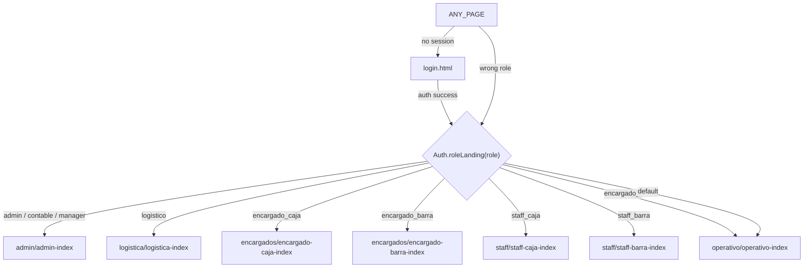
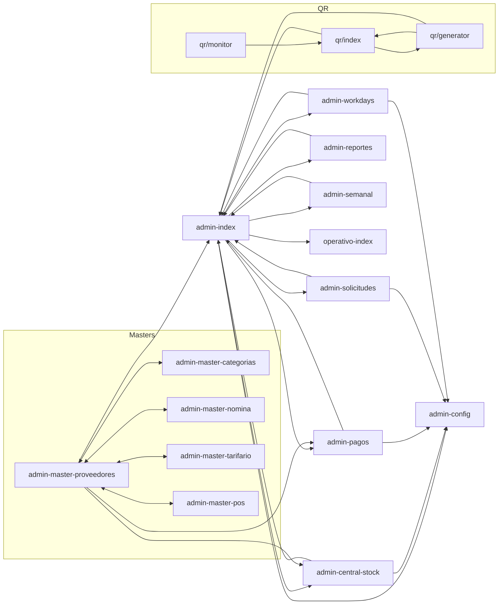
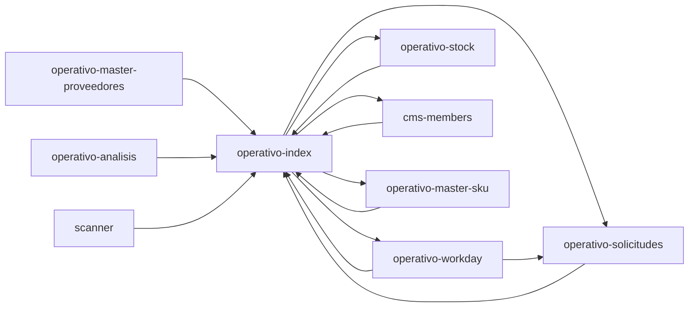
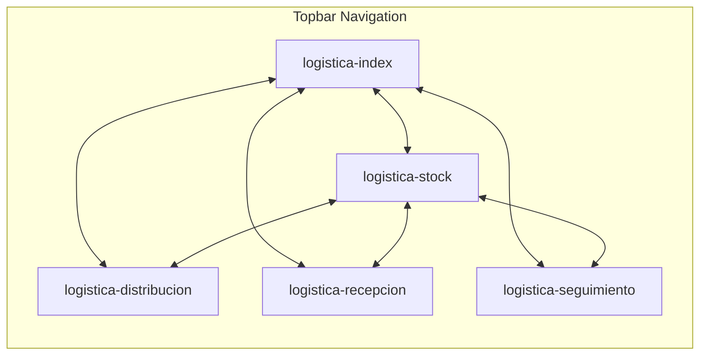
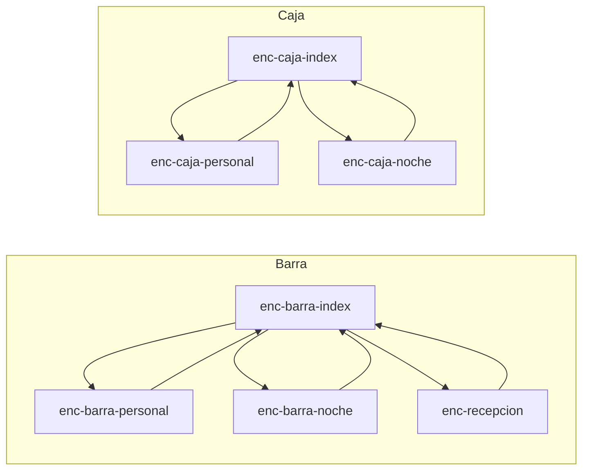
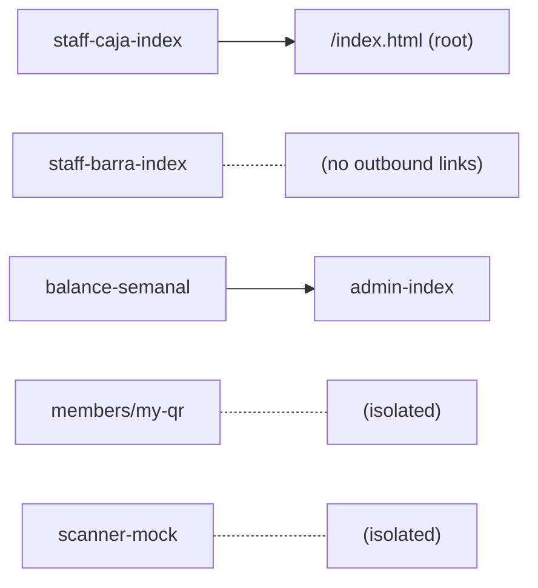

# Wiremap — Routing Completo

> Generated: 2026-02-21

## 1. Auth Flow

---

## 2. Role Access Matrix

| Página                       | admin | contable | logistico | enc_barra | enc_caja | staff_caja | operativo | staff_barra | staff_operativo | manager | gerente |
| ---------------------------- | :---: | :------: | :-------: | :-------: | :------: | :--------: | :-------: | :---------: | :-------------: | :-----: | :-----: |
| **Admin**                    |       |          |           |           |          |            |           |             |                 |         |         |
| admin-index                  |  ✅   |    ✅    |           |           |          |            |           |             |                 |         |         |
| admin-config                 |  ✅   |    ✅    |           |           |          |            |           |             |                 |         |         |
| admin-central-stock          |  ✅   |    ✅    |    ✅     |           |          |            |           |             |                 |         |         |
| admin-workdays               |  ✅   |    ✅    |           |           |          |            |           |             |                 |         |         |
| admin-pagos                  |  ✅   |    ✅    |           |           |          |            |           |             |                 |         |         |
| admin-solicitudes            |  ✅   |    ✅    |           |           |          |            |           |             |                 |         |         |
| admin-reportes               |  ✅   |    ✅    |           |           |          |            |           |             |                 |         |         |
| admin-semanal                |  ✅   |    ✅    |           |           |          |            |           |             |                 |         |         |
| admin-master-\* (6 pages)    |  ✅   |    ✅    |           |           |          |            |           |             |                 |         |         |
| qr/index (dashboard)         |  ✅   |          |           |           |    ✅    |            |           |             |                 |         |         |
| qr/monitor                   |  ✅   |    ✅    |           |           |          |            |           |             |                 |   ✅    |         |
| **Operativo**                |       |          |           |           |          |            |           |             |                 |         |         |
| operativo-index              |  ✅   |    ✅    |           |           |          |            |    ✅     |             |       ✅        |         |         |
| operativo-stock              |       |          |    ✅     |           |          |            |    ✅     |             |                 |         |         |
| operativo-solicitudes        |  ✅   |    ✅    |           |           |          |            |    ✅     |             |       ✅        |         |         |
| operativo-master-sku         |  ✅   |    ✅    |           |           |          |            |    ✅     |     ✅      |       ✅        |         |         |
| operativo-master-proveedores |  ✅   |    ✅    |           |           |          |            |    ✅     |     ✅      |       ✅        |         |         |
| operativo-analisis           |       |          |    ✅     |           |          |            |    ✅     |             |                 |         |         |
| operativo-workday            |  ✅   |    ✅    |           |           |          |            |    ✅     |             |       ✅        |         |         |
| cms-members                  |  ✅   |    ✅    |           |           |          |            |    ✅     |             |       ✅        |         |         |
| scanner                      |  ✅   |          |           |           |          |            |    ✅     |             |                 |         |         |
| **Logística**                |       |          |           |           |          |            |           |             |                 |         |         |
| logistica-index              |  ✅   |          |    ✅     |           |          |            |           |             |                 |         |         |
| logistica-stock              |  ✅   |          |    ✅     |           |          |            |           |             |                 |         |         |
| logistica-distribucion       |  ✅   |    ✅    |    ✅     |           |          |            |           |             |                 |         |         |
| logistica-recepcion          |  ✅   |    ✅    |    ✅     |           |          |            |           |             |                 |         |         |
| logistica-seguimiento        |  ✅   |          |    ✅     |           |          |            |           |             |                 |         |         |
| **Encargados**               |       |          |           |           |          |            |           |             |                 |         |         |
| encargado-barra-index        |  ✅   |    ✅    |           |    ✅     |          |            |           |             |                 |         |         |
| encargado-barra-personal     |  ✅   |    ✅    |           |    ✅     |          |            |           |             |                 |         |         |
| encargado-barra-noche        |  ✅   |    ✅    |           |    ✅     |          |            |           |             |                 |         |         |
| encargado-recepcion          |  ✅   |    ✅    |           |    ✅     |          |            |           |             |                 |         |         |
| encargado-caja-index         |  ✅   |    ✅    |           |           |    ✅    |            |           |             |                 |         |         |
| encargado-caja-personal      |  ✅   |    ✅    |           |           |    ✅    |            |           |             |                 |         |         |
| encargado-caja-noche         |  ✅   |    ✅    |           |           |    ✅    |            |           |             |                 |         |         |
| **Staff**                    |       |          |           |           |          |            |           |             |                 |         |         |
| staff-caja-index             |  ✅   |    ✅    |           |           |          |     ✅     |    ✅     |             |                 |         |         |
| staff-barra-index            |   —   |    —     |     —     |     —     |    —     |     —      |     —     |      —      |        —        |    —    |    —    |
| **Gerencia**                 |       |          |           |           |          |            |           |             |                 |         |         |
| balance-semanal              |  ✅   |    ✅    |           |           |          |            |           |             |                 |         |   ✅    |
| **Sin guard**                |       |          |           |           |          |            |           |             |                 |         |         |
| members/my-qr                |   —   |    —     |     —     |     —     |    —     |     —      |     —     |      —      |        —        |    —    |    —    |
| scanner-mock                 |   —   |    —     |     —     |     —     |    —     |     —      |     —     |      —      |        —        |    —    |    —    |
| test-devenciones             |   —   |    —     |     —     |     —     |    —     |     —      |     —     |      —      |        —        |    —    |    —    |
| prototypes/\* (4)            |   —   |    —     |     —     |     —     |    —     |     —      |     —     |      —      |        —        |    —    |    —    |

> `—` = sin guardOrRedirect (acceso libre o página de prueba)

---

## 3. Navigation Graph by Module

### Admin

### Operativo

### Logística

### Encargados

### Staff / Gerencia / Other

---

## 4. Cross-Module Links

| Desde            | Hacia                | Tipo            |
| ---------------- | -------------------- | --------------- |
| admin-index      | operativo-index      | Launcher card   |
| balance-semanal  | admin-index          | Breadcrumb back |
| staff-caja-index | /index.html (root)   | Breadcrumb back |
| login.html       | (role-based landing) | Auth redirect   |

---

## 5. Isolated Pages (no inbound links from any other page)

| Página                                        | Tipo       | Nota                                                  |
| --------------------------------------------- | ---------- | ----------------------------------------------------- |
| `scanner-mock.html`                           | Test       | QR scanner mock for dev                               |
| `members/my-qr.html`                          | Public     | Member QR display                                     |
| `admin/test-devenciones.html`                 | Test       | Accruals test page                                    |
| `prototypes/*` (4 pages)                      | Lab        | Design prototypes                                     |
| `staff/staff-barra-index.html`                | Production | ⚠ No inbound links — only reachable via Auth redirect |
| `operativo/operativo-analisis.html`           | Production | ⚠ No launcher card in operativo-index                 |
| `operativo/operativo-master-proveedores.html` | Production | ⚠ No launcher card in operativo-index                 |

---

## 6. Stats

| Metric                    | Value |
| ------------------------- | ----- |
| Total HTML pages          | 47    |
| With guardOrRedirect      | 38    |
| Without guard             | 9     |
| Unique roles              | 11    |
| Cross-module links        | 4     |
| Isolated production pages | 3     |
| Test/prototype pages      | 6     |
