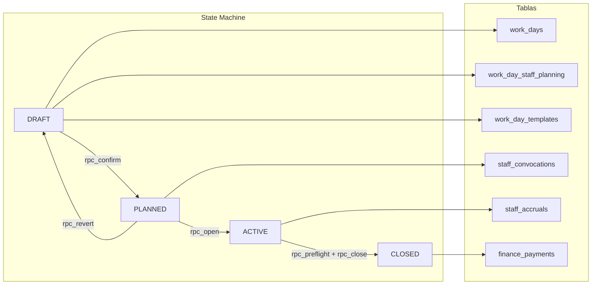

# Backend Architecture Map — FormulaMid 4

> **Generado:** 2026-02-16 | **Método:** Auditoría cruzada Business Logic ↔ Supabase live

---

## 1. Inventario de Objetos de Base de Datos

### 1.1 Tablas (65 en producción)

| Dominio              | Tablas                                                                                                                                                                                              | Cant. |
| -------------------- | --------------------------------------------------------------------------------------------------------------------------------------------------------------------------------------------------- | ----- |
| **Workday Core**     | `work_days`, `work_day_staff_planning`, `work_day_templates`, `events`                                                                                                                              | 4     |
| **Cash Closing**     | `cash_closings`, `closing_terminals`, `cash_movements`, `pos_terminals`, `pos_terminals_alias`                                                                                                      | 5     |
| **Bar Operations**   | `bar_sessions`, `bar_stock_snapshots`, `bar_session_sales`                                                                                                                                          | 3     |
| **Replenishment**    | `replenishment_requests`, `replenishment_items`, `replenishment_supplier_orders`, `replenishment_receipts`, `replenishment_receipt_items`, `replenishment_tracking`                                 | 6     |
| **Inventory**        | `master_sku`, `master_categories`, `master_recipes`, `recipe_code_mappings`, `inventory_stock`, `inventory_movements`, `inventory_stock_adjustments`, `inventory_ideal`                             | 8     |
| **Staff / Payroll**  | `master_staff_roles`, `staff_convocations`, `staff_accruals`, `staff_functions`, `profile_functions`, `profiles`                                                                                    | 6     |
| **Finance**          | `finance_payments`, `finance_payment_rules`, `finance_opening_cost_defs`, `finance_weekly_closings`, `cost_definitions`, `cost_config`, `accounts_payable`, `payment_categories`, `payment_methods` | 9     |
| **Revenue / Fiscal** | `revenue_reports`, `revenue_details`, `consumption_reports`, `consumption_details`                                                                                                                  | 4     |
| **QR / Access**      | `qr_batches`, `qr_codes`, `qr_checkins`                                                                                                                                                             | 3     |
| **Members**          | `members`                                                                                                                                                                                           | 1     |
| **Auth / Config**    | `auth_audit_log`, `audit_config`, `site_config`, `sku_change_requests`                                                                                                                              | 4     |
| **Menu**             | `menu_categories`, `menu_items`                                                                                                                                                                     | 2     |
| **Suppliers**        | `master_proveedores`                                                                                                                                                                                | 1     |
| **GBOL Import**      | `import_gbol_facturacion`, `import_gbol_comandas`, `import_gbol_withdrawals`, `gbol_sync_log`, `import_logs`                                                                                        | 5     |
| **Staging**          | `stg_afip_facturas`, `stg_extracciones`, `stg_gbol_items`, `stg_passline_tickets`                                                                                                                   | 4     |

### 1.2 Vistas (20 en producción)

| Vista                          | Dominio             | Fuentes principales                                                                                                                      |
| ------------------------------ | ------------------- | ---------------------------------------------------------------------------------------------------------------------------------------- |
| `v_admin_stock`                | Inventario          | `master_sku`, `inventory_stock`, `inventory_ideal`, `master_categories`                                                                  |
| `vw_bar_audit_variance`        | Auditoría Barra     | `bar_sessions`, `bar_stock_snapshots`, `bar_session_sales`, `master_sku`, `master_recipes`, `replenishment_*`                            |
| `vw_bar_efficiency`            | Auditoría Barra     | `bar_sessions`, `bar_stock_snapshots`, `bar_session_sales`, `master_recipes`, `master_sku`, `profiles`                                   |
| `vw_consumo_teorico`           | Auditoría Barra     | `bar_session_sales`, `master_recipes`, `master_sku`                                                                                      |
| `vw_daily_sales`               | Financiero          | `work_days`, `cash_closings`, `closing_terminals`, `bar_sessions`, `bar_session_sales`, `qr_codes`, `cash_movements`, `accounts_payable` |
| `vw_daily_sales_v2`            | Financiero (legacy) | Versión simplificada de `vw_daily_sales`                                                                                                 |
| `vw_fiscal_summary`            | Fiscal              | `revenue_details`, `work_days`                                                                                                           |
| `vw_per_capita_revenue`        | KPI                 | `work_days`, `cash_closings`, `qr_codes`, `bar_session_sales`                                                                            |
| `vw_recipe_profitability`      | Análisis            | `master_recipes`, `master_sku`                                                                                                           |
| `vw_reconcile_afip_gbol`       | Conciliación        | `stg_afip_facturas`, `stg_gbol_items`                                                                                                    |
| `vw_sku_ideal_dynamic`         | Inventario          | `master_sku`, ventas históricas                                                                                                          |
| `vw_staff_accruals_summary`    | Nómina              | `staff_accruals`, `profiles`, `master_staff_roles`, `work_days`                                                                          |
| `vw_staff_performance`         | KPI                 | `profiles`, `staff_convocations`, `closing_terminals`                                                                                    |
| `vw_stock_global`              | Inventario          | `master_sku`, `inventory_stock`, `master_categories`                                                                                     |
| `vw_supplier_orders_admin`     | Compras             | `replenishment_supplier_orders`, `master_proveedores`                                                                                    |
| `vw_supplier_orders_encargado` | Compras             | `replenishment_supplier_orders`, `master_proveedores`                                                                                    |
| `vw_tax_monthly`               | Fiscal              | `import_gbol_facturacion`                                                                                                                |
| `vw_work_day_summary`          | Dashboard           | `work_days`                                                                                                                              |
| `vw_workday_benchmarks`        | KPI                 | `work_days`, `vw_workday_pnl`                                                                                                            |
| `vw_workday_pnl`               | P&L                 | `work_days`, `cash_closings`, `qr_codes`, `bar_session_sales`, `staff_accruals`, `consumption_details`, `accounts_payable`               |

### 1.3 RPCs / Funciones (34 en producción)

#### Workday Lifecycle (8)

| Función                       | Args                                                | Retorna   | Propósito                          |
| ----------------------------- | --------------------------------------------------- | --------- | ---------------------------------- |
| `rpc_create_work_day`         | `p_work_date, p_event_id?, p_event_name?, p_notes?` | `uuid`    | Crea jornada en DRAFT              |
| `rpc_plan_work_day`           | `p_work_date, p_notes?`                             | `uuid`    | Crea jornada directa (shortcut)    |
| `rpc_confirm_work_day`        | `p_work_day_id`                                     | `void`    | DRAFT → PLANNED                    |
| `rpc_revert_work_day`         | `p_work_day_id`                                     | `void`    | PLANNED → DRAFT                    |
| `rpc_open_work_day`           | `p_work_day_id`                                     | `jsonb`   | PLANNED → ACTIVE                   |
| `rpc_preflight_close_workday` | `p_work_day_id`                                     | `jsonb`   | Pre-flight checks antes del cierre |
| `rpc_close_work_day`          | `p_work_day_id, p_cash_closing_id?`                 | `jsonb`   | ACTIVE → CLOSED                    |
| `calculate_health_score`      | `p_work_day_id`                                     | `integer` | Score 0-100 de la jornada          |

#### Payroll / Finance (7)

| Función                             | Args                                                  | Retorna | Propósito                       |
| ----------------------------------- | ----------------------------------------------------- | ------- | ------------------------------- |
| `admin_generate_workday_accruals`   | `p_work_day_id`                                       | `jsonb` | Genera devenciones salariales   |
| `admin_export_accruals_to_payments` | `p_user_id, p_from, p_to`                             | `jsonb` | Exporta devenciones a pagos     |
| `admin_generate_rule_payments`      | (ninguno)                                             | `void`  | Genera pagos por reglas de pago |
| `admin_approve_payment`             | `p_payment_id, p_approved_by`                         | `void`  | Aprueba un pago pendiente       |
| `admin_mark_payment_done`           | `p_payment_id, p_amount, p_voucher, p_method, p_note` | `void`  | Marca pago como completado      |
| `admin_undo_payment_done`           | `p_payment_id`                                        | `void`  | Revierte un pago completado     |
| `admin_sync_opening_cost_payments`  | `p_plan_date`                                         | `void`  | Sincroniza costos de apertura   |

#### Inventory (2)

| Función                      | Args                                 | Retorna | Propósito                       |
| ---------------------------- | ------------------------------------ | ------- | ------------------------------- |
| `admin_bulk_set_stock`       | `changes jsonb, p_reason?`           | `jsonb` | Ajuste masivo de stock          |
| `rpc_receive_supplier_order` | `p_order_id, p_items jsonb, p_notes` | `void`  | Recepción de orden de proveedor |

#### Auth / Helpers (6)

| Función                       | Args                      | Retorna      | Propósito                            |
| ----------------------------- | ------------------------- | ------------ | ------------------------------------ |
| `get_my_role`                 | (ninguno)                 | `text`       | Devuelve rol del usuario autenticado |
| `has_role`                    | `r text`                  | `boolean`    | Verifica si el usuario tiene un rol  |
| `is_admin`                    | (ninguno)                 | `boolean`    | Verifica si el usuario es admin      |
| `update_member_password_hash` | `p_member_id, p_password` | `void`       | Actualiza hash de password           |
| `verify_member_password`      | `p_member_id, p_password` | `TABLE(...)` | Verifica password de miembro         |
| `fn_normalize_terminal_name`  | `val text`                | `text`       | Normaliza nombre de terminal         |

#### Triggers (8)

| Función                               | Tipo    | Tabla asociada                  |
| ------------------------------------- | ------- | ------------------------------- |
| `calculate_costo_pack`                | TRIGGER | `master_sku`                    |
| `check_supplier_order_update`         | TRIGGER | `replenishment_supplier_orders` |
| `handle_new_user`                     | TRIGGER | `auth.users` → `profiles`       |
| `hash_access_password`                | TRIGGER | `members`                       |
| `set_updated_at`                      | TRIGGER | Múltiples tablas                |
| `trg_staff_accruals_updated_at`       | TRIGGER | `staff_accruals`                |
| `update_closing_terminals_from_sales` | TRIGGER | `bar_session_sales`             |
| `update_cost_config_updated_at`       | TRIGGER | `cost_config`                   |

#### Utility (2)

| Función                      | Propósito                                   |
| ---------------------------- | ------------------------------------------- |
| `fn_parse_arg_number`        | Parsea texto a numérico (formato argentino) |
| `fn_normalize_terminal_name` | Normaliza nombres de caja                   |

---

## 2. Flujos de Negocio → Objetos DB

### 2.1 Workday Management (`workday-management`)

| Fase    | Tablas Write                                                 | RPCS                                                                          | Vistas                                        |
| ------- | ------------------------------------------------------------ | ----------------------------------------------------------------------------- | --------------------------------------------- |
| DRAFT   | `work_days`, `work_day_staff_planning`, `work_day_templates` | `rpc_create_work_day`                                                         | —                                             |
| PLANNED | `staff_convocations`                                         | `rpc_confirm_work_day`                                                        | —                                             |
| ACTIVE  | `staff_accruals`                                             | `rpc_open_work_day`, `admin_generate_workday_accruals`                        | `vw_consumo_teorico`, `vw_bar_audit_variance` |
| CLOSED  | `finance_payments`                                           | `rpc_preflight_close_workday`, `rpc_close_work_day`, `calculate_health_score` | `vw_workday_pnl`, `vw_daily_sales`            |

### 2.2 Night Cash Closing (`night-cash-closing`)

| Fase                | Actor            | Tablas Write                                                                 | RPCs                           |
| ------------------- | ---------------- | ---------------------------------------------------------------------------- | ------------------------------ |
| Declaración         | `encargado_caja` | `cash_closings`, `closing_terminals`                                         | — (directo Supabase)           |
| Sincronización GBOL | `admin`          | `import_gbol_facturacion`, `import_gbol_comandas`, `import_gbol_withdrawals` | — (JS `GbolService`)           |
| Populate System     | `admin`          | `closing_terminals` (campos `system_*`)                                      | — (JS `populateSystemAmounts`) |
| Cierre Final        | `admin`          | `cash_closings`, `work_days`                                                 | `rpc_close_work_day`           |

### 2.3 Bar Manager Night (`bar-manager-night`)

| Fase      | Tablas Write                                           | RPCs | Notas                                        |
| --------- | ------------------------------------------------------ | ---- | -------------------------------------------- |
| Apertura  | `bar_sessions`, `bar_stock_snapshots` (type=`opening`) | —    | Precarga desde último cierre                 |
| Cierre    | `bar_stock_snapshots` (type=`closing`), `bar_sessions` | —    | Sin RPCs, todo client-side                   |
| Auditoría | — (read only)                                          | —    | `vw_bar_audit_variance`, `vw_bar_efficiency` |

---

## 3. Módulo JS → Dependencias DB

> Referencia completa en `docs/scheme.md` § "Mapa Módulo ↔ Tabla" (líneas 1243-1316).

### Resumen de cobertura por rol

| Rol        | Módulos JS | Tablas R | Tablas W | Vistas | RPCs |
| ---------- | ---------- | -------- | -------- | ------ | ---- |
| Admin      | 16         | 39       | 28       | 15     | 8+   |
| Operativo  | 8          | 14       | 9        | 1      | 0    |
| Encargados | 7          | 18       | 9        | 1      | 0    |
| Logística  | 5          | 8        | 11       | 1      | 1    |
| Staff      | 1          | 5        | 2        | 0      | 0    |
| Gerencia   | 1          | 0        | 0        | 1      | 0    |

---

## 4. Cobertura RLS (Row Level Security)

> ⚠️ **No auditado en esta iteración.** Se recomienda una auditoría RLS dedicada.

Tablas con RLS explícitamente OFF según docs:

- `import_logs`
- `replenishment_tracking`

---

## 5. Triggers Activos

| Trigger                               | Tabla                           | Efecto                                           |
| ------------------------------------- | ------------------------------- | ------------------------------------------------ |
| `calculate_costo_pack`                | `master_sku`                    | Auto-calcula `costo_pack` al insertar/actualizar |
| `check_supplier_order_update`         | `replenishment_supplier_orders` | Valida transiciones de estado                    |
| `handle_new_user`                     | `auth.users`                    | Crea perfil automático en `profiles`             |
| `hash_access_password`                | `members`                       | Hashea password al insertar/actualizar           |
| `set_updated_at`                      | Múltiples                       | Auto-actualiza `updated_at`                      |
| `update_closing_terminals_from_sales` | `bar_session_sales`             | Propaga ventas a terminales                      |
| `update_cost_config_updated_at`       | `cost_config`                   | Auto-actualiza timestamp                         |
