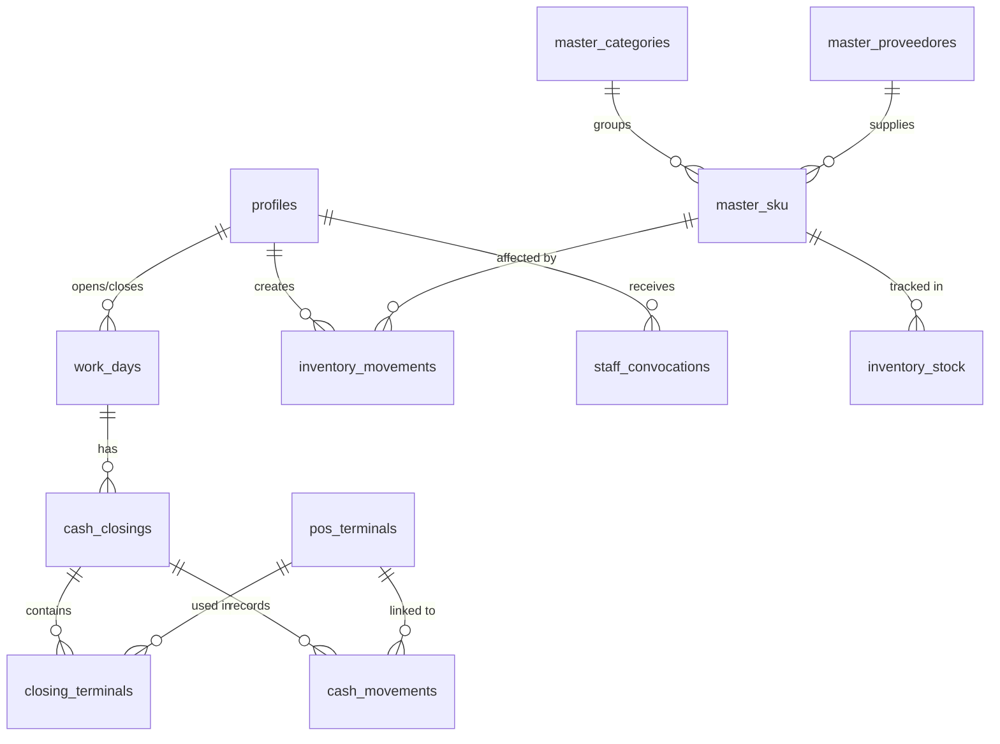

# Skill: DB Architect (Backend & Data)

> **Fuente de Verdad**: `docs/scheme.md`, Supabase Dashboard  
> **Última Actualización**: 2026-01-30

Este documento contiene el esquema de datos y reglas de integridad obligatorias.

---

## 1. Schema Core

### 1.1 Tablas Operativas Críticas

#### work_days (Jornadas)

Control de días operativos del club.

| Columna     | Tipo      | Descripción          |
| :---------- | :-------- | :------------------- |
| `id`        | uuid      | PK                   |
| `opened_by` | uuid      | FK → profiles.id     |
| `closed_by` | uuid      | FK → profiles.id     |
| `work_date` | date      | Fecha de la jornada  |
| `status`    | text      | Estado de la jornada |
| `opened_at` | timestamp | Hora de apertura     |
| `closed_at` | timestamp | Hora de cierre       |

**Valores válidos para `status`**:

- `'ABIERTA'` — Jornada activa
- `'CERRADA'` — Jornada finalizada

#### cash_closings (Cierres de Caja)

Arqueos nocturnos.

| Columna            | Tipo    | Descripción                    |
| :----------------- | :------ | :----------------------------- |
| `id`               | uuid    | PK                             |
| `work_day_id`      | uuid    | FK → work_days.id              |
| `closed_by`        | uuid    | Usuario que cerró              |
| `event_date`       | date    | Fecha del evento               |
| `status`           | text    | Estado del cierre              |
| `total_system`     | numeric | Total calculado por sistema    |
| `total_declared`   | numeric | Total declarado                |
| `total_difference` | numeric | Diferencia (declared - system) |

#### closing_terminals (Detalle por Terminal)

Declaración individual por caja.

| Columna           | Tipo    | Descripción                |
| :---------------- | :------ | :------------------------- |
| `id`              | uuid    | PK                         |
| `cash_closing_id` | uuid    | FK → cash_closings.id      |
| `terminal_id`     | uuid    | FK → pos_terminals.id      |
| `staff_id`        | uuid    | Cajero asignado            |
| `system_cash`     | numeric | Efectivo según sistema     |
| `system_zoco`     | numeric | Zoco según sistema         |
| `declared_cash`   | numeric | Efectivo declarado         |
| `declared_zoco`   | numeric | Zoco declarado             |
| `status`          | text    | Estado del cierre terminal |

---

### 1.2 Tablas de Inventario

#### inventory_stock (Stock Actual)

| Columna    | Tipo    | Descripción                         |
| :--------- | :------ | :---------------------------------- |
| `id`       | uuid    | PK                                  |
| `sku_id`   | uuid    | FK → master_sku.id                  |
| `quantity` | numeric | Cantidad actual                     |
| `location` | text    | Ubicación (DEPOSITO, BARRA_1, etc.) |

#### inventory_movements (Kardex)

> [!IMPORTANT]
> Todo movimiento **DEBE** tener `sku_id` y `created_by`.

| Columna      | Tipo    | Descripción                        |
| :----------- | :------ | :--------------------------------- |
| `id`         | uuid    | PK                                 |
| `sku_id`     | uuid    | **FK → master_sku.id (REQUERIDO)** |
| `created_by` | uuid    | **FK → profiles.id (REQUERIDO)**   |
| `type`       | text    | Tipo de movimiento                 |
| `quantity`   | numeric | Cantidad                           |
| `cost`       | numeric | Costo unitario                     |
| `notes`      | text    | Observaciones                      |

**Valores válidos para `type`**:

- `'ENTRADA'` — Recepción de proveedor
- `'SALIDA'` — Consumo/venta
- `'AJUSTE'` — Ajuste manual
- `'TRANSFERENCIA'` — Entre ubicaciones

#### consumption_reports (Reportes de Consumo)

| Columna            | Tipo | Descripción        |
| :----------------- | :--- | :----------------- |
| `id`               | uuid | PK                 |
| `operational_date` | date | Fecha operativa    |
| `file_name`        | text | Nombre del archivo |

#### consumption_details (Detalle de Consumo)

| Columna     | Tipo    | Descripción                 |
| :---------- | :------ | :-------------------------- |
| `id`        | uuid    | PK                          |
| `report_id` | uuid    | FK → consumption_reports.id |
| `sku_id`    | uuid    | FK → master_sku.id          |
| `quantity`  | numeric | Cantidad                    |

---

### 1.3 Tablas de Caja

#### cash_movements (Movimientos)

> [!IMPORTANT]
> Todo movimiento de caja **DEBE** tener `terminal_id`.

| Columna           | Tipo    | Descripción                           |
| :---------------- | :------ | :------------------------------------ |
| `id`              | uuid    | PK                                    |
| `cash_closing_id` | uuid    | FK → cash_closings.id                 |
| `terminal_id`     | uuid    | **FK → pos_terminals.id (REQUERIDO)** |
| `requested_by`    | uuid    | Solicitante                           |
| `confirmed_by`    | uuid    | Confirmador                           |
| `type`            | text    | Tipo (INGRESO/EGRESO)                 |
| `amount`          | numeric | Monto                                 |
| `reason`          | text    | Concepto                              |
| `status`          | text    | Estado                                |

---

## 2. Tablas Maestras

### profiles (Usuarios)

| Columna     | Tipo    | Descripción            |
| :---------- | :------ | :--------------------- |
| `id`        | uuid    | PK, FK → auth.users.id |
| `full_name` | text    | Nombre completo        |
| `role`      | text    | Rol del usuario        |
| `active`    | boolean | Activo/Inactivo        |

**Valores válidos para `role`**:

- `'admin'`
- `'gerencia'`
- `'encargado'`
- `'contable'`
- `'logistica'`
- `'barra'`
- `'caja'`
- `'puerta'`
- `'passline_entry'`
- `'staff'`

### master_sku (Productos)

| Columna                | Tipo    | Descripción                |
| :--------------------- | :------ | :------------------------- |
| `id`                   | uuid    | PK                         |
| `categoria_id`         | uuid    | FK → master_categories.id  |
| `proveedor_default_id` | uuid    | FK → master_proveedores.id |
| `name`                 | text    | Nombre del producto        |
| `unit_type`            | text    | Tipo de unidad             |
| `cost_price`           | numeric | Precio de costo            |
| `sale_price`           | numeric | Precio de venta            |
| `is_active`            | boolean | Activo                     |

### pos_terminals (Terminales POS)

| Columna         | Tipo    | Descripción             |
| :-------------- | :------ | :---------------------- |
| `id`            | uuid    | PK                      |
| `friendly_name` | text    | Nombre amigable         |
| `provider`      | text    | Proveedor (Zoco, G-Bol) |
| `external_id`   | text    | ID externo              |
| `is_active`     | boolean | Activo                  |

---

## 3. Vistas de Lectura

> [!CAUTION]
> **SIEMPRE** usa estas vistas para reportes. **NUNCA** hagas JOINs crudos.

### v_admin_stock

Vista consolidada de stock para administración.

```sql
SELECT sku_id, external_id, stock_actual, ideal_900, ideal_500,
       nombre, categoria_nombre, categoria_id
FROM v_admin_stock;
```

**Uso**: Pantalla de stock administrativo, auditoría de inventario.

### vw_daily_sales_v2

Resumen de ventas diarias.

```sql
SELECT work_day_id, work_date, status, total_declared,
       closing_notes, total_income, total_difference
FROM vw_daily_sales_v2
ORDER BY work_date DESC;
```

**Uso**: Reportes financieros, dashboard gerencial.

### vw_staff_performance

Rendimiento del personal.

```sql
SELECT user_id, full_name, role, shifts_total, shifts_confirmed,
       closures_count, net_cash_difference, abs_cash_difference
FROM vw_staff_performance;
```

**Uso**: Evaluación de personal, análisis de diferencias de caja.

### vw_stock_global

Stock global unificado.

```sql
SELECT sku_id, sku_nombre, categoria_id, categoria_nombre,
       stock_actual, requerido, activo, estado
FROM vw_stock_global;
```

**Uso**: Dashboard operativo, alertas de stock bajo.

### vw_supplier_orders_admin

Órdenes de compra para administración.

```sql
SELECT order_id, proveedor, estado, fecha_eta,
       presupuesto, costo_final, skus_count
FROM vw_supplier_orders_admin;
```

### vw_work_day_summary

Resumen de jornadas.

```sql
SELECT open_day, closed_days, planned_days
FROM vw_work_day_summary;
```

---

## 4. Relaciones Críticas (Foreign Keys)



---

## 5. Reglas de Integridad

### 5.1 inventory_movements

```sql
-- Siempre requerido
sku_id IS NOT NULL
created_by IS NOT NULL
```

### 5.2 cash_movements

```sql
-- Siempre requerido
terminal_id IS NOT NULL
```

### 5.3 work_days.status

```sql
-- Valores permitidos
status IN ('ABIERTA', 'CERRADA')
```

---

## 6. Patrones de Query

### 6.1 Select con Supabase JS

```javascript
// Usar vistas para lectura
const { data, error } = await window.sb
  .from("vw_stock_global")
  .select("*")
  .order("sku_nombre");

// Insert con campos obligatorios
const { data, error } = await window.sb.from("inventory_movements").insert({
  sku_id: selectedSkuId, // REQUERIDO
  created_by: profile.id, // REQUERIDO
  type: "ENTRADA",
  quantity: cantidad,
  cost: costo,
});
```

### 6.2 Upsert de Stock

```javascript
const { error } = await window.sb.from("inventory_stock").upsert(
  {
    sku_id: skuId,
    quantity: newQuantity,
    location: "DEPOSITO",
  },
  {
    onConflict: "sku_id,location",
  },
);
```

---

## 7. Checklist de Validación

Al trabajar con datos, verificar:

- [ ] Usar vistas para lectura (no JOINs manuales)
- [ ] FKs obligatorias presentes (sku_id, created_by, terminal_id)
- [ ] Valores de enum válidos (status, role, type)
- [ ] Manejo de errores con `if (error)`
- [ ] Ordenamiento explícito en queries

---

## 8. Mantenimiento de Fuentes de Verdad

> [!CAUTION]
> **Reglas para evitar duplicación de documentación**

### 8.1 Ubicaciones Canónicas

| Tipo de Documento   | Ubicación Única           | NO crear en      |
| :------------------ | :------------------------ | :--------------- |
| Esquema de BD       | `docs/scheme.md`          | `.agent/`        |
| Vistas documentadas | Este SKILL.md (sección 3) | Otros docs       |
| Migraciones         | Supabase Dashboard        | Archivos locales |
| Estado del proyecto | `docs/estado-presente.md` | `.agent/`        |
| Skills técnicos     | `.agent/skills/`          | `docs/`          |

### 8.2 Reglas de Actualización

1. **Si agregas tabla** → Actualizar `docs/scheme.md` Y este SKILL.md
2. **Si agregas vista** → Documentar en sección 3 de este SKILL.md
3. **Si cambias FK o constraint** → Actualizar sección 5
4. **NUNCA crear archivos duplicados** → Si existe, actualizar el existente

### 8.3 Checklist Pre-Commit

- [ ] ¿Existe ya un archivo similar? → Actualizar, no crear nuevo
- [ ] ¿Las referencias en otros docs apuntan a la fuente correcta?
- [ ] ¿Se actualizó la fecha `Última Actualización` del skill?

---

## 9. Orquestación Post-Tarea

> [!IMPORTANT]
> **Al finalizar cualquier tarea que modifique la BD:**

### 9.1 Actualización de Documentación

| Si modificaste...     | Acción Requerida                         |
| :-------------------- | :--------------------------------------- |
| Esquema (Tablas/Cols) | Actualizar manualmente `docs/scheme.md`  |
| Vistas/Functions      | Documentar en este SKILL.md (sección 3)  |
| Relaciones Clave      | Verificar si afecta `docs/screen-map.md` |

### 9.2 Comunicación

- Si el cambio requiere nuevos componentes UI → Notificar a `frontend-developer`
- Si el cambio requiere lógica compleja → Notificar a `logic-engineer`
