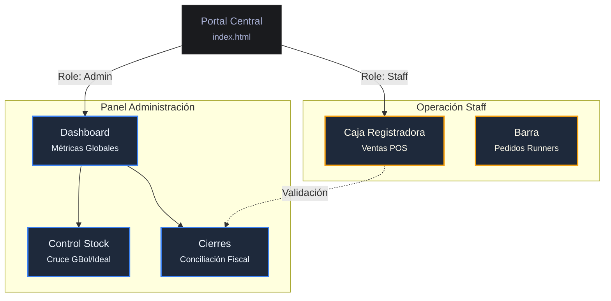

# Ejemplo de Mapa Estético

Este es un ejemplo de cómo debe lucir un mapa de pantallas generado por este skill.

## Características de este diseño:
1.  **Subgrafos**: Agrupan visualmente por contexto.
2.  **Etiquetas de Línea**: Explican la transición (`Role: Admin`).
3.  **Diferenciación de Estilo**: El color del borde y fondo indica el rol.
4.  **Meta-información**: El uso de `<small>` permite incluir el nombre del archivo sin ensuciar el nombre funcional de la pantalla.
