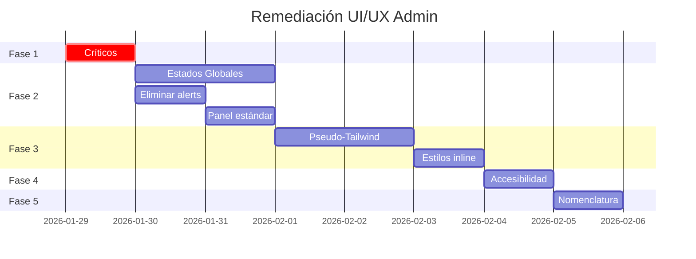

# Roadmap: Remedición UI/UX Admin Modules

> **Fecha**: 2026-01-29  
> **Fuente**: [task.md](file:///Users/lucianopieve/Documents/FormulaMid%204/task.md) (Auditoría UI/UX)  
> **Estado**: 🟡 En Progreso

---

## Resumen Ejecutivo

Se identificaron **~50 inconsistencias** en 13 módulos admin. Este roadmap prioriza la remediación por severidad y dependencias.

---

## Fase 1: Críticos (Bloqueantes) ✅ COMPLETADO

> [!CAUTION]
> Estos issues pueden causar errores funcionales. **RESUELTOS.**

| Módulo                | Issue                                                                | Estado                     |
| :-------------------- | :------------------------------------------------------------------- | :------------------------- |
| `admin-stock`         | ~~`initSlidePanel` espera `#slide-panel`, HTML usaba `#stockPanel`~~ | ✅ Corregido               |
| `admin-stock`         | ~~Rol `logistico` vs `logistica`~~                                   | ✅ Unificado a `logistica` |
| `admin-stock-ajustes` | ~~Usa `auth:ready` en vez de `guardOrRedirect`~~                     | ✅ Migrado a IIFE          |

**Completado**: 2026-01-29

---

## Fase 2: Funcionales (Alta Prioridad)

> [!IMPORTANT]
> Afectan la experiencia de usuario pero no causan crashes.

### 2.1 Estados Globales (Loading/Empty) ✅ COMPLETADO

| Módulo                     | Status                                              |
| :------------------------- | :-------------------------------------------------- |
| `admin-pagos`              | [x] Migrar placeholders a `page-card-loading/empty` |
| `admin-cierre`             | [x] Ya implementado                                 |
| `admin-workdays`           | [x] Agregar `#module-content` + estados             |
| `admin-reportes`           | [x] Agregar estados globales                        |
| `admin-stock-ajustes`      | [x] Agregar estados globales                        |
| `admin-master-sku`         | [x] Agregar `#module-content`                       |
| `admin-master-proveedores` | [x] Agregar `#module-content`                       |
| `admin-master-categorias`  | [x] Agregar `#module-content`                       |
| `admin-master-pos`         | [x] Agregar `#module-content`                       |
| `admin-master-tarifario`   | [x] Agregar `#module-content`                       |

**Completado**: 2026-01-30

### 2.2 Eliminar `confirm()`/`alert()` ✅ COMPLETADO

| Módulo                | Línea                      | Status                               |
| :-------------------- | :------------------------- | :----------------------------------- |
| `admin-pagos`         | ~~L437, L541, L648, L693~~ | ✅ Migrado a `Utils.confirmAction()` |
| `admin-cierre`        | -                          | [x] Ya usa modales                   |
| `admin-solicitudes`   | ~~L452~~                   | ✅ Migrado a `Utils.confirmAction()` |
| `admin-stock-ajustes` | ~~L120~~                   | ✅ Fase 1 (modal nativo)             |

**Completado**: 2026-01-29

### 2.3 Panel Estándar (`panel.js`) ⏸️ DIFERIDO

> [!NOTE]
> Requiere refactor arquitectónico. `admin-pagos` usa 3 slide-panels simultáneos con overlay compartido, incompatible con `panel.js` estándar (1 panel por página).

| Módulo              | Status                                             |
| :------------------ | :------------------------------------------------- |
| `admin-pagos`       | ⏸️ Arquitectura multi-panel, requiere diseño nuevo |
| `admin-solicitudes` | ✅ Ya usa `panel.js` estándar                      |

**Acción**: Crear issue para diseñar solución multi-panel o convertir a modales.

---

## Fase 3: Visuales (Media Prioridad)

### 3.1 Eliminar Pseudo-Tailwind ✅ COMPLETADO

| Módulo                   | Clases eliminadas                                          | Status      |
| :----------------------- | :--------------------------------------------------------- | :---------- |
| `admin-cierre`           | ~~`text-xs`, `mb-4`, `whitespace-pre-wrap`~~               | ✅ Limpiado |
| `admin-workdays`         | ~~`mt-3`, `flex`, `justify-between`, `text-sm`, `w-full`~~ | ✅ Limpiado |
| `admin-reportes`         | ~~`flex`, `text-white/40`, `grid`~~                        | ✅ Limpiado |
| `admin-stock-ajustes`    | ~~Utilidades varias~~                                      | ✅ Limpiado |
| `admin-master-sku`       | ~~`tabs-row mb-4`, `text-sm`, `pl-2`~~                     | ✅ Limpiado |
| `admin-master-tarifario` | ~~`text-sm`~~                                              | ✅ Limpiado |

**Completado**: 2026-01-29

### 3.2 Agregar `admin-scroll` a `<body>` ✅ COMPLETADO

| Módulo           | Status      |
| :--------------- | :---------- |
| `admin-cierre`   | ✅ Agregado |
| `admin-reportes` | ✅ Agregado |

**Completado**: 2026-01-29

### 3.3 Eliminar Estilos Inline en JS ✅ COMPLETADO

| Módulo           | Status                                            |
| :--------------- | :------------------------------------------------ |
| `admin-pagos`    | ✅ `.calendar-placeholder`                        |
| `admin-stock`    | ✅ `.opacity-60`                                  |
| `admin-workdays` | ✅ `.text-xs`                                     |
| `admin-index`    | ✅ `.kpi-dot-success`, `.kpi-dot-info`, `.hidden` |

**Completado**: 2026-01-29

---

## Fase 4: Accesibilidad ✅ COMPLETADO

### 4.1 Agregar `aria-label` a botones icon-only ✅

| Módulo              | Elemento    | Status                            |
| :------------------ | :---------- | :-------------------------------- |
| `admin-cierre`      | Modal close | ✅ `aria-label="Cerrar modal"`    |
| `admin-stock`       | Refresh     | ✅ `aria-label="Refrescar lista"` |
| `admin-solicitudes` | Refresh     | ✅ `aria-label="Refrescar lista"` |
| `admin-workdays`    | Panel close | ✅ `aria-label="Cerrar panel"`    |
| `admin-reportes`    | Refresh     | ✅ Ya existía                     |

**Completado**: 2026-01-29

---

## Fase 5: Nomenclatura ✅ COMPLETADO

| Módulo                    | Issue                               | Status                                      |
| :------------------------ | :---------------------------------- | :------------------------------------------ |
| `admin-cierre`            | "Cierre de Caja" vs "Cajas (Admin)" | ✅ Verificado consistente                   |
| `admin-solicitudes`       | "PEDIDOS" vs "Solicitudes"          | ✅ Verificado consistente                   |
| `admin-workdays`          | MAYÚSCULAS vs sentence case         | ✅ Normalizado a sentence case              |
| `admin-index`             | EN/ES mezclado                      | ✅ Traducido ("Work Days"→"Jornadas", etc.) |
| `admin-master-pos`        | "Friendly Name", "External ID"      | ✅ Ya corregido                             |
| `admin-master-sku`        | `sku-search` vs `search-input`      | ✅ Renombrado                               |
| `admin-master-categorias` | `categories-search`                 | ✅ Renombrado a `search-input`              |

**Completado**: 2026-01-29

---

## Cronograma Sugerido

---

## Métricas de Éxito

| Métrica                           | Antes | Objetivo |
| :-------------------------------- | :---- | :------- |
| Módulos con `confirm()`/`alert()` | 4     | 0        |
| Módulos sin estados globales      | 9     | 0        |
| Clases pseudo-Tailwind            | ~30   | 0        |
| Botones sin `aria-label`          | 5     | 0        |

---

## 🔗 Referencias

- [Auditoría Completa](file:///Users/lucianopieve/Documents/FormulaMid%204/task.md)
- [Guía de Módulos](file:///Users/lucianopieve/Documents/FormulaMid%204/docs/architecture/standard-module-guide.md)
- [Estándares UI](file:///Users/lucianopieve/Documents/FormulaMid%204/docs/architecture/ui-standards.md)
