# Project Status — FormulaMid 4

> **Consolidado:** 2026-02-22
> **Fuentes:** screen-map + user-flows-by-role (estado-presente.md eliminado — deprecado, ver state.md)

---
## Part 1 — Mapa de Pantallas

> **Última Actualización**: 2026-02-16  
> **Total Pantallas**: 46 producción + 3 prototipos  
> **Documento**: Arquitectura de navegación y contextos de usuario

---

## 🎯 Propósito

Este documento visualiza la **topografía completa** del sistema FormulaMid 4, organizando las 46 pantallas por rol operativo y contexto funcional. Útil para:

- Desarrolladores que necesitan entender el flujo de navegación
- QA para validar cobertura de tests por módulo
- Stakeholders para comprender el alcance del sistema

---

## 🗺️ Visualización de Arquitectura

```mermaid
graph TD
    %% ═══════════════════════════════════════════════════════════════
    %% PORTAL CENTRAL
    %% ═══════════════════════════════════════════════════════════════
    Portal[🏠 Portal Central<br/><small><i>index.html</i></small>]

    Portal --> A_IDX
    Portal --> O_IDX
    Portal --> L_IDX
    Portal --> E_BAR
    Portal --> E_CAJ
    Portal --> S_BAR
    Portal --> G_BAL
    Portal --> M_QR

    %% ═══════════════════════════════════════════════════════════════
    %% ADMINISTRACIÓN (17 pantallas)
    %% ═══════════════════════════════════════════════════════════════
    subgraph FM4_ADM [🔵 ADMINISTRACIÓN · 17 pantallas]
        direction TB
        A_IDX[📊 Dashboard<br/><small><i>admin-index</i></small>]

        subgraph ADM_OPS [⚙️ Operaciones Diarias]
            A_WD[📅 Work Days<br/><small><i>admin-workdays</i></small>]
            A_SOL[📬 Solicitudes<br/><small><i>admin-solicitudes</i></small>]
            A_REP[📈 Reportes<br/><small><i>admin-reportes</i></small>]
            A_WKL[📊 Semanal<br/><small><i>admin-semanal</i></small>]
            A_CFG[⚙️ Config<br/><small><i>admin-config</i></small>]
        end

        subgraph ADM_STK [📦 Control de Inventario]
            A_CEN[🔍 Central Stock<br/><small><i>admin-central-stock</i></small>]
        end

        subgraph ADM_MST [🗃️ Maestros de Datos]
            A_PRV[🏢 Proveedores<br/><small><i>admin-master-proveedores</i></small>]
            A_CAT[📁 Categorías<br/><small><i>admin-master-categorias</i></small>]
            A_TAR[💰 Tarifario<br/><small><i>admin-master-tarifario</i></small>]
            A_NOM[👥 Nómina<br/><small><i>admin-master-nomina</i></small>]
            A_PAG[💳 Pagos<br/><small><i>admin-pagos</i></small>]
            A_POS[📟 Terminales POS<br/><small><i>admin-master-pos</i></small>]
        end

        subgraph ADM_BAR [🍸 Gestión de Barras]
            AB_IDX[🎯 Hub Barras<br/><small><i>barras/index</i></small>]
            AB_REC[📖 Recetas<br/><small><i>barras/recipes</i></small>]
            AB_SES[🌙 Sesiones<br/><small><i>barras/session</i></small>]
        end

        subgraph ADM_QR [📱 Sistema QR]
            QR_IDX[🎯 Hub QR<br/><small><i>qr/index</i></small>]
            QR_GEN[🔲 Generador<br/><small><i>qr/generator</i></small>]
            QR_MON[👁️ Monitor<br/><small><i>qr/monitor</i></small>]
        end
    end

    %% ═══════════════════════════════════════════════════════════════
    %% OPERATIVO (9 pantallas)
    %% ═══════════════════════════════════════════════════════════════
    subgraph FM4_OPE [🟢 OPERATIVO · 9 pantallas]
        direction TB
        O_IDX[📊 Dashboard<br/><small><i>operativo-index</i></small>]

        subgraph OPE_ERP [📋 ERP Operativo]
            O_STK[📦 Stock Real<br/><small><i>operativo-stock</i></small>]
            O_WD[📅 Work Day<br/><small><i>operativo-workday</i></small>]
            O_SOL[📬 Solicitudes<br/><small><i>operativo-solicitudes</i></small>]
            O_ANA[📊 Análisis<br/><small><i>operativo-analisis</i></small>]
            O_SCN[📷 Scanner<br/><small><i>scanner</i></small>]
        end

        subgraph OPE_CMS [👥 Comunidad]
            O_MEM[👤 Miembros<br/><small><i>cms-members</i></small>]
        end

        subgraph OPE_MST [🗃️ Maestros Op.]
            O_SKU[🏷️ SKUs<br/><small><i>operativo-master-sku</i></small>]
            O_PRV[🏢 Proveedores<br/><small><i>operativo-master-proveedores</i></small>]
        end
    end

    %% ═══════════════════════════════════════════════════════════════
    %% LOGÍSTICA (5 pantallas)
    %% ═══════════════════════════════════════════════════════════════
    subgraph FM4_LOG [📦 LOGÍSTICA · 5 pantallas]
        direction TB
        L_IDX[📊 Dashboard<br/><small><i>logistica-index</i></small>]
        L_STK[🏭 Stock Depósito<br/><small><i>logistica-stock</i></small>]
        L_DIS[🚚 Distribución<br/><small><i>logistica-distribucion</i></small>]
        L_REC[📥 Recepción<br/><small><i>logistica-recepcion</i></small>]
        L_SEG[🔎 Seguimiento<br/><small><i>logistica-seguimiento</i></small>]
    end

    %% ═══════════════════════════════════════════════════════════════
    %% ENCARGADOS (7 pantallas)
    %% ═══════════════════════════════════════════════════════════════
    subgraph FM4_ENC [🟠 ENCARGADOS · 7 pantallas]
        direction TB

        subgraph ENC_BAR [🍸 Encargado Barra]
            E_BAR[📊 Dashboard<br/><small><i>encargado-barra-index</i></small>]
            E_BNO[🌙 Cierre Noche<br/><small><i>encargado-barra-noche</i></small>]
            E_BPE[👥 Personal<br/><small><i>encargado-barra-personal</i></small>]
        end

        subgraph ENC_CAJ [💰 Encargado Caja]
            E_CAJ[📊 Dashboard<br/><small><i>encargado-caja-index</i></small>]
            E_CNO[🌙 Cierre Noche<br/><small><i>encargado-caja-noche</i></small>]
            E_CPE[👥 Personal<br/><small><i>encargado-caja-personal</i></small>]
        end

        E_REP[📥 Recepción<br/><small><i>encargado-recepcion</i></small>]
    end

    %% ═══════════════════════════════════════════════════════════════
    %% STAFF (2 pantallas)
    %% ═══════════════════════════════════════════════════════════════
    subgraph FM4_STA [🟡 STAFF · 2 pantallas]
        direction TB
        S_BAR[🍸 Staff Barra<br/><small><i>staff-barra-index</i></small>]
        S_CAJ[💰 Staff Caja<br/><small><i>staff-caja-index</i></small>]
    end

    %% ═══════════════════════════════════════════════════════════════
    %% GERENCIA (1 pantalla)
    %% ═══════════════════════════════════════════════════════════════
    subgraph FM4_GER [🟣 GERENCIA · 1 pantalla]
        direction TB
        G_BAL[📊 Balance Semanal<br/><small><i>balance-semanal</i></small>]
    end

    %% ═══════════════════════════════════════════════════════════════
    %% MEMBERS (1 pantalla)
    %% ═══════════════════════════════════════════════════════════════
    subgraph FM4_MEM [🔴 MEMBERS · 1 pantalla]
        direction TB
        M_QR[📱 Mi QR<br/><small><i>my-qr</i></small>]
    end

    %% ═══════════════════════════════════════════════════════════════
    %% CONEXIONES INTERNAS
    %% ═══════════════════════════════════════════════════════════════
    A_IDX --> ADM_OPS
    A_IDX --> ADM_STK
    A_IDX --> ADM_MST
    A_IDX --> ADM_BAR
    A_IDX --> ADM_QR

    O_IDX --> OPE_ERP
    O_IDX --> OPE_MST

    L_IDX --> L_STK
    L_IDX --> L_DIS
    L_IDX --> L_REC

    E_BAR --> E_BNO
    E_BAR --> E_BPE
    E_CAJ --> E_CNO
    E_CAJ --> E_CPE

    %% ═══════════════════════════════════════════════════════════════
    %% ESTILOS PREMIUM
    %% ═══════════════════════════════════════════════════════════════
    classDef default fill:#1a1b1e,stroke:#333,color:#a9b1d6,stroke-width:1px;
    classDef admin fill:#1e293b,stroke:#3b82f6,color:#eff6ff,stroke-width:2px;
    classDef operative fill:#1e293b,stroke:#10b981,color:#ecfdf5,stroke-width:2px;
    classDef logistics fill:#1e293b,stroke:#8b5cf6,color:#f5f3ff,stroke-width:2px;
    classDef supervisor fill:#1e293b,stroke:#f59e0b,color:#fffbeb,stroke-width:2px;
    classDef staff fill:#1e293b,stroke:#eab308,color:#fefce8,stroke-width:2px;
    classDef gerencia fill:#1e293b,stroke:#a855f7,color:#faf5ff,stroke-width:2px;
    classDef portal fill:#0f172a,stroke:#ef4444,color:#fff,stroke-width:3px;
    classDef members fill:#1e293b,stroke:#ef4444,color:#fee2e2,stroke-width:2px;

    class Portal portal;
    class A_IDX,A_WD,A_SOL,A_REP,A_WKL,A_CFG,A_CEN,A_PRV,A_CAT,A_TAR,A_NOM,A_PAG,A_POS,QR_IDX,QR_GEN,QR_MON admin;
    class O_IDX,O_STK,O_WD,O_SOL,O_ANA,O_SCN,O_MEM,O_SKU,O_PRV operative;
    class L_IDX,L_STK,L_DIS,L_REC,L_SEG logistics;
    class E_BAR,E_BNO,E_BPE,E_CAJ,E_CNO,E_CPE,E_REP supervisor;
    class S_BAR,S_CAJ staff;
    class G_BAL gerencia;
    class M_QR members;
```



---

## 📋 Resumen por Contexto

| Contexto             | Páginas | Directorio                    | Roles Permitidos                    |
| :------------------- | :-----: | :---------------------------- | :---------------------------------- |
| 🔵 **Admin**         |   17    | `pages/admin/*` (incl. `qr/`) | `admin`, `contable`                 |
| 🟢 **Operativo**     |   10    | `pages/operativo/*`           | `operativo`, `staff_operativo`      |
| 📦 **Logística**     |    5    | `pages/logistica/*`           | `logistico`, `admin`                |
| 🟠 **Encargados**    |    7    | `pages/encargados/*`          | `encargado_barra`, `encargado_caja` |
| 🟡 **Staff**         |    2    | `pages/staff/*`               | `staff_barra`, `staff_caja`         |
| 🟣 **Gerencia**      |    1    | `pages/gerencia/*`            | `gerencia`, `admin`                 |
| 🔴 **Members**       |    1    | `pages/members/*`             | `member`                            |
| 🛠️ **Dev Utilities** |    0    | `pages/*.html`                | —                                   |
| 🧪 **Prototypes**    |    4    | `pages/prototypes/*`          | —                                   |
| **TOTAL**            | **49**  | —                             | —                                   |

---

## 📂 Inventario Completo por Carpeta

### 🔵 Admin (17)

|  #  | Archivo                         | Propósito                                              | Tablas Principales                                      |
| :-: | :------------------------------ | :----------------------------------------------------- | :------------------------------------------------------ |
|  1  | `admin-index.html`              | Dashboard principal de administración                  | `work_days`, `profiles`, `qr_codes`                     |
|  2  | `admin-workdays.html`           | Gestión de jornadas laborales (+ Night Chief + Cierre) | `work_days`, `staff_convocations`, `cash_closings` + 8V |
|  3  | `admin-solicitudes.html`        | Centro de solicitudes de insumos                       | `replenishment_*`, `master_sku`, `vw_stock_global`      |
|  4  | `admin-reportes.html`           | Generación de reportes                                 | 5 vistas: `vw_bar_efficiency`, `vw_daily_sales_v2`…     |
|  5  | `admin-semanal.html`            | Cierre semanal y balance                               | `finance_weekly_closings`, `vw_financial_week_live`     |
|  6  | `admin-central-stock.html`      | Gestión centralizada: Stock, Recetas, Rentabilidad     | `master_sku`, `master_recipes`, `inventory_stock` + 2V  |
|  7  | `admin-master-proveedores.html` | Maestro de proveedores                                 | `master_proveedores`, `master_categories`               |
|  8  | `admin-master-categorias.html`  | Maestro de categorías                                  | `master_categories`                                     |
|  9  | `admin-master-tarifario.html`   | Tarifario de precios                                   | `master_staff_roles`                                    |
| 10  | `admin-master-nomina.html`      | Gestión de personal                                    | `profiles`, `master_staff_roles`                        |
| 11  | `admin-pagos.html`              | Control de pagos                                       | `finance_payments`, `cost_definitions`, `payment_*`     |
| 12  | `admin-master-pos.html`         | Terminales punto de venta                              | `pos_terminals`                                         |
| 13  | `admin-config.html`             | Configuración del sitio                                | `cost_config`, `master_sku`                             |
| 14  | `test-devenciones.html`         | Testing de devengados de nómina                        | `staff_accruals`                                        |
| 15  | `qr/index.html`                 | Hub del sistema QR                                     | `qr_batches`, `qr_checkins`, `qr_codes`                 |
| 16  | `qr/generator.html`             | Generador de códigos QR                                | `qr_batches`, `qr_codes`                                |
| 17  | `qr/monitor.html`               | Monitor de escaneos QR                                 | `qr_batches`, `qr_codes`                                |

### 🟢 Operativo (10)

|  #  | Archivo                             | Propósito                       | Tablas Principales                               |
| :-: | :---------------------------------- | :------------------------------ | :----------------------------------------------- |
|  1  | `operativo-index.html`              | Dashboard operativo             | `qr_codes`                                       |
|  2  | `operativo-stock.html`              | Control de stock en tiempo real | `vw_stock_global`                                |
|  3  | `operativo-workday.html`            | Jornada del día                 | `work_days`, `staff_convocations`, `site_config` |
|  4  | `operativo-solicitudes.html`        | Solicitudes operativas          | `replenishment_*`, `vw_stock_global`             |
|  5  | `operativo-analisis.html`           | Análisis de datos               | `consumption_reports`, `consumption_details`     |
|  6  | `scanner.html`                      | Scanner de códigos              | `qr_codes`, `members`, `qr_checkins`             |
|  7  | `scanner-mock.html`                 | Scanner mock (desarrollo)       | — (mock sin conexión a BD)                       |
|  8  | `cms-members.html`                  | Gestión de miembros             | `members`                                        |
|  9  | `operativo-master-sku.html`         | SKUs (vista operativa)          | `master_sku`, `sku_change_requests`              |
| 10  | `operativo-master-proveedores.html` | Proveedores (vista operativa)   | `master_proveedores`                             |

### 📦 Logística (5)

|  #  | Archivo                       | Propósito               | Tablas Principales                                        |
| :-: | :---------------------------- | :---------------------- | :-------------------------------------------------------- |
|  1  | `logistica-index.html`        | Dashboard de logística  | `profiles`, `work_days`                                   |
|  2  | `logistica-stock.html`        | Stock en depósito       | `inventory_stock`, `vw_stock_global`                      |
|  3  | `logistica-distribucion.html` | Órdenes de distribución | `replenishment_*`, `inventory_stock`, `vw_stock_global`   |
|  4  | `logistica-recepcion.html`    | Recepción de mercadería | `replenishment_receipts`, `inventory_stock`               |
|  5  | `logistica-seguimiento.html`  | Seguimiento de órdenes  | `replenishment_supplier_orders`, `replenishment_tracking` |

### 🟠 Encargados (7)

|  #  | Archivo                         | Propósito                 | Tablas Principales                                     |
| :-: | :------------------------------ | :------------------------ | :----------------------------------------------------- |
|  1  | `encargado-barra-index.html`    | Dashboard encargado barra | `profiles`, `vw_supplier_orders_encargado`             |
|  2  | `encargado-barra-noche.html`    | Cierre nocturno barra     | `bar_sessions`, `bar_stock_snapshots`, `master_sku`    |
|  3  | `encargado-barra-personal.html` | Personal de barra         | `staff_convocations`, `work_day_staff_planning`        |
|  4  | `encargado-caja-index.html`     | Dashboard encargado caja  | `profiles`, `work_days`                                |
|  5  | `encargado-caja-noche.html`     | Cierre nocturno caja      | `cash_closings`, `closing_terminals`, `cash_movements` |
|  6  | `encargado-caja-personal.html`  | Personal de caja          | `staff_convocations`, `work_day_staff_planning`        |
|  7  | `encargado-recepcion.html`      | Recepción de insumos      | `replenishment_items`, `vw_supplier_orders_encargado`  |

### 🟡 Staff (2)

|  #  | Archivo                  | Propósito            | Tablas Principales                                |
| :-: | :----------------------- | :------------------- | :------------------------------------------------ |
|  1  | `staff-barra-index.html` | Interfaz staff barra | `bar_sessions`, `bar_stock_snapshots`             |
|  2  | `staff-caja-index.html`  | Interfaz staff caja  | `cash_closings`, `closing_terminals`, `work_days` |

### 🟣 Gerencia (1)

|  #  | Archivo                | Propósito                   | Tablas Principales  |
| :-: | :--------------------- | :-------------------------- | :------------------ |
|  1  | `balance-semanal.html` | Balance consolidado semanal | `vw_finance_weekly` |

### 🔴 Members (1)

|  #  | Archivo      | Propósito                             | Tablas Principales    |
| :-: | :----------- | ------------------------------------- | :-------------------- |
|  1  | `my-qr.html` | Visualización QR personal del miembro | `qr_codes`, `members` |

---

## Conclusión Operativa

La arquitectura FM4 implementa una **separación clara por rol y contexto**:

| Patrón                      | Descripción                                                  |
| :-------------------------- | :----------------------------------------------------------- |
| **Jerarquía de Dashboards** | Cada contexto tiene un `*-index.html` como punto de entrada  |
| **Módulos Anidados**        | Admin agrupa Barras y QR como sub-sistemas                   |
| **Roles Exclusivos**        | Staff tiene interfaces simplificadas sin acceso a maestros   |
| **Duplicación Controlada**  | Operativo replica algunos maestros con vista de solo-lectura |

### 🔗 Flujos Críticos

```
Solicitud de Insumos:
operativo-solicitudes → admin-solicitudes → logistica-distribucion

Cierre de Jornada:
encargado-barra-noche → admin-workdays (Night Chief tab)

Gestión de Miembros:
cms-members → operativo-cms → admin-master-nomina
```

---

## 🛠️ Notas Técnicas

| Aspecto        | Implementación                                                                 |
| :------------- | :----------------------------------------------------------------------------- |
| **Auth**       | `data-allowed-roles` + `Auth.guardOrRedirect()`                                |
| **Navegación** | `data-go` con `admin-navigation.js`                                            |
| **Estado**     | `window.Utils.setPageState()` para loading/empty/ready                         |
| **Realtime**   | Supabase Channels en módulos de encargados                                     |
| **CSS**        | `tokens.css` + `components.css` + módulo-específicos (0 imports de `main.css`) |

### 📊 Distribución por Tipo

```
Dashboards (índices):    7 pantallas (15%)
Maestros de datos:       9 pantallas (19%)
Operaciones:            15 pantallas (31%)
Reportes/Análisis:       6 pantallas (12%)
Sistemas especiales:    11 pantallas (23%)
```

---

_Documento generado automáticamente por Antigravity Agent usando el skill `generating-screen-maps`._

---

## Part 2 — User Flows by Role

> **Fuentes**: 4 notebooks NotebookLM + 46 pantallas tester_3.0 + screen-map.md + data-allowed-roles
> **Fecha**: 11-Feb-2026
> **Propósito**: Alinear skills de desarrollo con la realidad operativa

---

## Descubrimiento Clave: 12 Roles en Código vs 6 Documentados

Los notebooks documentan 6 roles (Admin, Contable, Operativo, Logístico, Encargado, Staff).
El código **implementa 12 sub-roles**:

| Rol Base      | Sub-roles en código                                                              | Pantallas                    |
| ------------- | -------------------------------------------------------------------------------- | ---------------------------- |
| **Admin**     | `admin`                                                                          | 20+ (acceso total)           |
| **Contable**  | `contable`                                                                       | 12 (compartidas con admin)   |
| **Gerente**   | `gerente`                                                                        | 1 (`balance-semanal`)        |
| **Operativo** | `operativo`, `staff_operativo`                                                   | 9                            |
| **Logístico** | `logistico`                                                                      | 5 + 3 compartidas            |
| **Encargado** | `encargado_barra`, `encargado_caja`, `encargado_limpieza`, `encargado_seguridad` | 7                            |
| **Staff**     | `staff_barra`, `staff_caja`, `staff_guardia`, `staff_seguridad`                  | 2-3                          |
| **Manager**   | `manager`                                                                        | 1 (`qr/monitor`)             |
| **Member**    | (sin rol explícito)                                                              | 0 (migrado a `midnightclub`) |

> [!IMPORTANT]
> Los roles `encargado_limpieza`, `encargado_seguridad`, `staff_guardia`, `staff_seguridad`, `gerente`, y `manager` no están documentados en ningún notebook pero SÍ están en el código.

---

## 1. Admin — Control Total

### Pantallas (20+)

```
admin-index.html ─── Dashboard
├── Operaciones Diarias
│   ├── admin-workdays.html ─── Gestión jornadas + Night Chief + Cierre
│   ├── admin-solicitudes.html ─── Centro de solicitudes
│   ├── admin-reportes.html ─── Reportes
│   ├── admin-semanal.html ─── Cierre semanal
│   └── admin-config.html ─── Configuración
├── Inventario
│   └── admin-central-stock.html ─── Stock + Recetas + Rentabilidad
├── Maestros
│   ├── admin-master-proveedores.html
│   ├── admin-master-categorias.html
│   ├── admin-master-tarifario.html
│   ├── admin-master-nomina.html
│   ├── admin-master-pos.html
│   └── admin-pagos.html
└── QR
    ├── qr/index.html
    ├── qr/generator.html
    └── qr/monitor.html
```

### Flujo de un día típico (Admin) — Ciclo OPERACIONAL (diario)

```
1. ANTES de abrir ───────────────────────────────────────────────────
   admin-workdays.html → Crear/Planificar workday (staff, evento, template)
   admin-solicitudes.html → Revisar solicitudes pendientes
   admin-central-stock.html → Verificar stock general

2. DURANTE la noche ─────────────────────────────────────────────────
   admin-workdays.html (Night Chief tab) → KPIs en vivo, break-even
   qr/monitor.html → Monitorear ingresos QR
   admin-reportes.html → Reportes en tiempo real

3. DESPUÉS (pre-cierre/cierre) ──────────────────────────────────────
   admin-workdays.html (Cierre tab) → P&L, verificar diferencias
   admin-pagos.html → Generar pagos pendientes
   ★ FIN del ciclo operacional diario
```

### Flujo semanal (Admin) — Ciclo FINANCIERO (lunes)

```
4. LUNES — Balance Semanal ──────────────────────────────────────────
   balance-semanal.html → Cruces de caja (8 POS × sistema vs rendición)
                        → Cruces de rendimiento (SKU × comandas vs consumido)
                        → ZOCO vs Sistema (descalces de procesadores)
                        → Gap fiscal (POS vs AFIP)
                        → Documentos/evidencia (GBOL exports, extractos)
                        → Export CSV/PDF
   ★ Módulo INDEPENDIENTE, no parte de Workdays
```

### Gaps del Admin

| Lo que debería tener (GBol) | Estado                                   | Prioridad |
| --------------------------- | ---------------------------------------- | --------- |
| 8 tipos de auditoría        | ❌ No existe                             | 🔴 Alta   |
| Dashboard de health score   | ⚠️ Calculado, sin visualización dedicada | 🟡 Media  |
| Comparativa GBol vs FM4     | ❌ No existe                             | 🟢 Baja   |

---

## 2. Operativo — Manager de Turno

### Pantallas (9)

```
operativo-index.html ─── Dashboard
├── ERP Operativo
│   ├── operativo-workday.html ─── Jornada del día (passline, staff, stock)
│   ├── operativo-stock.html ─── Stock en tiempo real
│   ├── operativo-solicitudes.html ─── Solicitudes (crear + seguimiento)
│   ├── operativo-analisis.html ─── Análisis de datos
│   └── scanner.html ─── Scanner QR
├── Comunidad
│   └── cms-members.html ─── Gestión miembros
└── Maestros (vista)
    ├── operativo-master-sku.html ─── Catálogo SKU (lectura)
    └── operativo-master-proveedores.html ─── Proveedores (lectura)
```

### Flujo de un día típico (Operativo)

```
1. PRE-APERTURA ─────────────────────────────────────────────────────
   operativo-workday.html → Ver staff confirmado, ausentes, rendimiento
   operativo-stock.html → Verificar stock actual vs ideal
   operativo-solicitudes.html → Crear solicitudes urgentes

2. DURANTE ──────────────────────────────────────────────────────────
   operativo-workday.html → Passline links (capacidad, ventas)
   scanner.html → Escanear QR de ingreso
   operativo-stock.html → Monitorear consumo en vivo

3. POST ─────────────────────────────────────────────────────────────
   operativo-analisis.html → Revisar performance
   operativo-solicitudes.html → Generar solicitudes para reposición
```

### Gaps del Operativo

| Lo que debería tener                  | Estado                               | Prioridad |
| ------------------------------------- | ------------------------------------ | --------- |
| Vista de rendimiento staff individual | ⚠️ Existe workday pero sin historial | 🔴 Alta   |
| Alerta stock bajo en tiempo real      | ⚠️ Stock existe, alertas no          | 🟡 Media  |
| Chat/comunicación con Encargados      | ❌ No existe                         | 🟡 Media  |
| Panel de emergencia (seguridad)       | ❌ No digitalizado (es físico hoy)   | 🟢 Baja   |

---

## 3. Logístico — Jefe de Depósito

### Pantallas (5)

```
logistica-index.html ─── Dashboard
├── logistica-stock.html ─── Stock en depósito central
├── logistica-distribucion.html ─── Órdenes de distribución
├── logistica-recepcion.html ─── Recepción de mercadería
└── logistica-seguimiento.html ─── Seguimiento de órdenes
```

### Flujo principal (Logístico)

```
1. RECIBE solicitud (de Operativo/Encargado vía operativo-solicitudes)
2. logistica-seguimiento → Ve solicitudes pendientes
3. logistica-stock → Verifica disponibilidad en depósito
4. logistica-distribucion → Prepara orden de distribución
5. logistica-recepcion → Registra recepción de proveedor
6. → Staff de barra confirma recepción (encargado-recepcion.html)
```

### Gaps del Logístico

| Lo que debería tener                           | Estado                                        | Prioridad |
| ---------------------------------------------- | --------------------------------------------- | --------- |
| Conexión directa con Solicitudes del Operativo | ⚠️ Puede ver, pero no hay flujo bidireccional | 🔴 Alta   |
| Notificaciones de stock crítico                | ❌ No existe                                  | 🔴 Alta   |
| Historial de recepciones vs pedidos            | ⚠️ Parcial                                    | 🟡 Media  |
| Integración con proveedores (ETA)              | ❌ No existe                                  | 🟢 Baja   |

---

## 4. Encargado — Supervisión de Área

### Pantallas (7, divididas en Barra y Caja)

```
ENCARGADO BARRA (3):                    ENCARGADO CAJA (3):
encargado-barra-index.html ─ Dashboard  encargado-caja-index.html ─ Dashboard
encargado-barra-noche.html ─ Cierre     encargado-caja-noche.html ─ Cierre
encargado-barra-personal.html ─ Staff   encargado-caja-personal.html ─ Staff

COMPARTIDA (1):
encargado-recepcion.html ─── Confirmar recepción de insumos
```

### Flujo principal (Encargado Barra)

```
1. PRE-APERTURA ─────────────────────────────────────────────────────
   encargado-barra-personal.html → Confirmar staff presente
   encargado-recepcion.html → Verificar insumos recibidos

2. DURANTE ──────────────────────────────────────────────────────────
   encargado-barra-index.html → Monitorear ventas por terminal
   (Sin pantalla dedicada) → Aprobar solicitudes de su zona

3. CIERRE ───────────────────────────────────────────────────────────
   encargado-barra-noche.html → Cierre de barras, verificar diferencias
   → Datos fluyen a admin-workdays (Night Chief tab)
```

### Flujo principal (Encargado Caja)

```
1. PRE-APERTURA → encargado-caja-personal.html → Staff asignado
2. DURANTE → encargado-caja-index.html → Monitor terminales
3. CIERRE → encargado-caja-noche.html → Arqueo, validar cierres Staff
```

### Gaps del Encargado

| Lo que debería tener                                   | Estado                                                                                    | Prioridad |
| ------------------------------------------------------ | ----------------------------------------------------------------------------------------- | --------- |
| Arqueo ciego del Staff (GBol workflow)                 | ❌ El workflow dice que Staff cierra sin ver totales, Encargado verifica. No implementado | 🔴 Alta   |
| Aprobación de solicitudes desde su vista               | ⚠️ Puede ver, no aprobar directamente                                                     | 🟡 Media  |
| `encargado_limpieza` y `encargado_seguridad` pantallas | ❌ Roles en código, sin pantallas propias                                                 | 🟡 Media  |
| Dashboard unificado (no tener que elegir barra/caja)   | ❌ Son dos flujos separados                                                               | 🟢 Baja   |

---

## 5. Staff — Terminal POS

### Pantallas (2)

```
staff-barra-index.html ─── POS Barra (venta de tragos)
staff-caja-index.html ─── POS Caja/Boletería (venta de entradas)
```

### Flujo (Staff)

```
1. Login → Se valida rol → Redirige a su POS
2. Abrirl turno → Vende durante la noche
3. Cierre → Arqueo ciego (debería no ver totales del sistema)
4. → Encargado verifica diferencias
```

### Sub-roles sin pantalla propia

| Sub-rol           | En código                      | Pantalla dedicada                 | Gap                                 |
| ----------------- | ------------------------------ | --------------------------------- | ----------------------------------- |
| `staff_barra`     | ✅                             | ✅ `staff-barra-index`            | —                                   |
| `staff_caja`      | ✅                             | ✅ `staff-caja-index`             | —                                   |
| `staff_guardia`   | ✅ (en `scanner.html`)         | ❌ Comparte scanner con Operativo | Podría necesitar vista simplificada |
| `staff_seguridad` | ✅ (en `encargado-caja-noche`) | ❌ Sin vista propia               | Aclarar si necesita algo            |
| `staff_operativo` | ✅ (en varias operativo)       | ❌ Comparte con Operativo         | Aclarar permisos                    |

---

## 6. Roles Secundarios

### Contable

- Acceso a **12 pantallas** de Admin (solo lectura/validación)
- No tiene dashboard propio — entra por las mismas pantallas de Admin
- **Gap**: No tiene vista de auditoría dedicada (las 8 auditorías de GBol)

### Gerente

- Acceso principal: `balance-semanal.html` — módulo financiero semanal
- El Balance Semanal es un módulo completo: cruces de caja, rendimiento, ZOCO, fiscal, documentos
- **Gap**: Necesita comparativas históricas (semana vs semana anterior), tendencias multiperiodo

### Manager

- Solo `qr/monitor.html`
- **Gap**: Rol poco documentado. ¿Es un alias de otro rol?

### Member

- Migrado a repo público `midnightclub` (`members-only.html`)
- QR se genera en la propia página del member via edge function `generate-member-qr`

---

## 7. Flujos Cross-Rol (Cadena Completa)

### Flujo de Stock (5 pasos, 4 roles)

```
Operativo detecta falta        Encargado aprueba          Logístico prepara           Encargado recibe
operativo-solicitudes.html  →  (sin pantalla propia)  →  logistica-distribucion  →  encargado-recepcion
       [OPERATIVO]                 [ENCARGADO]              [LOGÍSTICO]              [ENCARGADO]
                                                                                         │
                                                                                         â–¼
                                                                              Admin verifica
                                                                           admin-solicitudes
                                                                               [ADMIN]
```

> [!WARNING]
> **Gap crítico**: El paso 2 (aprobación del Encargado) no tiene pantalla dedicada. El Encargado no puede aprobar/rechazar solicitudes desde su propia interfaz.

### Flujo de Caja (5 pasos, 3 roles)

```
Staff abre terminal → Staff vende → Staff cierra (arqueo ciego) → Encargado verifica → Admin cierra definitivo
  staff-*-index       staff-*-index     (NO EXISTE)            encargado-*-noche      admin-workdays
    [STAFF]             [STAFF]          [STAFF]                 [ENCARGADO]             [ADMIN]
```

> [!WARNING]
> **Gap crítico**: El arqueo ciego (Staff cierra sin ver totales del sistema) no está implementado. El Staff ve todo.

### Flujo de Ingreso (3 fases, roles físicos)

```
Seguridad Privada → Policía → Validadores → Operativo (Scanner)
    [FÍSICO]        [FÍSICO]    [FÍSICO]     scanner.html
                                              [OPERATIVO / STAFF_GUARDIA]
```

> [!NOTE]
> Este flujo es mayormente físico. Solo el paso final (scanner QR) está digitalizado. El protocolo está en NB4 pero no hay necesidad inmediata de digitalizarlo más allá del scanner.

---

## 8. Matriz Pantalla × Rol (Permisos Reales del Código)

| Pantalla               | admin | contable | operativo | logistico | enc_barra | enc_caja | staff_barra | staff_caja |
| ---------------------- | :---: | :------: | :-------: | :-------: | :-------: | :------: | :---------: | :--------: |
| admin-index            |  ✅   |          |           |           |           |          |             |            |
| admin-workdays         |  ✅   |    ✅    |           |           |           |          |             |            |
| admin-solicitudes      |  ✅   |    ✅    |           |           |           |          |             |            |
| admin-reportes         |  ✅   |    ✅    |           |           |           |          |             |            |
| admin-semanal          |  ✅   |    ✅    |           |           |           |          |             |            |
| admin-central-stock    |  ✅   |    ✅    |           |    ✅     |           |          |             |            |
| admin-pagos            |  ✅   |    ✅    |           |           |           |          |             |            |
| admin-config           |  ✅   |          |           |           |           |          |             |            |
| admin-master-\* (6)    |  ✅   |    ✅    |           |           |           |          |             |            |
| operativo-index        |  ✅   |          |    ✅     |           |    ✅     |    ✅    |             |            |
| operativo-workday      |  ✅   |          |    ✅     |           |    ✅     |    ✅    |     ✅      |     ✅     |
| operativo-stock        |  ✅   |          |    ✅     |    ✅     |           |          |             |            |
| operativo-solicitudes  |  ✅   |          |    ✅     |    ✅     |           |          |             |            |
| operativo-analisis     |  ✅   |          |    ✅     |    ✅     |           |          |             |            |
| operativo-master-sku   |  ✅   |          |    ✅     |           |           |          |             |            |
| scanner                |  ✅   |          |    ✅     |           |           |          |             |            |
| cms-members            |  ✅   |    ✅    |    ✅     |           |           |          |             |            |
| logistica-\* (5)       |  ✅   |          |           |    ✅     |           |          |             |            |
| encargado-barra-\* (3) |  ✅   |          |           |           |    ✅     |          |             |            |
| encargado-caja-\* (3)  |  ✅   |          |           |           |           |    ✅    |             |            |
| encargado-recepcion    |  ✅   |    ✅    |           |           |    ✅     |          |             |            |
| staff-barra-index      |  ✅   |          |           |           |           |          |     ✅      |            |
| staff-caja-index       |       |          |    ✅     |           |           |          |             |     ✅     |
| balance-semanal        |  ✅   |    ✅    |           |           |           |          |             |            |
| qr/index               |  ✅   |          |           |           |           |    ✅    |             |            |
| qr/generator           |  ✅   |          |           |           |           |          |             |            |
| qr/monitor             |  ✅   |          |           |           |           |          |             |            |

---

## 9. Resumen de Gaps — Priorizado por Impacto

### 🔴 Críticos (bloquean workflows documentados)

1. **Arqueo ciego Staff** — El workflow de GBol dice que Staff no debe ver totales. No implementado.
2. **Aprobación de solicitudes por Encargado** — Sin pantalla, el Encargado no puede aprobar solicitudes de su zona.
3. **Audit trail** — Las 8 auditorías de GBol (anulaciones, precios, conexiones) no existen en FM4.

### 🟡 Importantes (mejoran significativamente la operación)

4. **Vista unificada Contable** — Contable entra por pantallas de Admin sin dashboard propio.
5. **Alertas de stock bajo en tiempo real** — Solo hay check manual.
6. **Roles fantasma** — `encargado_limpieza`, `encargado_seguridad`, `staff_guardia` existen en código sin pantalla propia.
7. **Historial de rendimiento Staff** — Solo datos del día actual, sin tendencia.
8. **Flujo bidireccional Logístico ↔ Operativo** — Solicitudes van en una dirección, no hay feedback.

### 🟢 Deseables (nice-to-have)

9. **Dashboard Gerente expandido** — Balance Semanal ya es módulo completo (rediseño v3), necesita comparativas históricas.
10. **Chat/notificaciones entre roles** — Comunicación es verbal/WhatsApp hoy.
11. **Digitalización protocolo ingreso** — Funciona bien en físico.
12. **Integración ETA proveedores** — Datos de proveedor no disponibles.

---

_Documento basado en 4 notebooks NotebookLM, 46 pantallas de tester_3.0, y `data-allowed-roles` del código fuente._
