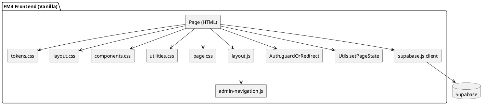

# UI/UX Golden Standard — Pattern Library

**Last Updated**: 2026-02-21 (deduplicado con MASTER.md)
**Reference Files**: `pages/admin/admin-central-stock.html`, `pages/admin/admin-solicitudes.html`

---

## Overview

Este documento define los **patrones HTML/JS de referencia** para componentes de UI. Para **tokens de diseño** (colores, tipografía, spacing, z-index, motion), consultar [`master-design-spec.md`](../01-design-system/master-design-spec.md).

---

## Admin Layout Foundation (Critical — `components.css`)

These styles live in `components.css` as the **single source of truth**. Page-specific CSS files must NOT redefine them.

### Topbar

- **Class**: `.topbar`
- **Position**: `fixed`, top: 0, full width, z-index: 100
- **Height**: `var(--topbar-height)` → **56px** (defined in `tokens.css`)
- **Padding**: `0 24px`
- **Background**: `#000` (pure black)
- **Layout**: `display: grid; grid-template-columns: 1fr auto 1fr`
- **Children**: `.topbar-start` (breadcrumb), `.topbar-center` (search), `.topbar-end` (notifications + avatar)

### Page Shell

- **Class**: `.page-shell`
- **Usage**: `<main>` element, top-level container for page content below topbar.
- **Margin-top**: `var(--topbar-height)` — pushes content below fixed topbar
- **Padding**: `0 100px` — wider margins for content area
- **Min-height**: `calc(100vh - var(--topbar-height))`
- **Max-width**: `1440px` (centered via auto margins)
- **Background**: `var(--bg-body)` → `#000`

### Breadcrumb

- **Classes**: `.breadcrumb`, `.breadcrumb-item`, `.breadcrumb-link`, `.breadcrumb-sep`
- **Style**: uppercase, 11px, letter-spacing 0.1em
- **Pattern**: `ADMINISTRACIÓN / CURRENT` — link for parent, plain for current

### Topbar Dropdowns (Notifications + User Menu)

- **Container**: `.dropdown-container` (position: relative)
- **Bell**: `.icon-btn` > `.icon-notification` + `.notification-badge`
- **Avatar**: `.avatar.avatar-sm` (32px, purple-500)
- **Menu**: `.dropdown-container .dropdown-menu` (absolute, #1a1a1a, border-radius 8px)
- **States**: `.dropdown-menu.hidden` (opacity 0, pointer-events none)

> ⚠️ **Anti-Pattern**: Do NOT redefine `.topbar`, `.page-shell`, `.breadcrumb`, `.icon-btn`, `.avatar`, or `.dropdown-container` in page-specific CSS files. Only add page-specific overrides with higher specificity (e.g., `.cms-members .topbar .breadcrumb { gap: 6px }`).

---

## Component Patterns

### 1. Dashboard Header with Tabs

**Usage**: Page titles with action buttons and tab navigation

```html
<div class="dashboard-header align-start">
  <div>
    <h2 class="dashboard-title dashboard-title-soft">Gestión de Inventario</h2>
    <p class="dashboard-subtitle dashboard-subtitle-soft">
      Control de stock, SKUs y análisis de consumo
    </p>
  </div>
  <div class="actions-bar">
    <div class="tab-bar" id="main-tabs">
      <button class="tab-chip active" data-tab="stock">Stock</button>
      <button class="tab-chip" data-tab="recetas">Recetas</button>
      <button class="tab-chip" data-tab="rentabilidad">Rentabilidad</button>
    </div>
    <button
      class="btn-icon btn-icon-flat btn-icon-plus"
      id="btn-new"
      aria-label="Nuevo"
    >
      +
    </button>
  </div>
</div>
```

**CSS Classes**:

- `.dashboard-header` - Container for page header
- `.align-start` - Aligns items to start (top)
- `.dashboard-title-soft` - Softer title styling
- `.dashboard-subtitle-soft` - Subtle subtitle
- `.actions-bar` - Container for buttons and tabs
- `.tab-bar` - Tab container
- `.tab-chip` - Individual tab button
- `.active` - Active tab state

---

### 2. Summary Metrics Cards

**Usage**: Display key performance indicators at the top of the page

```html
<div class="summary-metrics-container">
  <div class="summary-metrics-grid">
    <div class="summary-metric-card">
      <div class="summary-metric-label">Total Valorizado</div>
      <div class="summary-metric-value summary-metric-primary">
        $1.208.829,01
      </div>
    </div>
    <div class="summary-metric-card">
      <div class="summary-metric-label">Stock Activo</div>
      <div class="summary-metric-value summary-metric-success">$784.344,01</div>
    </div>
    <div class="summary-metric-card">
      <div class="summary-metric-label">Stock Inactivo</div>
      <div class="summary-metric-value summary-metric-tertiary">
        $424.485,00
      </div>
    </div>
  </div>
</div>
```

**CSS Classes**:

- `.summary-metrics-container` - Outer wrapper
- `.summary-metrics-grid` - 3-column grid layout
- `.summary-metric-card` - Individual metric card
- `.summary-metric-label` - Small uppercase label
- `.summary-metric-value` - Large number display
- `.summary-metric-primary` - Purple accent (var(--purple-400))
- `.summary-metric-success` - White accent
- `.summary-metric-tertiary` - Gray accent

---

### 3. Sidebar Filter Panel

**Usage**: Collapsible sidebar with filters and controls

```html
<aside class="sidebar-filters">
  <h4 class="sidebar-section-title">Filtros</h4>

  <!-- Date Range -->
  <div class="date-range-inline">
    <input type="date" id="filter-date-start" class="input" />
    <span class="date-separator">-</span>
    <input type="date" id="filter-date-end" class="input" />
  </div>

  <!-- Aforo -->
  <div class="aforo-row">
    <input type="number" id="people-count" class="input" value="500" />
    <span class="aforo-label">personas</span>
    <span class="tooltip-trigger" data-tooltip="Descripción">?</span>
  </div>

  <!-- Section with border -->
  <div class="sidebar-section">
    <h4 class="sidebar-section-title">Importar</h4>
    <!-- Content -->
  </div>
</aside>
```

**CSS Classes**:

- `.sidebar-filters` - Main sidebar container
- `.sidebar-section-title` - Small uppercase section header
- `.sidebar-section` - Section with top border and spacing
- `.date-range-inline` - Inline date picker row
- `.aforo-row` - Compact number input with label
- `.tooltip-trigger` - Question mark icon with tooltip

---

### 4. Chart Section with KPIs

**Usage**: Chart display with dropdown selector and KPI cards

```html
<div class="chart-section">
  <div class="chart-header">
    <div class="custom-dropdown" id="chart-mode-dropdown">
      <div class="custom-dropdown-trigger">
        <span class="custom-dropdown-text">Consumo vs Recaudación</span>
        <svg class="custom-dropdown-icon" viewBox="0 0 24 24">
          <polyline points="6 9 12 15 18 9"></polyline>
        </svg>
      </div>
      <div class="custom-dropdown-menu">
        <div class="custom-dropdown-option" data-value="option1">Opción 1</div>
        <div class="custom-dropdown-option" data-value="option2">Opción 2</div>
      </div>
    </div>
  </div>

  <div class="chart-kpis-grid">
    <div class="chart-kpi-card">
      <div class="chart-kpi-label-row">
        <p class="chart-kpi-label">Costo Consumo</p>
        <span class="chart-kpi-trend trend-up">+2442.8%</span>
      </div>
      <p class="chart-kpi-value chart-kpi-warning">$7.399.077,54</p>
    </div>
  </div>

  <canvas id="chart" class="chart-canvas-max"></canvas>
</div>
```

**CSS Classes**:

- `.chart-section` - Chart container with gradient background
- `.chart-header` - Header with dropdown
- `.custom-dropdown` - Custom styled dropdown
- `.custom-dropdown-trigger` - Clickable dropdown button
- `.custom-dropdown-menu` - Dropdown menu container
- `.custom-dropdown-option` - Individual menu option
- `.chart-kpis-grid` - 3-column KPI grid
- `.chart-kpi-card` - Individual KPI card
- `.chart-kpi-label` - Small uppercase label
- `.chart-kpi-value` - Large number
- `.chart-kpi-warning` - Warning color (yellow)
- `.chart-kpi-success` - Success color (green)
- `.chart-kpi-trend` - Trend indicator badge

---

### 5. Filter Bar with Pills

**Usage**: Horizontal filter bar with category pills and search

```html
<div class="sku-filter-bar">
  <!-- Category Pills -->
  <div class="pill-group" id="category-pills">
    <button class="pill is-active" data-category="all">Todas</button>
    <button class="pill" data-category="bebidas">Bebidas</button>
    <button class="pill" data-category="insumos">Insumos</button>
  </div>

  <div class="filter-spacer"></div>

  <!-- Status Toggle -->
  <button class="status-toggle-btn" data-status="active">
    <span class="status-toggle-label">Activos</span>
    <span class="status-indicator status-active"></span>
  </button>

  <!-- Search -->
  <div class="search-input-wrap">
    <svg class="search-icon" viewBox="0 0 24 24">
      <circle cx="11" cy="11" r="8"></circle>
      <line x1="21" y1="21" x2="16.65" y2="16.65"></line>
    </svg>
    <input type="text" class="input search-input" placeholder="Buscar..." />
  </div>

  <!-- Counter -->
  <span class="filter-counter"> <span id="filter-count">34</span> SKUs </span>
</div>
```

**CSS Classes**:

- `.sku-filter-bar` - Main filter bar container
- `.pill-group` - Group of pill buttons
- `.pill` - Individual pill button
- `.is-active` - Active pill state (white bg, black text)
- `.filter-spacer` - Flex spacer
- `.status-toggle-btn` - Status toggle button
- `.status-indicator` - Colored dot indicator
- `.search-input-wrap` - Search input wrapper with icon
- `.filter-counter` - Results counter

---

### 6. Data Table with Sorting

**Usage**: Sortable data table with sticky header

```html
<div class="table-viewport table-shell sku-table-container">
  <div class="table-scroll">
    <table class="table table-sticky table-compact sku-table">
      <thead>
        <tr class="table-head">
          <th
            class="table-cell is-header cell-pad sortable"
            data-sort="nombre"
            tabindex="0"
          >
            Nombre <span class="sort-icon"></span>
          </th>
          <th
            class="table-cell is-header cell-pad text-right sortable"
            data-sort="stock"
            tabindex="0"
          >
            Stock <span class="sort-icon"></span>
          </th>
          <th class="table-cell is-header cell-pad text-center">Acciones</th>
        </tr>
      </thead>
      <tbody id="table-body">
        <tr data-sku-id="123">
          <td class="table-cell cell-pad">Red Bull Lata 250ml</td>
          <td class="table-cell cell-pad text-right">150</td>
          <td class="table-cell cell-pad text-center">
            <button class="btn-icon" aria-label="Editar">✎</button>
          </td>
        </tr>
      </tbody>
    </table>
  </div>
</div>
```

**CSS Classes**:

- `.table-viewport` - Outer viewport container
- `.table-shell` - Table wrapper
- `.table-scroll` - Scrollable inner container
- `.table` - Base table class
- `.table-sticky` - Sticky header behavior
- `.table-compact` - Reduced padding variant
- `.table-head` - Header row
- `.table-cell` - All table cells
- `.is-header` - Header cell styling
- `.cell-pad` - Standard padding
- `.sortable` - Sortable column
- `.sort-icon` - Sort indicator
- `.text-right` - Right-aligned text
- `.text-center` - Center-aligned text

**Advanced Guidelines for Wide Tables**:

- **Structure**: Always use `table-viewport > table-shell > table-scroll > table`.
- **Layout**: Use `table-layout: fixed` for predictable column widths.
- **Visuals**:
  - `<th>`: Background `rgba(0,0,0,0.6)` for contrast.
  - **Inactive Rows**: Apply opacity (0.5) instead of badges.
  - **Hero Cards**: Max-width ~1400px for large data grids.

---

### 7. Modal Dialog (Native `<dialog>`)

**Usage**: Modal dialogs with native HTML dialog element

```html
<dialog id="myModal" class="modal">
  <div class="modal-content modal-content-md">
    <div class="modal-header">
      <h3 class="modal-title">Modal Title</h3>
      <button class="modal-close" onclick="this.closest('dialog').close()">
        ×
      </button>
    </div>
    <div class="modal-body">
      <!-- Modal content -->
    </div>
    <div class="modal-footer">
      <button class="btn-secondary" onclick="this.closest('dialog').close()">
        Cancelar
      </button>
      <button class="btn-primary" id="btn-confirm">Confirmar</button>
    </div>
  </div>
</dialog>
```

**CSS Classes**:

- `.modal` - Applied to `<dialog>` element
- `.modal-content` - Inner content container
- `.modal-content-md` - Medium size (520px)
- `.modal-content-lg` - Large size (800px)
- `.modal-content-xl` - Extra large (900px)
- `.modal-content-imports` - Custom imports size (800px, 80vh)
- `.modal-header` - Header with title and close button
- `.modal-title` - Modal title
- `.modal-close` - Close button (×)
- `.modal-body` - Scrollable body content
- `.modal-body-imports` - Custom imports body (65vh)
- `.modal-footer` - Footer with action buttons

---

### 8. Slide Panel

**Usage**: Side panel that slides in from the right

```html
<div class="panel-overlay" id="panel-overlay"></div>
<aside class="slide-panel" id="slide-panel">
  <div class="panel-header">
    <h3 class="panel-title">Panel Title</h3>
    <button class="panel-close" id="btn-close-panel">×</button>
  </div>
  <div class="panel-body">
    <!-- Panel content -->
  </div>
  <div class="panel-footer">
    <button class="btn-secondary">Cancelar</button>
    <button class="btn-primary">Guardar</button>
  </div>
</aside>
```

**CSS Classes**:

- `.panel-overlay` - Dark backdrop overlay
- `.slide-panel` - Panel container (480px width)
- `.open` or `.active` - Open state
- `.panel-header` - Panel header
- `.panel-title` - Panel title
- `.panel-close` - Close button
- `.panel-body` - Scrollable body
- `.panel-footer` - Fixed footer with buttons

---

### 9. Button System

**Primary Button** (White bg, black text):

```html
<button class="btn-primary">Guardar</button>
```

**Secondary Button** (Transparent with border):

```html
<button class="btn-secondary">Cancelar</button>
```

**Ghost Button** (Transparent, no border):

```html
<button class="btn-ghost">Ver más</button>
```

**Icon Button** (Square with border):

```html
<button class="btn-icon btn-icon-plus" aria-label="Nuevo">+</button>
```

**Danger Button** (Red background):

```html
<button class="btn-danger">Eliminar</button>
```

---

### 10. Dropbox Upload Zone (Import Pattern)

**Usage**: File upload drag-and-drop zones within sidebar (replaces modal-based import)

```html
<div class="sidebar-section">
  <h4 class="sidebar-section-title">Importar</h4>
  <div class="dropbox-grid-2">
    <div class="dropbox-zone" id="dropbox-consumption">
      <input
        type="file"
        id="file-consumption"
        class="hidden"
        accept=".xlsx, .xls"
      />
      <svg class="dropbox-icon" viewBox="0 0 24 24">
        <path d="M21 15v4a2 2 0 0 1-2 2H5a2 2 0 0 1-2-2v-4"></path>
        <polyline points="17 8 12 3 7 8"></polyline>
        <line x1="12" y1="3" x2="12" y2="15"></line>
      </svg>
      <span class="dropbox-title">Consumo</span>
      <span class="dropbox-subtitle">Excel/CSV</span>
    </div>
    <div class="dropbox-zone" id="dropbox-revenue">
      <input
        type="file"
        id="file-revenue"
        class="hidden"
        accept=".xlsx, .xls"
      />
      <svg class="dropbox-icon" viewBox="0 0 24 24">
        <path d="M21 15v4a2 2 0 0 1-2 2H5a2 2 0 0 1-2-2v-4"></path>
        <polyline points="17 8 12 3 7 8"></polyline>
        <line x1="12" y1="3" x2="12" y2="15"></line>
      </svg>
      <span class="dropbox-title">Recaudación</span>
      <span class="dropbox-subtitle">Excel/CSV</span>
    </div>
  </div>
</div>
```

**CSS Classes**:

- `.dropbox-grid-2` - 2-column grid for dropboxes
- `.dropbox-zone` - Upload zone container
- `.dropbox-icon` - Upload icon (SVG)
- `.dropbox-title` - Zone label
- `.dropbox-subtitle` - Subtitle text (e.g., "Excel/CSV")
- `.is-dragover` - State when dragging file over
- `.dropbox-file-selected` - State when file is selected

**Best Practice**:

- Place dropboxes in sidebar sections rather than modals for better UX
- Use `.sidebar-section` wrapper with `.sidebar-section-title` for consistency
- Dropboxes trigger immediate processing callbacks via `setupDropbox()` JS helper

---

### 11. Tab Content Pattern - Recipes (Recetas)

**Usage**: Tab content with sidebar filters, stats, and data table

```html
<div class="tab-content" data-tab="recetas">
  <div class="grid-sidebar-main">
    <!-- Sidebar with filters and collapsible stats -->
    <aside class="sidebar-filters">
      <h4 class="sidebar-section-title">Filtros</h4>
      <div class="sidebar-actions">
        <button class="btn-secondary btn-sm">Limpiar</button>
        <button class="btn-primary btn-sm">Aplicar</button>
      </div>

      <!-- Collapsible Stats -->
      <div class="sidebar-section">
        <div class="stats-header" id="stats-toggle">
          <h4 class="sidebar-section-title">Estadísticas</h4>
          <svg class="toggle-icon" viewBox="0 0 24 24">
            <polyline points="6 9 12 15 18 9"></polyline>
          </svg>
        </div>
        <div class="stats-body" id="stats-body">
          <div class="stats-compact">
            <div class="stat-item">
              <span class="stat-label">Total Recetas</span>
              <span class="stat-value">124</span>
            </div>
            <div class="stat-item">
              <span class="stat-label">Activas</span>
              <span class="stat-value">98</span>
            </div>
          </div>
        </div>
      </div>
    </aside>

    <!-- Main content with table -->
    <div class="main-content-area">
      <div class="table-viewport table-shell">
        <div class="table-scroll">
          <table
            class="table table-sticky table-compact"
            role="table"
            aria-label="Tabla de recetas"
          >
            <thead>
              <tr role="row">
                <th
                  class="table-cell is-header cell-pad"
                  role="columnheader"
                  scope="col"
                >
                  Nombre
                </th>
                <th
                  class="table-cell is-header cell-pad text-right"
                  role="columnheader"
                  scope="col"
                >
                  Ingredientes
                </th>
                <th
                  class="table-cell is-header cell-pad text-center"
                  role="columnheader"
                  scope="col"
                >
                  Acciones
                </th>
              </tr>
            </thead>
            <tbody id="recipes-table-body">
              <!-- Dynamic rows -->
            </tbody>
          </table>
        </div>
      </div>
    </div>
  </div>
</div>
```

**Key Classes**:

- `.grid-sidebar-main` - Sidebar + main grid layout
- `.sidebar-filters` - Sidebar container
- `.sidebar-actions` - Button group in sidebar
- `.stats-header` - Collapsible stats header
- `.toggle-icon` - Chevron icon for collapse/expand
- `.stats-body` - Collapsible stats content
- `.stats-compact` - Compact stats list
- `.stat-item`, `.stat-label`, `.stat-value` - Stat components
- `.table table-sticky table-compact` - Consistent table pattern
- ARIA roles: `role="table"`, `role="row"`, `role="columnheader"`, `scope="col"`

---

### 12. Tab Content Pattern - Profitability (Rentabilidad)

**Usage**: Tab content with summary metrics, filter bar, and data table

```html
<div class="tab-content active" data-tab="rentabilidad">
  <!-- Summary Metrics -->
  <div class="summary-metrics-container">
    <div class="summary-metrics-grid">
      <div class="summary-metric-card">
        <div class="summary-metric-label">Recaudación Total</div>
        <div class="summary-metric-value summary-metric-success">
          $2.450.320
        </div>
      </div>
      <div class="summary-metric-card">
        <div class="summary-metric-label">Costo Total</div>
        <div class="summary-metric-value summary-metric-warning">$980.450</div>
      </div>
      <div class="summary-metric-card">
        <div class="summary-metric-label">Margen Neto</div>
        <div class="summary-metric-value summary-metric-primary">60%</div>
      </div>
    </div>
  </div>

  <!-- Filter Bar with Search -->
  <div class="sku-filter-bar">
    <div class="search-input-wrap">
      <svg class="search-icon" viewBox="0 0 24 24">
        <circle cx="11" cy="11" r="8"></circle>
        <line x1="21" y1="21" x2="16.65" y2="16.65"></line>
      </svg>
      <input
        type="text"
        class="input search-input"
        placeholder="Buscar receta..."
      />
    </div>

    <select class="rentability-select" id="filter-recipe-category">
      <option value="">Todas las categorías</option>
      <option value="tragos">Tragos</option>
      <option value="comida">Comida</option>
    </select>

    <div class="filter-spacer"></div>

    <span class="filter-counter">
      <span id="recipe-count">45</span> recetas
    </span>
  </div>

  <!-- Data Table -->
  <div class="table-viewport table-shell">
    <div class="table-scroll">
      <table
        class="table table-sticky table-compact"
        role="table"
        aria-label="Tabla de rentabilidad"
      >
        <thead>
          <tr role="row">
            <th
              class="table-cell is-header cell-pad"
              role="columnheader"
              scope="col"
            >
              Receta
            </th>
            <th
              class="table-cell is-header cell-pad text-right"
              role="columnheader"
              scope="col"
            >
              Precio Venta
            </th>
            <th
              class="table-cell is-header cell-pad text-right"
              role="columnheader"
              scope="col"
            >
              Costo
            </th>
            <th
              class="table-cell is-header cell-pad text-right"
              role="columnheader"
              scope="col"
            >
              Margen %
            </th>
          </tr>
        </thead>
        <tbody id="profitability-table-body">
          <!-- Dynamic rows -->
        </tbody>
      </table>
    </div>
  </div>
</div>
```

**Key Classes**:

- `.summary-metrics-container` / `.summary-metrics-grid` - Top metrics section
- `.summary-metric-card`, `.summary-metric-label`, `.summary-metric-value` - Metric components
- `.summary-metric-primary` / `.summary-metric-success` / `.summary-metric-warning` - Color variants
- `.sku-filter-bar` - Horizontal filter bar
- `.search-input-wrap` + `.search-icon` - Search with icon
- `.rentability-select` - Custom select for rentability tab (compact, 32px height)
- `.filter-spacer` - Flex spacer to push counter right
- `.filter-counter` - Results counter
- ARIA roles for table accessibility

**Pattern Notes**:

- Rentabilidad tab uses summary metrics at top (not sidebar stats)
- Filter bar uses search + select + counter pattern
- Table follows same `.table-sticky table-compact` pattern as other tabs

---

## Utility Classes

### Visibility

```css
.u-hidden       /* display: none !important */
.u-visible      /* display: block !important */
```

### Spacing

```css
.form-group-spaced-top    /* margin-top: 24px */
```

### Text Alignment

```css
.text-center              /* text-align: center */
.text-right               /* text-align: right */
.text-center-muted        /* center + tertiary color */
.table-cell-center-muted  /* for table cells */
```

### Layout

```css
.grid-sidebar-main        /* Sidebar (280px) + main (1fr) */
.filter-spacer            /* flex: 1 spacer */
```

---

## Architectural Patterns by Role

### 1. Managers (Encargados)

- **Pattern**: Master-Detail + Real-time Status Pills
- **Goal**: "Eyes on venue, hands on app" (High visibility)
- **Modules**: `barra-personal`, `caja-noche`, `recepcion`

### 2. Operations (Operativo ERP)

- **Pattern**: View-based Architecture (`vw_stock_global`)
- **Goal**: Decouple UI from inventory calculations
- **Modules**: `stock`, `solicitudes`, `análisis`

### 3. Staff

- **Pattern**: Wizard Step-by-Step
- **Goal**: Reduce human error with clear milestones
- **Modules**: `caja-index`, `barra-index`

---

## State Classes

Use these semantic state classes:

```css
.is-active       /* Active tab, pill, etc. */
.is-open         /* Open dropdown, menu */
.is-visible      /* Visible overlay */
.is-dragover     /* Dragging file over dropzone */
.has-file        /* Dropzone with selected file */
.active          /* Alternative to is-active */
.open            /* Alternative to is-open */
.hidden          /* Hidden element */
```

---

> **Accessibility, Motion & Responsive:** Ver [`master-design-spec.md`](../01-design-system/master-design-spec.md) §11 (Stack Guidelines), §5 (Transitions), Pre-Delivery Checklist.

---

## CSS Architecture

### File Structure

```
assets/css/
├── tokens.css              # Design tokens (colors, spacing, typography)
├── components.css          # Global reusable components + Admin Layout Foundation
│                           #   → Topbar, Breadcrumb, Page Shell, Dropdowns, Avatar
│                           #   → Buttons, Modals, Tables, Progress bars
├── admin-central-stock.css # Page-specific: Central Stock (sidebar, chart, filters)
├── admin-solicitudes.css   # Page-specific: Solicitudes (tabs, KPIs, pre-approval)
├── cms-members.css         # Page-specific: CMS Members (staff list, badges)
└── admin-workdays.css      # Page-specific: Workdays (planner layout)
```

### Consolidation Rules

| Component                  | Location          | Rationale                      |
| :------------------------- | :---------------- | :----------------------------- |
| Topbar `.topbar`           | `components.css`  | Shared across all admin pages  |
| Breadcrumb `.breadcrumb-*` | `components.css`  | Shared across all admin pages  |
| Page Shell `.page-shell`   | `components.css`  | Shared across all admin pages  |
| Dropdowns `.dropdown-*`    | `components.css`  | Shared across all admin pages  |
| Avatar `.avatar`           | `components.css`  | Shared across all admin pages  |
| Chart Section `.chart-*`   | Page-specific CSS | Only used in stock/solicitudes |
| Sidebar `.sidebar-filters` | Page-specific CSS | Layout varies per page         |

### Naming Convention

- **BEM-lite**: `component-element-modifier`
- **State classes**: `.is-*`, `.has-*`
- **Utilities**: `.u-*`
- **Modifiers**: `--variant-name`

### Specificity Rules

1. Avoid `!important` except for utility overrides
2. Use single class selectors when possible
3. Scope page-specific styles with `body.admin-shell` or page class (e.g., `.cms-members`)
4. Descendant selectors max 3 levels deep
5. **NEVER redefine** `.topbar`, `.page-shell`, `.breadcrumb` in page-specific CSS

---

## Common Patterns Quick Reference

### Grid Layout (Sidebar + Main)

```html
<div class="grid-sidebar-main">
  <aside class="sidebar-filters">...</aside>
  <div class="main-content-area">...</div>
</div>
```

### Collapsible Stats Section

```html
<div class="stats-header" id="stats-toggle">
  <h4 class="sidebar-section-title">Estadísticas</h4>
  <svg class="toggle-icon" viewBox="0 0 24 24">...</svg>
</div>
<div class="stats-body" id="stats-body">
  <div class="stats-compact">...</div>
</div>
```

### Ingredient Row (Dynamic Template)

```html
<template id="tpl-ingredient-row">
  <div class="ingredient-row">
    <select class="select input-sku">
      ...
    </select>
    <input type="number" class="input input-amount" placeholder="0.00" />
    <button class="btn-icon-flat text-error btn-remove-ing">×</button>
  </div>
</template>
```

---

---

## Technical Standards (Implementation)

Reference patterns for core module structure.

### 1. Standard HTML Anatomy (Admin Pages)

```html
<!DOCTYPE html>
<html lang="es">
  <head>
    <meta charset="UTF-8" />
    <meta name="viewport" content="width=device-width, initial-scale=1.0" />
    <title>Module Name - FormulaMid</title>
    <link rel="stylesheet" href="../../assets/css/tokens.css" />
    <link rel="stylesheet" href="../../assets/css/components.css" />
    <link rel="stylesheet" href="../../assets/css/admin-page-specific.css" />
  </head>
  <body class="admin-shell admin-scroll" data-allowed-roles="admin,contable">
    <!-- Topbar — 3-column grid from components.css -->
    <header class="topbar">
      <div class="topbar-start">
        <nav class="breadcrumb">
          <span class="breadcrumb-item">
            <a class="breadcrumb-link" href="admin-index.html"
              >Administración</a
            >
          </span>
          <span class="breadcrumb-sep">/</span>
          <span class="breadcrumb-item current">Módulo</span>
        </nav>
      </div>
      <div class="topbar-center">
        <div class="header-search">
          <svg class="header-search-icon" viewBox="0 0 24 24">
            <circle cx="11" cy="11" r="8"></circle>
            <line x1="21" y1="21" x2="16.65" y2="16.65"></line>
          </svg>
          <input type="text" class="input" placeholder="Buscar..." />
          <span class="header-shortcut">⌘K</span>
        </div>
      </div>
      <div class="topbar-end">
        <div class="dropdown-container">
          <button class="icon-btn" id="btn-notifications">
            <svg class="icon-notification" viewBox="0 0 24 24">
              <path d="M18 8A6 6 0 0 0 6 8c0 7-3 9-3 9h18s-3-2-3-9"></path>
              <path d="M13.73 21a2 2 0 0 1-3.46 0"></path>
            </svg>
            <span class="notification-badge">3</span>
          </button>
          <div class="dropdown-menu dropdown-notifications hidden">...</div>
        </div>
        <div class="dropdown-container">
          <div class="avatar avatar-sm">MC</div>
          <div class="dropdown-menu dropdown-user hidden">...</div>
        </div>
      </div>
    </header>

    <!-- Main Content -->
    <main class="page-shell" role="main">
      <div class="page-card-wrap">
        <div class="page-card overflow-visible">
          <!-- Loading State -->
          <div id="page-card-loading" class="page-card-loading is-visible">
            <div class="state-spinner"></div>
          </div>
          <!-- Empty State -->
          <div id="page-card-empty" class="page-card-empty">...</div>
          <!-- Content -->
          <div id="module-content" class="hidden">...</div>
        </div>
      </div>
    </main>

    <!-- Dependencies -->
    <script src="../../assets/js/core/supabase-init.js"></script>
    <script defer src="../../assets/js/core/auth.js"></script>
    <script defer src="../../assets/js/core/navigation.js"></script>
    <script defer src="../../assets/js/modules/admin/admin-modulo.js"></script>
  </body>
</html>
```

### 2. Standard JavaScript Pattern

All modules MUST use this IIFE async skeleton with defensive DOM grouping.

```javascript
/* Module: admin-modulo.js */
(async function () {
  "use strict";

  // 1. Auth Guard
  const session = await window.Auth.guardOrRedirect(["admin", "contable"]);
  if (!session) return;

  const PAGE_KEY = "admin-modulo";

  // 2. DOM Elements (Grouped in 'ui')
  const ui = {
    listContainer: document.getElementById("list-container"),
    searchInput: document.getElementById("search-input"),
    pageCardLoading: document.getElementById("page-card-loading"),
    pageCardEmpty: document.getElementById("page-card-empty"),
    contentWrap: document.getElementById("module-content"),
  };

  // Validation
  if (!window.Utils.assertSbOrShowBlockingError(ui.listContainer)) return;

  // 3. State
  const savedState = window.NavState ? window.NavState.restore(PAGE_KEY) : {};
  let state = {
    dataList: [],
    searchTerm: savedState.searchTerm || "",
  };

  // 4. Render
  function renderList(data) {
    if (!ui.listContainer) return;
    // ... render logic
  }

  function setPageState({ loading = false, empty = false } = {}) {
    ui.pageCardLoading?.classList.toggle("is-visible", loading);
    ui.pageCardEmpty?.classList.toggle("is-visible", empty);
    ui.contentWrap?.classList.toggle("hidden", loading || empty);
  }

  // 5. Data Fetching
  async function loadData() {
    setPageState({ loading: true });
    try {
      const { data, error } = await window.sb.from("table").select("*");
      if (error) throw error;
      state.dataList = data || [];

      if (state.dataList.length === 0) setPageState({ empty: true });
      else renderList(state.dataList);
    } catch (e) {
      console.error(e);
      window.Toast.error("Error cargando datos");
    } finally {
      ui.pageCardLoading?.classList.remove("is-visible");
    }
  }

  // 6. Init
  loadData();
})();
```

### 3. Dashboard Landing Pattern

For role-based landing pages (`admin-index`).

- **Header**: Glass effect, personalized welcome + Live KPIs.
- **Segmented Nav**: `.segmented-control` > `.segment-btn`.
- **Module Grid**: `.module-grid` > `.module-column` > `.module-card`.

---

## Implementation Checklist

When creating a new page, ensure:

- [ ] Zero inline styles
- [ ] Uses design tokens from tokens.css
- [ ] Follows component patterns from this guide
- [ ] Accessible (keyboard nav, ARIA labels)
- [ ] Responsive (tests on 768px, 1024px, 1920px)
- [ ] Consistent button styles
- [ ] Proper focus indicators
- [ ] Semantic HTML structure
- [ ] Loading and empty states
- [ ] Error handling UI

---

## Migration Guide

To apply golden standard to an existing page:

1. **Audit inline styles**: Search for `style="` in HTML
2. **Create semantic classes**: Define in page-specific CSS
3. **Replace inline styles**: Apply new classes
4. **Adopt header pattern**: Replace page header with dashboard-header
5. **Standardize buttons**: Update to btn-primary/secondary/ghost
6. **Apply table pattern**: Use table-sticky for data tables
7. **Update modals**: Use native `<dialog>` with modal-content classes
8. **Test thoroughly**: Visual regression and interaction testing

---

## Implementation History

| Phase   | Date       | Summary                                                                                                    |
| ------- | ---------- | ---------------------------------------------------------------------------------------------------------- |
| Phase 2 | 2026-02-04 | Tab consistency (sidebar → sidebar-filters, stat-card → summary-metric, filter-bar → sku-filter-bar) |
| Phase 4 | 2026-02-05 | CSS architecture cleanup (FASE sections in admin-central-stock.css)                                        |
| Phase 5 | 2026-02-05 | Accessibility & responsive testing (WCAG AA, 4 breakpoints verified)                                       |
| Phase 6 | 2026-02-07 | Topbar/Breadcrumb/Dropdown consolidated to components.css                                                  |
| Dedup   | 2026-02-21 | Tokens, accessibility, animation sections moved to MASTER.md                                               |

The following standardizations were applied in Phase 2 to ensure all tabs follow the golden standard:

### Fixed Issues

1. **Duplicate `chartModal` dialog** - Removed duplicate modal declaration (kept semantic structure with modal-header)
2. **Tab Recetas sidebar** - Migrated from `card flex-col gap-4` to `sidebar-filters` pattern with proper sections
3. **Tab Recetas table** - Migrated from `data-table` to `table table-sticky table-compact` with full ARIA roles
4. **Tab Rentabilidad stats** - Migrated from `stat-card`/`stat-label`/`stat-value` to `summary-metric-*` pattern
5. **Tab Rentabilidad filter bar** - Migrated from `filter-bar filter-bar-compact` to `sku-filter-bar` with search icon
6. **Import modal removed** - Replaced with sidebar dropbox pattern (better UX, contextual)

### CSS Cleanup

- Removed duplicate declarations: `.grid-sidebar-main`, `.modal-content-lg`, `.modal-content-md`, `.icon-notification`, `.dropbox-icon`, `.dropbox-title`
- Removed unused utilities: `.sidebar-card-recipes`, `.text-tertiary`, `.font-semibold`, `.font-bold`, `.text-uppercase-tracking`, `.flex-justify-between`, `.border-t`, `.pt-4`, `.avatar-sm`, `.text-sm-tertiary`, `.flex-between-center`, `.flex-gap-2`, `.input-sku-select`, `.input-amount-sm`
- Added new styles: `.rentability-select`, `.chart-modal-hint`
- Fixed broken comment at line ~1840

### Consistency Audit Checklist

Use this checklist when reviewing or creating tabs:

**Sidebar Pattern** (when applicable):

- [ ] Uses `.sidebar-filters` as container
- [ ] Section titles use `.sidebar-section-title`
- [ ] Sections use `.sidebar-section` wrapper with border
- [ ] Stats use `.stats-compact` with `.stat-item` / `.stat-label` / `.stat-value`
- [ ] Collapsible sections use `.stats-header` with `.toggle-icon` chevron

**Summary Metrics Pattern** (when applicable):

- [ ] Uses `.summary-metrics-container` wrapper
- [ ] Grid uses `.summary-metrics-grid`
- [ ] Cards use `.summary-metric-card`
- [ ] Labels use `.summary-metric-label`
- [ ] Values use `.summary-metric-value` with color variant

**Filter Bar Pattern**:

- [ ] Uses `.sku-filter-bar` container
- [ ] Search uses `.search-input-wrap` with `.search-icon` SVG
- [ ] Spacing uses `.filter-spacer` (not manual margins)
- [ ] Counter uses `.filter-counter` with nested `<span id="count">`
- [ ] Pills use `.pill-group` with `.pill` buttons

**Data Table Pattern**:

- [ ] Wrapper uses `.table-viewport .table-shell`
- [ ] Scroll container uses `.table-scroll`
- [ ] Table uses `.table .table-sticky .table-compact`
- [ ] ARIA roles: `role="table"`, `role="row"`, `role="columnheader"`, `scope="col"`
- [ ] Headers use `.table-cell .is-header .cell-pad`
- [ ] Sortable columns use `.sortable` with `.sort-icon`
- [ ] Text alignment uses `.text-right` / `.text-center` on `<th>` and `<td>`

**Modal Pattern**:

- [ ] Uses native `<dialog>` element with `.modal` class
- [ ] Content uses `.modal-content` with size variant (`.modal-content-md`, `.modal-content-lg`, etc.)
- [ ] Header uses `.modal-header` wrapper with `.modal-title` and `.modal-close` button
- [ ] Body uses `.modal-body` (scrollable)
- [ ] Footer uses `.modal-footer` with `.btn-secondary` and `.btn-primary`

---

## Phase 4: CSS Architecture Cleanup (Complete)

**Completed**: 2026-02-05

The CSS in `admin-central-stock.css` (formerly `admin-herramientas.css`) is organized into FASE sections.

> **Note**: Topbar, Breadcrumb, Page Shell, Dropdowns, and Avatar were **consolidated to `components.css`** in Phase 6 (2026-02-07). See "Admin Layout Foundation" section above.

### Benefits

- **Maintainability**: Each section is clearly labeled with `/* =========... FASE N: Title ...========= */` headers
- **Discoverability**: Easy to find styles for specific components
- **Scalability**: New styles can be added to appropriate sections
- **Consistency**: All 10 areas follow the same organizational pattern

### Unique Component Patterns

These components are specific to `admin-herramientas` and extend the global Golden Standard:

| Component           | Classes                                                                                                                         | FASE |
| :------------------ | :------------------------------------------------------------------------------------------------------------------------------ | :--- |
| **Tab System**      | `.tab-bar`, `.tab-chip`, `.tab-chip.active`                                                                                     | 7    |
| **Custom Dropdown** | `.custom-dropdown`, `.custom-dropdown-trigger`, `.custom-dropdown-menu`, `.custom-dropdown-option`                              | 1    |
| **Summary Metrics** | `.summary-metrics-container`, `.summary-metrics-grid`, `.summary-metric-card`, `.summary-metric-label`, `.summary-metric-value` | 1    |
| **Status Toggle**   | `.status-toggle-btn`, `.status-toggle-label`, `.status-indicator`                                                               | 4    |
| **Dropbox Zones**   | `.dropbox-zone`, `.dropbox-grid-2`, `.dropbox-icon`, `.dropbox-title`, `.dropbox-subtitle`                                      | 10+  |

---

## Phase 5: Accessibility & Responsive Testing (Complete)

**Completed**: 2026-02-05

### Accessibility Fixes Applied

| Fix                    | Status | Details                                                                |
| :--------------------- | :----: | :--------------------------------------------------------------------- |
| **Heading Hierarchy**  |  ✅   | H4→H3 for Filtros, Importar, Estadísticas (proper H2→H3 sequence) |
| **Date Inputs ARIA**   |  ✅   | `aria-label="Fecha de inicio"` / `aria-label="Fecha de fin"`           |
| **Aforo Input ARIA**   |  ✅   | `aria-label="Número de personas (aforo)"`                             |
| **Semantic Landmarks** |  ✅   | Proper use of `<main>`, `<nav>`, `<aside>`                             |
| **Table Semantics**    |  ✅   | All tables use `<thead>`, `<th>`, `role="columnheader"`                |
| **Focus Indicators**   |  ✅   | Visible focus states on all interactive elements                       |

### Responsive Breakpoints Verified

| Breakpoint  | Resolution | Status | Layout Behavior                 |
| :---------- | :--------- | :----: | :------------------------------ |
| **Desktop** | 1920×1080 |  ✅   | Full sidebar + main content     |
| **Laptop**  | 1366×768  |  ✅   | Layout adapts proportionally    |
| **Tablet**  | 1024×768  |  ✅   | Grid collapses to single column |
| **Mobile**  | 768×1024  |  ✅   | Sidebar stacks, pills wrap      |

---

## Resources

- **Reference Implementation**: [admin-central-stock.html](../../pages/admin/admin-central-stock.html)
- **CSS Source**: [admin-central-stock.css](../../assets/css/admin-central-stock.css)
- **Design Tokens**: [tokens.css](../../assets/css/tokens.css)
- **Global Components**: [components.css](../../assets/css/components.css) — includes Admin Layout Foundation

---

**Last Verified**: 2026-02-07
**Zero Inline CSS**: ✅ Confirmed
**Accessibility**: ✅ WCAG AA Compliant
**CSS Consolidation**: ✅ Topbar/Breadcrumb/Dropdown in components.css

---

## Layout Standardization Spec

## Background

El proyecto tiene **44 pantallas** y **5 roles**. Sin una base común de layouts, aumenta el costo de diseño/desarrollo, se multiplican inconsistencias visuales y se vuelve más difícil mantener accesibilidad, responsive y QA. Esta especificación busca **estandarizar layouts** para acelerar la entrega, reducir retrabajo y hacer el producto más coherente para los usuarios.

## Requirements

### Must (imprescindible)

- **Sistema de layout base**: grid (columnas), breakpoints, espaciados, contenedores y reglas de alineación (p. ej., `Container`, `Stack`, `Grid`, `Section`).
- **Tokens de diseño**: escala de spacing, tipografías, tamaños, radios, sombras, z-index y colores (modo claro/oscuro si aplica).
- **Templates de pantalla**: 3–6 plantillas reutilizables (p. ej. `AppShell + Sidebar`, `TopNav`, `Master-Detail`, `Form Wizard`, `Dashboard`, `List+Filters`).
- **Componentes layout-aware**: encabezados de página, breadcrumbs, toolbar de acciones, panel de filtros, tablas/listas, formularios, modales, drawers.
- **Estandarización por rol**: navegación y permisos consistentes (RBAC) sin duplicar pantallas innecesariamente.
- **Estados y vacíos**: loading/skeleton, empty states, error states, y comportamiento de overflow/scroll.
- **Accesibilidad mínima**: focus visible, orden de tab, tamaños de toque/click, contrastes, roles ARIA donde corresponda.
- **Documentación + governance**: guía de uso, “do/don’t”, checklist de revisión de UI, y proceso para introducir excepciones.

### Should (debería)

- **Guías de responsive**: reglas claras para reflow (p. ej., cuándo colapsar sidebar, cómo apilar filtros, truncado/line-clamp).
- **Soporte i18n**: layouts tolerantes a textos largos, monedas/fechas.
- **Herramientas de control**: linters/CI para tokens, convenciones de naming y verificación de uso de componentes.

### Could (podría)

- **Theming multi-marca** (si hay white-label).
- **Catálogo interactivo** (Storybook / equivalente) con ejemplos por template.

### Won’t (por ahora)

- Pixel-perfect por pantalla sin usar templates (se acepta solo como excepción documentada).

## Method

### 1) Estándar de “Layout System” (CSS-first)

**Objetivo:** que las 45 pantallas se construyan con el mismo set de piezas, evitando CSS “por pantalla”.

**Capas (recomendado con CSS Layers):**

1. **tokens.css** (Design Tokens): variables CSS en `:root`.
2. **reset.css** / base tipográfica.
3. **layout.css** (primitives): container, grid, stack, sidebar, header, footer, panels.
4. **components.css** (UI reutilizable): buttons, inputs, table, card, modal, toast, tabs.
5. **pages/\*.css** (excepciones justificadas): reglas mínimas y siempre “encima”.

> Esto encaja con lo que ya tienen (tokens.css + components.css + módulos), pero agrega **layout.css** como contrato común + orden fijo de carga.

### 2) Design Tokens mínimos (contrato)

#### Auditoría rápida del CSS que pegaste (riesgos de inconsistencia)

En tu snippet ya hay una base fuerte, pero hoy está “mezclado” (tokens + componentes + layout + utilidades) y aparecen varios **tokens referenciados que no están definidos** y **duplicaciones**:

- Variables usadas pero no definidas en `:root`: `--input-font`, `--input-fs`, `--input-lh`, `--input-h`, `--fs-lg`, `--lh-relaxed`, `--z-sticky`, `--z-panel`, `--z-toast`, `--z-dropdown`, `--topbar-h`, `--space-lg`, `--space-md`, `--space-sm`, `--space-xs`, `--radius-*`, `--control-h(-sm)`, `--transition-*`, `--accent-info-bg`, `--white-alpha-05`, `--white-alpha-10`, `--border-active`, `--shadow-*`, `--neutral-*`, `--purple-500`, `--yellow-400`.
- **Inconsistencia de naming**: definís `--topbar-height` pero usás `--topbar-h`; `--container-width` ok, pero `--space-*` a veces numérico (`--space-6`) y a veces semántico (`--space-lg`).
- **Conflictos por duplicación de clases**: `.card` y `.toast` aparecen **dos veces** con definiciones distintas (la última gana, y eso rompe coherencia entre pantallas).

#### Refactor recomendado (sin frameworks, compatible con tu estructura)

1. **Unificar naming de tokens** (elegir 1 estilo):
   - Opción A (recomendada): **numérico** tipo `--space-1/2/3/4/6/8...` y crear aliases semánticos opcionales (`--space-sm: var(--space-2)` etc.).
   - Estandarizar: `--topbar-h` (y eliminar `--topbar-height`) o viceversa.
2. **Definir el set mínimo faltante** (para evitar “variables huérfanas”):
   - Tipos: `--fs-*`, `--lh-*`, `--fw-*`.
   - Radios: `--radius-sm/md/lg/full`.
   - Z: `--z-header`, `--z-dropdown`, `--z-modal`, `--z-toast`, `--z-overlay`.
   - Transiciones: `--transition-fast/base`.
   - Sombras: `--shadow-soft/md/lg`.
   - Alphas: `--white-alpha-05/10`.
3. **Separar por capas** para que no haya colisiones:
   - `tokens.css` (solo variables)
   - `layout.css` (solo `.l-*`)
   - `components.css` (solo `.c-*`)
   - `utilities.css` (solo `.u-*`)
   - `pages/*.css` (solo excepciones)
4. **Renombrar clases a prefijos** (cambia poco HTML, pero ordena muchísimo):
   - Layout: `.l-container`, `.l-shell`, `.l-grid`, `.l-stack`
   - Componentes: `.c-card`, `.c-toast`, `.c-table`, `.c-input`, `.c-topbar`
   - Estados: `.is-loading`, `.is-open`, `.is-disabled`
5. **Regla anti-duplicación**: una clase base, un lugar. Si querés variantes, usar modificadores:
   - `.c-card` + `.c-card--transparent`
   - `.c-toast` + `.c-toast--success`

**Tokens obligatorios** (todos en `:root`):

- Spacing scale: `--s0, --s1, --s2...` (ej. 0/4/8/12/16/24/32/48)
- Tipografía: `--font-sans`, `--fs-1..`, `--lh-1..`
- Radios: `--r1..`
- Elevación: `--shadow-1..`
- Colores semánticos: `--c-bg`, `--c-surface`, `--c-text`, `--c-muted`, `--c-primary`, `--c-danger`, etc.
- Z-index: `--z-header`, `--z-modal`, `--z-toast`
- Layout: `--container-max`, `--sidebar-w`, `--header-h`, `--safe-bottom` (para móviles)

**Tokens obligatorios** (todos en `:root`):

- Spacing scale: `--s0, --s1, --s2...` (ej. 0/4/8/12/16/24/32/48)
- Tipografía: `--font-sans`, `--fs-1..`, `--lh-1..`
- Radios: `--r1..`
- Elevación: `--shadow-1..`
- Colores semánticos: `--c-bg`, `--c-surface`, `--c-text`, `--c-muted`, `--c-primary`, `--c-danger`, etc.
- Z-index: `--z-header`, `--z-modal`, `--z-toast`
- Layout: `--container-max`, `--sidebar-w`, `--header-h`, `--safe-bottom` (para móviles)

### 3) Breakpoints (alineado al uso real)

- **Admin (desktop-first):** optimizar para ≥ 1024px; mantener degradación aceptable a 768px.
- **Staff/Encargados (mobile-first):** optimizar 360–430px; soportar landscape.

Recomendación: definir breakpoints por variable y usarlos consistentemente:

- `--bp-sm: 640px; --bp-md: 768px; --bp-lg: 1024px; --bp-xl: 1280px;`

### 4) Templates de pantalla (4 + 2 patrones)

Con tu mapa, alcanza con **4 shells** y **2 patrones** para cubrir casi todo:

**Shell A — Desktop Admin (Sidebar + Topbar)**

- Usado por: `pages/admin/*`, `pages/operativo/*` (si corre en desktop), `pages/logistica/*`, `pages/gerencia/*`.
- Estructura: sidebar fija + topbar + main con scroll interno.

**Shell B — Desktop “Data Management” (List + Filters + Detail)**

- Usado por maestros: proveedores, categorías, tarifario, nómina, pos, sku.
- Patrón: columna izquierda filtros/lista, derecha detalle/edición.

**Shell C — Mobile Operativo (Top App Bar + Content + Sticky Action Bar)**

- Usado por: `pages/encargados/*`, `pages/staff/*`, `scanner.html`.
- Patrón: header compacto + contenido scroll + acciones primarias siempre accesibles.

**Shell D — Mobile Member (Una sola acción principal)**

- Usado por: `my-qr.html`.
- Patrón: vista “hero” centrada, sin navegación compleja.

**Patrón 1 — Dashboard Tiles**

- Cards con KPIs + acciones rápidas (admin/operativo/logística/encargados).

**Patrón 2 — Wizard / Cierre (stepper)**

- Para cierres de noche (barra/caja) y workday: pasos con validación y CTA fijo.

### 5) Primitives de layout (reutilizables, sin framework)

Implementar como clases “de composición” (estilo CUBE):

- `.l-container` (máximo ancho + padding)
- `.l-stack` (apila con gap)
- `.l-cluster` (fila con wrap + gap)
- `.l-grid` (grid 12 col desktop / 4 col mobile por data-attr)
- `.l-sidebar` (sidebar + content)
- `.l-split` (dos columnas 30/70 ajustable)
- `.l-panel` (panel derecho: filtros/ayuda)

Regla clave: **las páginas no definen márgenes globales**, solo usan primitives + componentes.

### 6) Contrato HTML (para estandarizar todas las pantallas)

Todas las páginas deberían seguir un esqueleto uniforme (aunque cambie el shell):

- `body[data-context][data-shell][data-allowed-roles]`
- `header.app-header` (título, breadcrumbs, acciones)
- `nav.app-nav` (según contexto/rol)
- `main.app-main` (contenido)
- `footer.app-footer` (solo si aplica)

**Render del shell:**

- Opción simple: cada HTML incluye el mismo markup.
- Opción más mantenible: `layout.js` inyecta header/nav desde `partials/*.html` o templates string, usando tu `admin-navigation.js`/`data-go`.

### 7) Estados estándar (QA-friendly)

Basado en `window.Utils.setPageState()`:

- `loading` → skeleton
- `empty` → empty state con CTA
- `error` → mensaje + retry
- `ready` → contenido

Definir un set único de componentes: `<div class="c-state c-state--empty">…`.

### 8) RBAC y navegación consistente (sin duplicar layout)

Ya usan `data-allowed-roles + Auth.guardOrRedirect()`.
Completar el estándar:

- `navigation.config.js`: menú por `context` + flags por rol.
- `layout.js`: construye nav + resalta activo + breadcrumbs.
- Prohibición: links hardcodeados dispersos; usar `data-go="admin-solicitudes"` siempre.

### PlantUML — Componentes principales



### 9) Tools y Resources (con links)

#### Referencias de diseño (para patrones y consistencia)

- GOV.UK Design System (patrones + accesibilidad): https://design-system.service.gov.uk/
- Shopify Polaris (incluye Web Components, útil para vanilla): https://polaris-react.shopify.com/ y https://shopify.dev/docs/api/app-home/polaris-web-components
- IBM Carbon Design System (guías + componentes): https://carbondesignsystem.com/
- Material Design (layout/adaptive): https://m3.material.io/

#### CSS / arquitectura (para estandarizar sin “pelearte” con especificidad)

- CSS Cascade Layers `@layer` (para ordenar tokens/layout/components):
  - https://developer.mozilla.org/en-US/docs/Web/CSS/Reference/At-rules/%40layer
  - https://developer.mozilla.org/en-US/docs/Learn_web_development/Core/Styling_basics/Cascade_layers
- CUBE CSS (ideal si vas a `.l-` + `.c-` + `.u-` + excepciones): https://cube.fyi/
- BEM (si preferís naming por componentes): https://getbem.com/

#### Tokens (si quieren formalizar intercambio / build de tokens)

- Design Tokens Community Group (W3C CG): https://www.w3.org/community/design-tokens/
- Design Tokens Format Module (spec): https://www.designtokens.org/tr/drafts/format/
- Style Dictionary (build/generación de tokens): https://styledictionary.com/ (repo: https://github.com/style-dictionary/style-dictionary)

#### Tooling recomendado (Vanilla + HTML)

**Dev/build**

- Vite (dev server + build): https://vite.dev/
- PostCSS (plugins como autoprefixer, etc.): https://postcss.org/
- Lightning CSS (minify/transform rápido, opcional): https://lightningcss.dev/ (npm: https://www.npmjs.com/package/lightningcss)

**Calidad de código**

- Stylelint (CSS): https://stylelint.io/ (VS Code: https://marketplace.visualstudio.com/items?itemName=stylelint.vscode-stylelint)
- ESLint (JS): https://eslint.org/ (VS Code: https://marketplace.visualstudio.com/items?itemName=dbaeumer.vscode-eslint)
- Prettier (format): https://prettier.io/
- Lint HTML:
  - Opción moderna: ESLint HTML plugin: https://eslint.org/blog/2025/05/eslint-html-plugin/
  - Alternativa simple: HTMLHint: https://htmlhint.com/

**Testing (regresiones de layout incluidas)**

- Playwright (E2E + mobile emulation): https://playwright.dev/
- Storybook (catálogo para componentes/layouts; usar `@storybook/html`): https://storybook.js.org/docs/api/new-frameworks
- Visual regression opcional: Chromatic: https://www.chromatic.com/

**Accesibilidad / performance**

- axe-core (motor a11y): https://github.com/dequelabs/axe-core
- axe DevTools (extensión): https://chromewebstore.google.com/detail/axe-devtools-web-accessib/lhdoppojpmngadmnindnejefpokejbdd
- Pa11y (CI a11y): https://pa11y.org/
- Lighthouse (perf/a11y): https://developer.chrome.com/docs/lighthouse/overview

#### Opcional: Web Components como “component model” sin frameworks

- Guías MDN Web Components: https://developer.mozilla.org/en-US/docs/Web/API/Web_components

## Implementation

### Fase 0 — Inventario y clasificación (rápido)

- Crear una lista: **pantalla → template (A/B/C/D) + patrón (dashboard/wizard/list)**.
- Definir “excepciones” permitidas (máx. 1–2 por módulo).

### Fase 0.5 — Tooling (opcional pero recomendado)

Si hoy todo es “static + supabase” igual podés agregar tooling sin cambiar runtime.

**Dependencias sugeridas (Node):**

- Lint/format: ESLint + Prettier + Stylelint + (HTML lint opcional)
- Tests: Playwright + axe-core (o Pa11y)
- Dev/build: Vite (opcional)

**Scripts ejemplo (package.json):**

```json
{
  "scripts": {
    "dev": "vite",
    "build": "vite build",
    "lint:js": "eslint .",
    "lint:css": "stylelint \"assets/css/**/*.css\"",
    "lint:html": "eslint \"**/*.html\"",
    "format": "prettier . --write",
    "test:e2e": "playwright test",
    "test:a11y": "pa11y-ci"
  }
}
```

**Configs mínimos (referencia):**

- Stylelint: https://stylelint.io/user-guide/get-started/
- ESLint: https://eslint.org/
- Prettier: https://prettier.io/docs/
- Playwright: https://playwright.dev/docs/intro

> Nota: `lint:html` puede implementarse con el plugin oficial de ESLint para HTML.

### Fase 1 — Base del sistema (1 vez)

1. Consolidar `tokens.css` (si ya existe, normalizar nombres y escalas).
2. Crear `layout.css` con primitives (`l-container`, `l-stack`, `l-grid`, `l-sidebar`, etc.).
3. Establecer **orden estándar** de `<link>` CSS en todas las páginas.
4. Definir el contrato HTML mínimo (`data-context`, `data-shell`, `app-header/nav/main`).

**Estructura de carpetas sugerida (robusta para 45 pantallas):**

```text
assets/
  css/
    tokens.css
    reset.css
    layout.css
    components.css
    utilities.css
    pages/
      admin-workdays.css
      encargado-barra-noche.css
  js/
    core/
      auth.js
      layout.js
      navigation.js
      state.js
      supabase-client.js
    pages/
      admin-workdays.js
      staff-barra.js
partials/
  header.html
  nav-admin.html
  nav-mobile.html
pages/
  admin/
  operativo/
  logistica/
  encargados/
  staff/
  gerencia/
  members/
```

**CSS Layers (opcional, recomendado para evitar guerras de especificidad):**

```css
/* en un entrypoint (o al inicio de cada archivo si no tenés bundler) */
@layer tokens, reset, layout, components, utilities, pages;

@layer tokens {
  /* tokens.css */
}
@layer reset {
  /* reset.css */
}
@layer layout {
  /* layout.css */
}
@layer components {
  /* components.css */
}
@layer utilities {
  /* utilities.css */
}
@layer pages {
  /* pages/*.css */
}
```

### Fase 2 — Shells

- Implementar **Shell A** (desktop) y **Shell C** (mobile) primero.
- `layout.js`:
  - Lee `data-context` + `data-shell`
  - Inyecta nav/header comunes
  - Aplica active state y breadcrumbs

### Fase 3 — Migración por “rutas críticas”

Orden recomendado:

1. Encargados + Staff (mobile)
2. Admin Operaciones (workdays/solicitudes/semanal)
3. Logística
4. Maestros (Shell B)
5. QR + Members

### Fase 4 — Calidad + Gobernanza

**Objetivo:** que el estándar se sostenga con el tiempo (no solo “migrar y listo”).

**Checklist obligatorio de PR (UI/Layout):**

- Usa primitives `.l-*` (no “padding/margin global” en `.page-shell` por pantalla)
- Header consistente (título + subtitle opcional + actions)
- Estados: `loading/empty/error/ready` con componentes estándar
- Scroll definido (una sola región principal con scroll; modales/drawers no rompen el body)
- Mobile: CTA principal accesible (sticky bar) + `env(safe-area-inset-bottom)` si aplica
- A11y base: focus visible, labels, aria en icon buttons, orden de tab correcto

**Reglas de exceptions (para evitar “CSS spaghetti”):**

- Si una pantalla necesita un layout especial:
  1. se crea un **nuevo primitive** o **nuevo patrón** reutilizable, o
  2. se documenta como excepción con un mini-ADR (`docs/adr/ADR-xxx-layout-exception.md`).

**CI recomendado (mínimo viable):**

- `lint:css` + `lint:js` + `format --check`
- `playwright test` en 2 viewports:
  - Desktop: 1440×900 (admin)
  - Mobile: 390×844 (staff/encargados)
- A11y gate (una muestra de pantallas críticas) con Pa11y o axe

**Documentación viva (para acelerar onboarding):**

- Un catálogo (Storybook HTML o `/docs/ui.html`) que incluya:
  - Shells A/B/C/D
  - Patrones (dashboard / list+filters / wizard)
  - Componentes (tabla, form, modal, toast)
  - Estados (loading/empty/error)

## Milestones

- **M1 (Base):** tokens normalizados + `layout.css` primitives + contrato HTML.
- **M2 (Shells):** Shell A (desktop) + Shell C (mobile) funcionando con `layout.js`.
- **M3 (Mobile listo):** todas las pantallas de Encargados y Staff migradas.
- **M4 (Admin/Logística listo):** pantallas operativas/admin principales migradas.
- **M5 (Maestros + QR + Members):** migración completa + documentación.
- **M6 (QA & A11y):** checklist pasado, fixes y estabilización.

## Gathering Results

Medir antes/después (2–4 semanas):

- **Tiempo para crear una pantalla nueva** (desde HTML vacío hasta lista/form funcionando).
- **Bugs UI por sprint** (inconsistencias, scrolls rotos, padding, etc.).
- **Cobertura de estados**: % pantallas con loading/empty/error estándar.
- **Tamaño de CSS** total y CSS duplicado (reglas repetidas por pantalla).
- **A11y básico**: focus visible, labels, contraste, navegación por teclado (al menos en Admin).

## Implementation

_TBD en la siguiente iteración: pasos concretos de implementación, migración pantalla por pantalla._

## Milestones

- **M1 (Base):** tokens normalizados + `layout.css` primitives + contrato HTML.
- **M2 (Shells):** Shell A (desktop) + Shell C (mobile) funcionando con `layout.js`.
- **M3 (Mobile listo):** todas las pantallas de Encargados y Staff migradas.
- **M4 (Admin/Logística listo):** pantallas principales migradas.
- **M5 (Cobertura total):** maestros + QR + members migrados + documentación.
- **M6 (QA & A11y):** checklist pasado, fixes y estabilización.

## Gathering Results

Medir antes/después (2–4 semanas):

- **Lead time de UI:** tiempo para crear una pantalla nueva usando templates.
- **Retrabajo UI:** cantidad de PRs de “ajuste visual” por sprint.
- **Bugs de layout:** issues de scroll, padding, sticky bars, tablas, overlays.
- **Consistencia:** % pantallas que cumplen contrato (header, nav, estados).
- **Performance:** LCP/CLS (especialmente en mobile) y peso total de CSS/JS.
- **Accesibilidad básica:** focus visible, labels, contraste, navegación por teclado (Admin).

## Need Professional Help in Developing Your Architecture?

Please contact me at [sammuti.com](https://sammuti.com) :)
in Developing Your Architecture?

Please contact me at [sammuti.com](https://sammuti.com) :)
