# Midnight Workflows — FormulaMid 4

> **Consolidado:** 2026-02-22
> **Contenido:** 4 flujos operativos fusionados (synthesis + workday + cash-closing + bar-manager)

---
## §1 — Visión Estratégica: Lógica de Negocio

---

## 1. Visión Estratégica: El Ecosistema de Control

El objetivo principal del sistema no es simplemente registrar datos, sino **optimizar la operación a través de un ecosistema de control con datos confiables y accionables**. El sistema debe concentrar, normalizar y cerrar cada jornada con total trazabilidad para permitir una auditoría rápida y la toma de decisiones.

- **Consumidor Principal:** Rol de `admin`.
- **Datos Críticos:** Desvío de caja, auditoría de stock y reporte de pérdidas/errores.

El sistema conecta herramientas de **prevención** (Calculadora de Precios, Stock Ideal) con mecanismos de **detección** (Auditoría de Flujos) para atacar las causas raíz de las inconsistencias y no solo sus síntomas.

---

## 2. El `Workday` como Contenedor Operativo Central

El `Workday` es la entidad que aglutina toda la actividad de una jornada. Su ciclo de vida (`DRAFT` → `PLANNED` → `ACTIVE` → `CLOSED`) actúa como el proceso maestro que orquesta los demás flujos.

### Diagrama Conceptual del Flujo de Datos

```mermaid
graph TD
    subgraph "Fase de Planificación (Admin)"
        A[Admin: Define Plan de Staff] --> W[Workday: DRAFT/PLANNED];
    end

    subgraph "Fase de Operación (Encargados)"
        W -- "ID de Jornada" --> B[Flujo de Barra];
        W -- "ID de Jornada" --> C[Flujo de Caja];
        W -- "ID de Jornada" --> V[Flujo de Validación QR];
    end

    subgraph "Fuentes de Datos Externas"
        G[Sistema POS: GBOL]
        Z[Procesador de Pago: Zoco]
        P[Tickets: Passline]
    end

    subgraph "Módulos de Recolección de Datos"
        B -- "Crea/Actualiza" --> BS[bar_sessions];
        B -- "Crea/Actualiza" --> BSS[bar_stock_snapshots];
        C -- "Crea/Actualiza" --> CT[closing_terminals];
        C -- "Crea/Actualiza" --> CC[cash_closings];
        V -- "Input de datos" --> W;
    end
    
    subgraph "Fase de Cierre y Auditoría (Admin)"
        W -- "Pasa a estado: CLOSED" --> R[Reporte Final de Workday];
        G -- "Sincroniza Ventas" --> CT;
        Z -- "Conciliación Asíncrona" --> R;
        P -- "Valida Accesos" --> V;
    end

    BSS --> R;
    CC --> R;
```

---

## 3. Ciclos de Vida de las Entidades Clave

### 3.1. Ciclo de Vida del Personal (Staffing)

El sistema gestiona el personal desde la demanda hasta el pago.

1.  **Demanda (Planner):** En el `Workday Planner`, el `admin` define la **dotación** necesaria por rol/área (ej: "3 bartenders"). Se guarda en `staff_plan`.
2.  **Asignación (Encargados):** Los encargados de área reciben esta demanda y convocan al personal, asignando **personas concretas** de su nómina. Se registra en `staff_convocations` y `staff_assignments`.
3.  **Devengado (Nómina):** Al cierre, el sistema calcula el pago por rol basándose en un `Tarifario` centralizado, generando los registros en `staff_accruals`.

### 3.2. Ciclo de Vida Financiero (Cash Closing)

La reconciliación de caja es un proceso de dos fases para manejar la asincronía de los proveedores de pago.

1.  **Cierre Preliminar (Noche):**
    -   El `encargado de caja` registra los montos **declarados** manualmente (efectivo, Zoco manual).
    -   El `admin` sincroniza los datos del POS (GBOL) para obtener los montos del **sistema**.
    -   Ambos valores (`declared_*` y `system_*`) se guardan en `closing_terminals`. El estado es `pending`.
2.  **Cierre Definitivo (Semanal):**
    -   Días después (ej. lunes), llega el reporte oficial de Zoco.
    -   Un proceso de `Balance Semanal` cruza el preliminar contra el oficial.
    -   El estado cambia a `matched`, `mismatch`, o `resolved`.

### 3.3. Ciclo de Vida del Inventario (Stock)

El control de stock es fundamental para la auditoría de costos.

1.  **Apertura de Sesión:** El stock inicial de una sesión de barra se basa en: `Cierre de la Sesión Anterior + Reposiciones Intermedias`.
2.  **Cierre de Sesión:** Se registra el stock físico final.
3.  **Auditoría:** El sistema compara el **Consumo Real** (`Apertura - Cierre`) con el **Consumo Teórico** (calculado por las recetas de los productos vendidos en el POS).

---

## 4. Gaps de Control y Reglas de Negocio a Implementar

La combinación de los análisis de código y los documentos estratégicos revela los siguientes puntos críticos a modelar en el sistema:

| Gap / Punto Crítico                                    | Regla de Negocio a Implementar                                                                                                                                                             |
| ------------------------------------------------------ | ------------------------------------------------------------------------------------------------------------------------------------------------------------------------------------------ |
| **1. Consumos "Sin Cargo" / Bonificaciones**             | Todo producto sin cargo debe emitirse con un **ticket nominativo** que incluya `motivo` y `responsable`. Se debe auditar un reporte diario de estos tickets y su impacto en el costo.          |
| **2. Desvíos de Caja**                                   | Una diferencia entre el monto declarado y el del sistema **debe crear un "Evento de Auditoría"**. Este evento debe requerir un `comentario obligatorio` y permanecer abierto hasta su resolución. |
| **3. Trazabilidad de la Apertura de Stock**              | La "precarga" de stock en la apertura de barra debe ser justificable. Es necesario un **registro o ledger de reposiciones intermedias** para explicar cualquier diferencia con el cierre anterior. |
| **4. Asincronía de Canales de Pago**                     | El sistema debe manejar estados de conciliación (`pending`, `matched`, `mismatch`). El cierre nocturno es **preliminar**; la conciliación final puede ocurrir días después.                   |
| **5. Ranking de Productos Críticos**                     | El sistema debe poder rankear productos por un **Score Compuesto** (Valor 50%, Rotación 30%, Riesgo 20%) para enfocar los esfuerzos de control en el "Top 15".                               |
| **6. Cálculo de Precios de Venta**                       | Los precios deben calcularse con **"ingeniería inversa"**, partiendo de un `margen neto objetivo` y despejando el precio final tras aplicar costos de canal e impuestos.                 |
| **7. Control de Accesos (Validación QR)**                | La validación de tickets (ej. Passline) debe ser tratada como un **flujo de datos de primera clase** dentro del `Workday`, registrando conteos y anomalías.                                   |

---

## 5. Alcance y Prioridades para Versión 1.0

- **Foco Principal:** Cierres de jornada consistentes, auditables y rápidos.
- **Fuera de Alcance 1.0:** Alertas en tiempo real (ya cubiertas por GBOL).
- **Resultado Clave:** Proveer al `admin` un reporte de cierre accionable que exponga desvíos y permita una auditoría eficiente sin depender de herramientas externas.

---

## §2 — Gestión de Jornadas de Trabajo (Workday)

**ID de Flujo:** `workday-management`
**Prioridad:** Alta
**Actores Principales:** `admin`, `contable`
**Punto de Entrada Principal:** `pages/admin/admin-workdays.html`

---

## Resumen

Este flujo describe el ciclo de vida completo de una "jornada de trabajo" (Workday) en el sistema. Es el proceso central que abarca desde la planificación de recursos y costos, pasando por la operación en tiempo real durante la noche, hasta el cierre contable y la generación de reportes de rentabilidad. El flujo está implementado como una máquina de estados finitos que asegura la integridad de los datos en cada etapa.

---

## Máquina de Estados del Workday

El `Workday` progresa a través de cuatro estados principales. Las transiciones son manejadas por funciones RPC en la base de datos para garantizar la seguridad y la lógica de negocio.

1.  **`DRAFT` (Borrador):**
    *   **Contexto:** La jornada existe solo como un plan.
    *   **Acciones:** El administrador puede seleccionar una fecha, definir qué personal es necesario (`work_day_staff_planning`), asignar costos de apertura (`finance_payments`) y guardar la configuración como una plantilla (`work_day_templates`).
    *   **UI:** Pestaña "Planner".

2.  **`PLANNED` (Planificado):**
    *   **Transición:** Se llega a este estado al ejecutar la función `rpc_confirm_work_day`.
    *   **Acciones:** El plan se confirma. Se pueden enviar convocatorias formales al personal (`staff_convocations`).
    *   **UI:** Pestaña "Planner" (bloqueada para edición mayor).

3.  **`ACTIVE` (Activo / En Vivo):**
    *   **Transición:** Se activa mediante `rpc_open_work_day`.
    *   **Acciones:** La jornada está en curso. Se habilita la operación en tiempo real. Un proceso de sondeo (`polling`) comienza a consultar datos en vivo.
    *   **UI:** Se habilita la pestaña "Night Chief", que actúa como el panel de control operativo.

4.  **`CLOSED` (Cerrado):**
    *   **Transición:** Se cierra con la función `rpc_close_work_day`.
    *   **Acciones:** La operación ha finalizado. Se calculan y guardan todos los datos finales, incluyendo la nómina (`staff_accruals`), las variaciones de stock y un puntaje de salud (`health_score`) de la jornada.
    *   **UI:** La pestaña "Report" se convierte en la vista principal, mostrando un análisis detallado de Profit & Loss (P&L).

---

## Secuencia de Operaciones Detallada

1.  **Planificación (`DRAFT`):**
    *   Un admin navega a `admin-workdays.html`.
    *   Selecciona una fecha.
    *   Dimensiona el personal y los costos asociados.
    *   Confirma el plan, llamando a `rpc_confirm_work_day`.

2.  **Activación (`PLANNED` → `ACTIVE`):**
    *   Al inicio de la jornada, un admin o encargado hace clic en "Abrir Jornada", ejecutando `rpc_open_work_day`.
    *   El sistema desbloquea el panel "Night Chief".

3.  **Reconciliación en Vivo (`ACTIVE`):**
    *   Durante la noche, el "Jefe de Noche" (Night Chief) utiliza su panel.
    *   Se dispara la función `GbolService.syncNight()`. Esta es una operación crítica que:
        1.  Se conecta con el sistema de Punto de Venta externo (GBOL).
        2.  Trae los datos de ventas y los guarda en tablas temporales (`import_*`).
        3.  La función `populateSystemAmounts` procesa estos datos y los agrega en `closing_terminals`. Esto representa el lado "Sistema" de la reconciliación financiera.
    *   El personal de caja introduce manualmente los montos declarados (efectivo, tarjetas), que se comparan con las cifras del "Sistema".

4.  **Auditorías y Nómina (`ACTIVE`):**
    *   Hacia el final de la noche, se ejecuta el RPC `admin_generate_workday_accruals` para calcular y crear los registros de pago para el personal en `staff_accruals`.
    *   Se realiza la auditoría de stock, comparando el consumo teórico (`vw_consumo_teorico`) con el conteo físico. Las diferencias se reflejan en `vw_bar_audit_variance`.

5.  **Cierre (`ACTIVE` → `CLOSED`):**
    *   El encargado ejecuta `rpc_close_work_day`.
    *   Esta función finaliza todos los cálculos, actualiza el estado del `work_days` y `cash_closings`, y genera el `health_score`.

6.  **Reportería (`CLOSED`):**
    *   Una vez cerrada, la jornada se analiza a través de la pestaña "Report".
    *   Los gráficos y KPIs de esta vista se alimentan principalmente de las vistas de base de datos `vw_workday_pnl` y `vw_night_snapshot`.

---

## Componentes Técnicos Clave

| Componente                                       | Tipo                | Responsabilidad                                                                                                                             |
| ------------------------------------------------ | ------------------- | ------------------------------------------------------------------------------------------------------------------------------------------- |
| `pages/admin/admin-workdays.html`                | Archivo HTML        | Punto de entrada y estructura de la UI (Planner, Night Chief, Report). Define los roles permitidos (`admin`, `contable`).                   |
| `assets/js/modules/admin/admin-workdays.js`      | Archivo JavaScript  | **Corazón del flujo.** Contiene la lógica de la UI, la máquina de estados, y orquesta todas las llamadas a la base de datos y servicios.      |
| `assets/js/core/gbol-service.js`                 | Archivo JavaScript  | Fachada para la integración con el TPV externo (GBOL). Maneja la sincronización de datos financieros para la reconciliación.               |
| `work_days`                                      | Tabla (Supabase)    | La tabla central que contiene el registro principal para cada jornada y su estado actual.                                                   |
| `cash_closings`                                  | Tabla (Supabase)    | Almacena los resultados de los cierres de caja, incluyendo montos declarados vs. sistema.                                                  |
| `staff_accruals`                                 | Tabla (Supabase)    | Almacena los registros de nómina generados para el personal en una jornada específica.                                                      |
| `rpc_open_work_day`, `rpc_close_work_day`        | Función RPC (DB)    | Funciones seguras que manejan las transiciones críticas de estado del Workday, conteniendo la lógica de negocio que no debe vivir en el cliente. |
| `vw_workday_pnl`, `vw_night_snapshot`            | Vista (Supabase)    | Vistas complejas que agregan datos de múltiples tablas para alimentar los dashboards de reportería de forma eficiente.                      |

---

## §3 — Cierre de Caja Nocturno

**ID de Flujo:** `night-cash-closing`
**Prioridad:** Alta
**Actores Principales:** `encargado de caja`, `admin`
**Puntos de Entrada:** 
- `pages/encargados/encargado-caja-noche.html` (para el encargado)
- `pages/admin/admin-workdays.html` (para el administrador)

---

## Resumen

El Cierre de Caja Nocturno es un flujo de dos fases diseñado para separar la declaración de fondos del encargado de la reconciliación final del sistema. Esto crea un punto de control claro y un rastro de auditoría robusto. Primero, el Encargado de Caja declara el dinero y otros métodos de pago contados físicamente. Segundo, un Administrador sincroniza los datos de ventas del sistema externo (GBOL) para comparar y finalizar el cierre.

---

## Fase 1: Declaración del Encargado de Caja

Esta fase se centra en la responsabilidad del `encargado de caja`.

**Punto de Entrada:** `pages/encargados/encargado-caja-noche.html`
**Lógica Principal:** `assets/js/modules/encargados/encargado-caja-noche.js`

### Secuencia de Operaciones:

1.  **Asegurar Cierre Existente:** Al cargar la página, el script `ensureClosingExists` verifica si ya existe un registro en la tabla `cash_closings` para la jornada activa. Si no, lo crea.
2.  **Cierre por Terminal:** Para cada terminal de venta (POS):
    *   El encargado introduce los montos contados en el formulario (ej. `declared_cash`, `declared_zoco`).
    *   Al enviar, la función `submitCloseTerminal` actualiza la fila correspondiente en la tabla `closing_terminals`, llenando los campos `declared_*`. En este punto, los campos `system_*` permanecen en `0`.
3.  **Cierre de la Noche (Soft Close):**
    *   Una vez que todas las terminales están cerradas, el encargado hace clic en "Cerrar Noche".
    *   La función `submitCloseNight` actualiza el estado del registro principal en `cash_closings` y también el estado del `work_days` a `closed`. Esto es un cierre "suave" o preliminar.

**Resultado de la Fase 1:** Todos los montos declarados por el personal de caja han sido registrados en la base de datos. El sistema está a la espera de los datos oficiales de ventas para la reconciliación.

---

## Fase 2: Sincronización y Reconciliación del Administrador

Esta fase es responsabilidad del rol `admin`, y típicamente se ejecuta desde un panel de control central.

**Punto de Entrada:** `pages/admin/admin-workdays.html` (o similar)
**Lógica Principal:** `assets/js/core/gbol-service.js` orquestado por `assets/js/modules/admin/admin-workdays.js`.

### Secuencia de Operaciones:

1.  **Disparador de Sincronización:** Un administrador inicia el proceso de sincronización, probablemente desde el panel de la jornada de trabajo (`admin-workdays.html`).
2.  **Sincronización con GBOL (`syncNight`):**
    *   Se invoca la función `GbolService.syncNight()`.
    *   Esta función se conecta a la API del sistema de ventas externo (GBOL) y descarga el informe de facturación del día.
    *   Los datos brutos se insertan en una tabla de preparación (staging table) llamada `import_gbol_facturacion`.
3.  **Población de Montos del Sistema (`populateSystemAmounts`):**
    *   A continuación, se llama a `GbolService.populateSystemAmounts()`.
    *   Este método procesa los datos de la tabla `import_gbol_facturacion`.
    *   Calcula los totales por método de pago para cada terminal (ej. `system_cash`, `system_zoco`).
    *   Actualiza las mismas filas en `closing_terminals` que el encargado modificó, pero esta vez llenando los campos `system_*`.

**Resultado de la Fase 2:** La tabla `closing_terminals` ahora contiene tanto los montos declarados (`declared_*`) como los montos reportados por el sistema (`system_*`). El sistema puede ahora calcular y mostrar las discrepancias.

---

## Componentes Técnicos Clave

| Componente                    | Tipo             | Responsabilidad                                                                                                            |
| ----------------------------- | ---------------- | -------------------------------------------------------------------------------------------------------------------------- |
| `encargado-caja-noche.js`     | Archivo JS       | Maneja la lógica del cliente para la declaración de montos y el cierre suave de la noche.                                    |
| `gbol-service.js`             | Archivo JS       | **Componente crítico.** Actúa como la capa de servicio para el TPV externo, manejando la sincronización y reconciliación de datos. |
| `admin-workdays.js`           | Archivo JS       | Orquesta el proceso de reconciliación llamando a los métodos del `gbol-service`.                                          |
| `cash_closings`               | Tabla (Supabase) | Tabla principal que representa el cierre financiero de una jornada completa.                                                |
| `closing_terminals`           | Tabla (Supabase) | **Tabla clave de reconciliación.** Contiene una fila por terminal, con columnas para `declared_*` y `system_*` para la comparación. |
| `import_gbol_facturacion`     | Tabla (Supabase) | Tabla temporal para almacenar los datos brutos de ventas traídos desde el sistema GBOL antes de ser procesados.            |
| `rpc_close_work_day`          | Función RPC (DB) | Una función más robusta, probablemente usada por el admin para realizar el cierre transaccional final de toda la jornada.       |

---

## §4 — Noche del Encargado de Barra

**ID de Flujo:** `bar-manager-night`
**Prioridad:** Media
**Actores Principales:** `encargado de barra`
**Punto de Entrada Principal:** `pages/encargados/encargado-barra-noche.html`

---

## Resumen

Este flujo define el proceso operativo para un `encargado de barra` durante su turno. El ciclo de vida completo de su sesión (apertura, actividad, cierre) está rígidamente estructurado en torno a la toma de inventario. Todo el proceso depende de que exista una "Jornada de Trabajo" (`work_day`) activa en el sistema.

---

## Prerrequisito Crítico: Jornada de Trabajo Activa

Antes de que cualquier operación pueda comenzar, el sistema realiza una verificación fundamental a través de `WorkDayHelper.getOpenWorkDay()`.

- **Si existe un `work_day` con `status = 'open'`:** El flujo puede continuar.
- **Si no existe un `work_day` activo:** La interfaz de usuario se bloquea y muestra un mensaje indicando al encargado que debe contactar a la administración para abrir la jornada.

---

## Ciclo de Vida de la Sesión de Barra

El flujo se gestiona como una máquina de estados controlada desde el cliente (`encargado-barra-noche.js`) que interactúa directamente con la base de datos.

### 1. Apertura de Sesión

- **Contexto:** El encargado inicia su turno.
- **Lógica Principal:** `executeOpenBar`
- **Proceso:**
    1.  El sistema presenta una lista de todos los productos (`master_sku`) para registrar el inventario inicial.
    2.  **Mecanismo de Precarga:** Para agilizar el conteo, los campos de stock inicial se rellenan automáticamente (`precarga`) con los valores del **cierre de la última sesión de barra registrada**, sin importar a qué jornada perteneció. Esta lógica reside en `fetchLastClosingStock`.
    3.  El encargado verifica y ajusta las cantidades.
    4.  Al confirmar, el sistema:
        -   Crea un nuevo registro en `bar_sessions` con `status='active'`, asociando la sesión al `work_day` activo y al usuario.
        -   Guarda cada item del inventario inicial como un registro de tipo `opening` en la tabla `bar_stock_snapshots`.

### 2. Sesión Activa

- **Contexto:** El turno está en progreso.
- **UI:** La vista de apertura se oculta y se muestra un panel que indica que la sesión está activa, mostrando la hora de inicio.
- **Acciones:** La única acción principal disponible en esta fase es iniciar el proceso de cierre del turno.

### 3. Cierre de Sesión

- **Contexto:** El encargado finaliza su turno.
- **Lógica Principal:** `executeCloseBar`
- **Proceso:**
    1.  El sistema vuelve a presentar la lista completa de SKUs para que el encargado registre el inventario físico final.
    2.  Al confirmar, el sistema:
        -   Guarda el inventario final como registros de tipo `closing` en la tabla `bar_stock_snapshots`.
        -   Actualiza el estado de la sesión actual en `bar_sessions` a `status='closed'`.

---

## Modelo de Datos y Componentes Técnicos

Este flujo se caracteriza por una lógica del lado del cliente que interactúa directamente con las tablas de Supabase, sin usar Funciones Remotas (RPCs).

| Componente                | Tipo             | Responsabilidad                                                                                                                      |
| ------------------------- | ---------------- | ------------------------------------------------------------------------------------------------------------------------------------ |
| `encargado-barra-noche.js`| Archivo JS       | **Corazón del flujo.** Orquesta toda la lógica de la UI, el ciclo de vida de la sesión y las operaciones de base de datos.               |
| `work-day-helper.js`      | Archivo JS       | Provee la función crítica `getOpenWorkDay()` que actúa como barrera de entrada para todo el proceso.                                   |
| `work_days`               | Tabla (Supabase) | Tabla maestra que define si el local está operativo. El flujo depende de un registro `open` aquí.                                      |
| `master_sku`              | Tabla (Supabase) | La lista canónica de todos los productos que deben ser contados.                                                                     |
| `bar_sessions`            | Tabla (Supabase) | Registra el ciclo de vida (`active`, `closed`) de cada turno de un encargado, vinculándolo a un `work_day`.                         |
| `bar_stock_snapshots`     | Tabla (Supabase) | **Tabla de Auditoría.** Funciona como un libro mayor que registra el `opening` y `closing` stock para cada `bar_session`. Esto permite un seguimiento detallado del inventario a lo largo del tiempo. |
