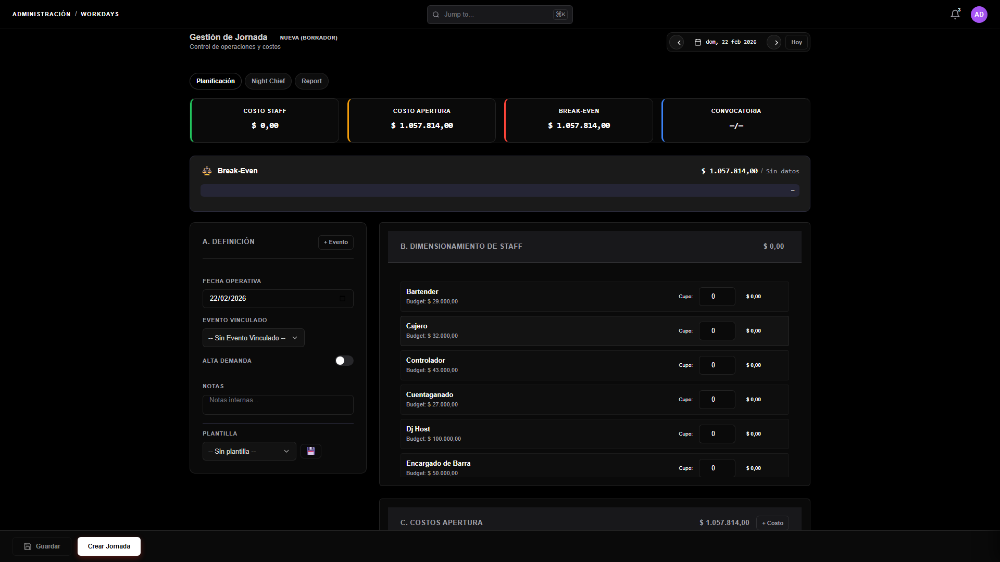

# Admin Workdays — Ficha TDD + UX

> **Generado:** 2026-02-22 · **Tier:** 0 (Operación Crítica) · **Status:** Paso 1+3 TDD completados

---

## 1. Pre-flight: Anatomía del Módulo

### Identidad

| Campo     | Valor                                                             |
| :-------- | :---------------------------------------------------------------- |
| **HTML**  | `pages/admin/admin-workdays.html` (85 KB)                         |
| **JS**    | `assets/js/modules/admin/admin-workdays.js` (120 KB, 3234 líneas) |
| **CSS**   | `assets/css/admin-workdays.css` (17 KB)                           |
| **Roles** | `admin`, `contable`                                               |
| **Guard** | `window.Auth.guardOrRedirect(["admin", "contable"])`              |

### Status Machine

```
NULL → DRAFT → PLANNED → ACTIVE → CLOSED
       ↑                              ↓
       └──────── CANCELLED ←──────────┘ (no implementado actualmente)
```

- **DRAFT**: Jornada creada, datos editables
- **PLANNED**: Plan confirmado (staff + costos fijos)
- **ACTIVE**: Noche abierta (pre-flight checks OK)
- **CLOSED**: Post-night, reportes generados

### Arquitectura UI: 3 Tabs

| Tab               | Disponibilidad | Contenido                                                 |
| :---------------- | :------------- | :-------------------------------------------------------- |
| **Planificación** | Siempre        | Sidebar (Definición + Costos) + Main (Staff + KPIs)       |
| **Night Chief**   | Solo ACTIVE    | Cierre terminales, P&L, stock audit, devengamientos, GBOL |
| **Report**        | Siempre        | Historial, dashboard KPIs, anomalías, chart               |

### Tablas Supabase (23)

#### Core (escritura)

| Tabla                     | Operación              | Contexto                              |
| :------------------------ | :--------------------- | :------------------------------------ |
| `work_days`               | INSERT, SELECT, UPDATE | CRUD de jornada + cambio de status    |
| `work_day_staff_planning` | INSERT, SELECT, DELETE | Plan de cupos por rol                 |
| `staff_convocations`      | INSERT, SELECT, UPSERT | Asignación de personal a slots        |
| `finance_payments`        | INSERT, SELECT         | Costos de apertura → pagos pendientes |
| `events`                  | INSERT, SELECT         | Crear/vincular evento                 |
| `cost_definitions`        | SELECT, UPDATE         | Maestro de costos por evento          |
| `staff_accruals`          | INSERT, SELECT, UPDATE | Devengamientos post-noche             |
| `work_day_templates`      | INSERT, SELECT         | Templates de planificación            |

#### Cierre (Night Chief — lectura + escritura)

| Tabla               | Operación | Contexto                        |
| :------------------ | :-------- | :------------------------------ |
| `cash_closings`     | SELECT    | Cierres de caja declarados      |
| `closing_terminals` | SELECT    | Detalle por terminal POS        |
| `pos_terminals`     | SELECT    | Maestro de terminales           |
| `qr_batches`        | SELECT    | Stats QR (lotes)                |
| `qr_codes`          | SELECT    | Stats QR (códigos individuales) |

#### Referencias (lectura)

| Tabla                | Contexto                     |
| :------------------- | :--------------------------- |
| `master_staff_roles` | Roles operativos + base_rate |
| `profiles`           | Usuarios para asignación     |

#### Vistas SQL (8)

| Vista                   | Tab         | Propósito               |
| :---------------------- | :---------- | :---------------------- |
| `vw_workday_pnl`        | Night Chief | P&L de la noche         |
| `vw_night_snapshot`     | Report      | Historial consolidado   |
| `vw_bar_audit_variance` | Night Chief | Varianza stock barra    |
| `vw_bar_efficiency`     | Night Chief | Eficiencia de sesiones  |
| `vw_consumo_teorico`    | Night Chief | Consumo teórico vs real |
| `vw_daily_sales`        | Night Chief | Ventas del día          |
| `vw_fiscal_summary`     | Night Chief | Resumen fiscal GBOL     |
| `vw_workday_benchmarks` | Report      | Benchmarks históricos   |

### Funciones Clave (82+)

#### Status Machine

- `handleConfirmOrUpdate()` — Dispatcher central por status
- `handleCreate()` — NULL → DRAFT
- `handleConfirmPlan()` — DRAFT → PLANNED
- `handleOpen()` → `showPreFlightModal()` → `runPreFlightChecks()` — PLANNED → ACTIVE
- `performCloseNight()` — ACTIVE → CLOSED

#### Data Loading

- `loadInitialData()` — master_staff_roles, cost_definitions, events, profiles
- `loadDayDetails()` — work_day_staff_planning, staff_convocations
- `loadCierreData()` — Lazy-load al entrar a Night Chief
- `loadAccruals()`, `loadStockAuditData()`, `loadFiscalSummary()` — Lazy
- `loadReportDashboard()`, `loadBenchmarks()`, `loadTemplates()` — Lazy

#### Real-time

- `startPolling()` / `stopPolling()` — Polling de KPIs en Night Chief
- `checkAnomalies()` — Detección de anomalías durante polling

#### Importers

- `ImporterExtracciones`, `ImporterGbol`, `ImporterPassline`, `ImporterAfip` — File uploads

---

## 2. Lighthouse Scores

| Categoría      | Score  | Issues                                                                          |
| :------------- | :----: | :------------------------------------------------------------------------------ |
| Performance    | **90** | —                                                                               |
| Accessibility  | **88** | 19 form elements sin labels, 2 ARIA inputs sin nombre, 1 contraste insuficiente |
| Best Practices | **92** | Console errors, DevTools issues                                                 |
| SEO            | **90** | —                                                                               |

### A11y Issues Críticos

- **19 `<input>` sin `<label>` asociado** (peso 10) — Todos los inputs de cupo/costo en Planificación
- **2 ARIA inputs sin accessible name** (peso 7)
- **1 color-contrast** insuficiente (peso 7)

---

## 3. Evaluación Heurística Nielsen

### Screenshot Analizado



### Hallazgos

|  #  | Heurística                        | Sev. | Hallazgo                                                                                              | Impacto                                                               | Recomendación                                                            |
| :-: | :-------------------------------- | :--: | :---------------------------------------------------------------------------------------------------- | :-------------------------------------------------------------------- | :----------------------------------------------------------------------- |
|  1  | **Visibilidad del estado**        |  2   | Status pill `NUEVA (BORRADOR)` visible, pero KPIs Break-Even muestra "Sin datos" sin explicación      | Admin no sabe si falta benchmark o es error                           | Tooltip: "Se calculará con historial de ≥3 noches"                       |
|  2  | **Correspondencia real**          |  1   | Terminología correcta: "Jornada", "Cupo", "Costos Apertura", "Evento Vinculado"                       | —                                                                     | OK                                                                       |
|  3  | **Control y libertad**            |  3   | No hay opción CANCELAR jornada una vez creada en DRAFT. No hay UNDO de "Crear Jornada"                | Admin crea por error → no puede eliminar sin DB                       | Agregar botón "Descartar Borrador" en status DRAFT                       |
|  4  | **Consistencia y estándares**     |  2   | Tabs (Planificación/Night Chief/Report) siguen patrón chip correcto. KPI cards con colores semánticos | Night Chief tab deshabilitada sin tooltip explicativo                 | Agregar tooltip: "Disponible cuando la jornada esté ABIERTA"             |
|  5  | **Prevención de errores**         |  1   | "Crear Jornada" pide confirmación vía `Utils.confirmAction()`. Pre-flight checks antes de abrir noche | —                                                                     | OK — buen patrón                                                         |
|  6  | **Reconocimiento > recuerdo**     |  2   | Plantilla dropdown visible. Pero Break-Even card no explica sus métricas                              | Admin nuevo no entiende "Costo Apertura vs Break-Even"                | Agregar info icon con tooltip explicativo en cada KPI                    |
|  7  | **Flexibilidad y eficiencia**     |  2   | Templates (Sprint 4) aceleran creación. Navegación de fecha con ← Hoy → es eficiente                  | No hay atajos de teclado. No hay "duplicar jornada anterior"          | [P2] Considerar shortcut para duplicar planificación previa              |
|  8  | **Diseño estético y minimalista** |  1   | Layout sidebar + main bien equilibrado. Jerarquía visual clara con secciones A/B/C                    | —                                                                     | OK                                                                       |
|  9  | **Recuperación ante errores**     |  2   | Toast messages para errores (`Toast.error`). Pero no se indica QUÉ campo falló                        | Admin ve "Error verificando fecha" genérico                           | Mensajes contextuales: "La fecha X ya tiene jornada activa"              |
| 10  | **Ayuda y documentación**         |  3   | Cero tooltips, cero help text. Labels existen pero no explican el flujo                               | Admin nuevo no sabe que después de Crear debe Confirmar y luego Abrir | Tour/onboarding o info card: "Flujo: Crear → Confirmar → Abrir → Cerrar" |

### Score Heurístico Global: **7.0 / 10**

|    Severidad     | Count | Acción          |
| :--------------: | :---: | :-------------- |
| 4 (Catastrófico) |   0   | —               |
|    3 (Mayor)     |   2   | Fix prioritario |
|    2 (Menor)     |   5   | Próximo sprint  |
|  1 (Cosmético)   |   3   | Backlog         |

---

## 4. Cognitive Walkthrough: Crear Jornada

**Persona:** El Admin (experiencia media, usa el sistema 2-3 veces/semana)
**Flujo:** Crear una nueva jornada para el viernes

| Paso | Acción esperada                                    | Q1 Intenta | Q2 Ve |                                   Q3 Entiende                                   |                       Q4 Feedback                        |     ¿Failure?      |
| :--: | :------------------------------------------------- | :--------: | :---: | :-----------------------------------------------------------------------------: | :------------------------------------------------------: | :----------------: |
|  1   | Seleccionar fecha en date picker                   |     ✅     |  ✅   |                                       ✅                                        | ✅ Status cambia a "Verificando..." → "Nueva (Borrador)" |         —          |
|  2   | Opcionalmente vincular evento                      |     ✅     |  ✅   |                                       ✅                                        |                 ✅ Dropdown se actualiza                 |         —          |
|  3   | Definir cupos por rol (Bartender: 3, Cajero: 2...) |     ✅     |  ✅   |                                       ✅                                        |          ✅ Badge $ se recalcula en tiempo real          |         —          |
|  4   | Ajustar costos de apertura                         |     ✅     |  ✅   |           ⚠️ No queda claro qué es "Recurrente" vs el input editable            |                  ✅ KPIs se actualizan                   |     **Minor**      |
|  5   | Click "Crear Jornada"                              |     ✅     |  ✅   |                                       ✅                                        |     ✅ Confirmación + Toast success + status → DRAFT     |         —          |
|  6   | Asignar personal a slots                           |     ✅     |  ✅   | ⚠️ Todos los usuarios aparecen en todos los dropdowns (sin filtrar por función) |                 ✅ Checkmark ✅ aparece                  | **Known** (TK-004) |
|  7   | Click "Confirmar Plan"                             |     ✅     |  ✅   |                                       ✅                                        |                   ✅ Status → PLANNED                    |         —          |
|  8   | Click "Abrir Noche"                                |     ✅     |  ✅   |                                       ✅                                        |      ✅ Pre-flight modal → checks → Status → ACTIVE      |         —          |

**Failure points:** 1 menor (paso 4: label "Recurrente" confuso), 1 conocido (paso 6: TK-004 dropdowns sin filtro por función)

**Eficiencia:** 8 pasos para creación completa. Mínimo teórico: 5 (fecha + cupos + crear + confirmar + abrir). **Ratio: 0.63** (< 0.7 threshold)

---

## 5. Hallazgos Cross-Referencia

| Fuente            | Hallazgo                                                               | Coincide con                                                |
| :---------------- | :--------------------------------------------------------------------- | :---------------------------------------------------------- |
| Lighthouse A11y   | 19 inputs sin labels                                                   | H10 (Ayuda), A11y                                           |
| Visual Audit      | Admin Workdays es "Reference Implementation" para `.grid-sidebar-main` | H8 (Diseño) — confirmado positivo                           |
| Context-loader KI | "Edit-Not-Create" policy para site_config                              | Patrón aplicable a workdays (crear borrador → no eliminar)  |
| TK-004            | Staff dropdowns muestran todos los usuarios                            | H5 (Prevención de errores) — asignar bartender a rol cajero |
| TK-003            | Staff cost no recalcula                                                | H1 (Visibilidad del estado)                                 |

---

## 6. DB Snapshot (2026-02-22 17:59)

| Tabla                     |  Count | Notas                                    |
| :------------------------ | -----: | :--------------------------------------- |
| `work_days`               |  **0** | Tabla vacía — ambiente limpio            |
| `work_day_staff_planning` |  **0** | Sin planificación (no hay jornadas)      |
| `staff_convocations`      |  **0** | Sin asignaciones                         |
| `staff_accruals`          |  **0** | Sin devengamientos                       |
| `finance_payments`        | **16** | Pagos existentes (no ligados a workdays) |
| `events`                  | **11** | Eventos futuros disponibles              |
| `cost_definitions`        | **14** | Costos per_event activos                 |
| `master_staff_roles`      | **16** | Roles operativos definidos               |
| `profiles`                | **29** | Usuarios totales                         |

---

## 7. Recomendaciones Priorizadas

### Fix Prioritario (Sev 3)

1. **[H3] Agregar "Descartar Borrador"** — Botón visible solo en status DRAFT que ejecute DELETE + confirmation
2. **[H10] Info card de flujo** — Banner o stepper visual: `Crear → Confirmar → Abrir → Cerrar`
3. **[A11y] Labels para 19 inputs** — Agregar `<label for="">` o `aria-label` a todos los inputs de cupo y costo

### Próximo Sprint (Sev 2)

4. **[H1] Tooltip en Break-Even "Sin datos"** — Explicar que necesita ≥3 noches históricas
5. **[H4] Tooltip en tab Night Chief disabled** — "Disponible con jornada ABIERTA"
6. **[H6] Info icons en KPI cards** — Explicar Costo Staff, Costo Apertura, Break-Even
7. **[H9] Mensajes de error contextuales** — Reemplazar genéricos por específicos
8. **[H7] Shortcut "Duplicar planificación anterior"** — Para noches rutinarias

### Backlog (Sev 1)

9. **[H2] Terminología** — Ya correcta, mantener
10. **[H5] Confirmaciones** — Ya implementadas, mantener
11. **[H8] Layout** — Ya es reference implementation, mantener
