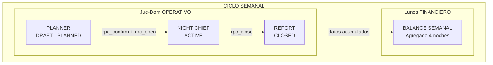
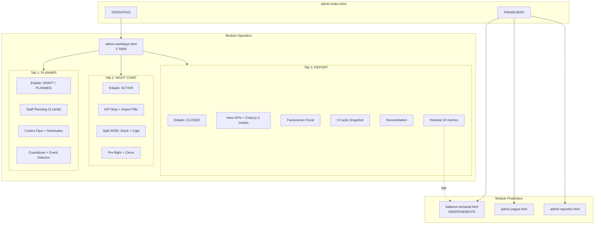
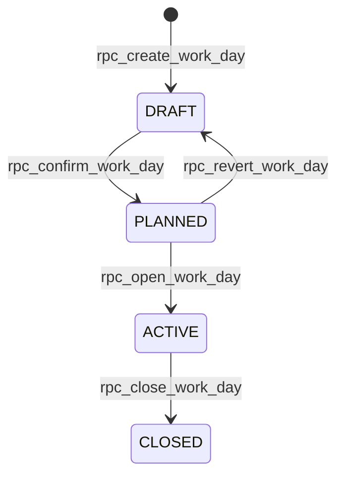
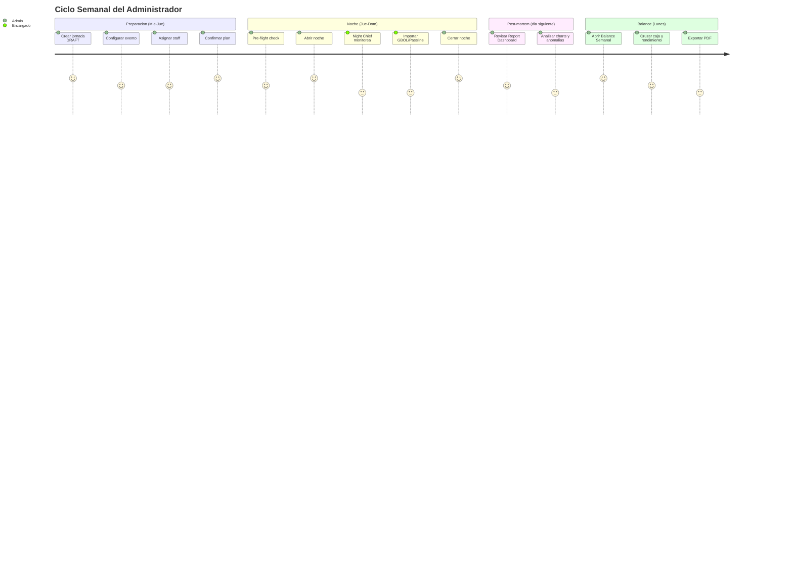
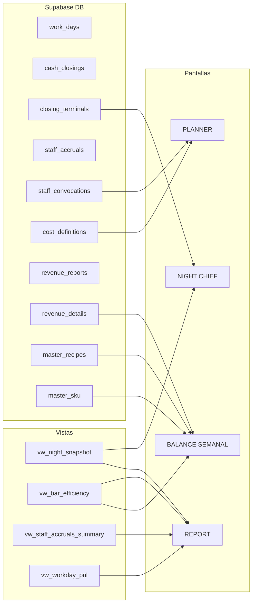

# Screen Map — WorkDays + Balance Semanal

> **Fecha**: 16-Feb-2026
> **Fuente**: Deep Research (22+ artefactos) + verificación de archivos reales

---

## 1. Flujo Operativo Temporal

---

## 2. Mapa de Pantallas

### Prototipos (`tester_3.0/pages/prototypes/`)

| Pantalla            | Carpeta                |   Estado    | Destino Producción                          |
| :------------------ | :--------------------- | :---------: | :------------------------------------------ |
| **Planner**         | `lab-workdays/`        | Prototipado | Tab 1 de `admin-workdays.html`              |
| **Night Chief**     | `lab-workdays-night/`  | Prototipado | Tab 2 de `admin-workdays.html`              |
| **Balance Semanal** | `lab-balance-semanal/` | Prototipado | Módulo independiente `balance-semanal.html` |

> **Report (Tab 3)**: No existe como prototipo independiente. Se construye nuevo como "Post-Mortem Dashboard" (Versión A) dentro de `admin-workdays.html`.

### Producción (`tester_3.0/pages/admin/`)

| Pantalla                   | Archivo             |   Status    | Destino                                   |
| :------------------------- | :------------------ | :---------: | :---------------------------------------- |
| `admin-workdays.html`      | Legacy 4 tabs       | Desalineado | **Reemplazado** por 3 tabs unificados     |
| `admin-semanal.html`       | Legacy balance      | Desalineado | **Reemplazado** por `lab-balance-semanal` |
| `admin-reportes.html`      | Reportes noche      | Se mantiene | Complementa Report tab                    |
| `admin-pagos.html`         | Pagos proveedores   |   Vigente   | Fuente de `finance_payments`              |
| `admin-central-stock.html` | Stock + GBOL import |   Vigente   | Puente clave para cruce CMV               |

---

## 3. Arquitectura — Flujo Detallado

---

## 4. State Machine — Lifecycle de una Jornada

---

## 5. Visibilidad de Tabs por Estado

|   Estado    |      Tab PLANNER      |   Tab NIGHT CHIEF   | Tab REPORT |
| :---------: | :-------------------: | :-----------------: | :--------: |
|  **DRAFT**  | **Activo** (editable) |      Disabled       |  Disabled  |
| **PLANNED** |  Visible (read-only)  |      Disabled       |  Disabled  |
| **ACTIVE**  |  Visible (read-only)  |     **Activo**      |  Disabled  |
| **CLOSED**  |  Visible (read-only)  | Visible (read-only) | **Activo** |

---

## 6. Journey del Admin (Ciclo Semanal)

---

## 7. Data Flow — Tabla → Pantalla

---

## 8. Pantallas Eliminadas / Absorbidas

| Pantalla Legacy             | Destino                |   Accion    |
| :-------------------------- | :--------------------- | :---------: |
| `admin-cierre.html` + `.js` | Night Chief (Tab 2)    |   DELETE    |
| `admin-semanal.html`        | `balance-semanal.html` | REEMPLAZADA |
| `balance-semanal.js` (ger.) | `balance-semanal.html` | SUPERCEDIDA |

---

## 9. Componentes Compartidos (Design System)

| Componente          | Clases                                           | Usado en         |
| :------------------ | :----------------------------------------------- | :--------------- |
| Topbar + Breadcrumb | `lab-topbar`                                     | Todas            |
| KPI Strip           | `wd-kpi-strip` / `nc-kpi-strip` / `rp-kpi-strip` | Todas            |
| Panel               | `wd-panel` / `nc-panel` / `rp-panel`             | Todas            |
| Table               | `wd-table` / `nc-table` / `rp-table`             | Todas            |
| Chart Section       | `rp-chart-section` + `<canvas>`                  | Report           |
| Snapshot 3-col      | `rp-snapshot`                                    | Report           |
| Reconciliation      | `rp-reconciliation`                              | Report           |
| Countdown           | `wd-countdown`                                   | Planner          |
| Import Pills        | `nc-import-pill`                                 | Night Chief      |
| Diff Cell           | `rp-diff--negative/positive`                     | Report + Balance |
