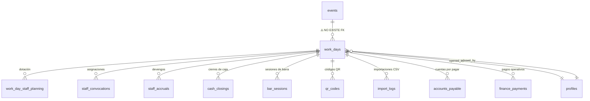

# 🧠 ERP Architect — Diagnóstico: Módulo Workdays

> **Protocolo**: Análisis Documental → Mapeo de Entidades → Detección de Gaps → Propuesta de Normalización
> **Fuente**: `docs/workdays.md` + Live DB (FormulaMid) + `admin-workdays.js`
> **Tipo de Documento**: System Design (Control)

---

## 1. Mapa de Entidades

`work_days` es la **tabla gravitacional** del sistema. Todo orbita alrededor de ella:



### Vistas Dependientes (8)
| Vista | Propósito | Sección Destino |
|-------|-----------|-----------------|
| `vw_night_snapshot` | Snapshot completo de noche | REPORT → Histórico |
| `vw_work_day_summary` | Resumen de jornada | REPORT → Resumen |
| `vw_daily_sales` / `vw_daily_sales_v2` | Ventas por día | NIGHT CHIEF → KPIs |
| `vw_bar_efficiency` | Eficiencia por barra | REPORT → Stock Audit |
| `vw_bar_audit_variance` | Varianza de inventario | REPORT → Stock Audit |
| `vw_staff_accruals_summary` | Resumen de devengos | NIGHT CHIEF → Devenciones |
| `vw_sku_ideal_dynamic` | Stock teórico vs real | REPORT → Stock Audit |

### RPCs Existentes (4)

| RPC | Status que escribe | Guard | ¿Frontend lo usa? |
|-----|-------------------|-------|-------------------|
| `rpc_plan_work_day` | `'planned'` | Ninguno | ❌ **NO** — JS inserta directo |
| `rpc_open_work_day` | `'open'` | Single-open check | ✅ Sí |
| `rpc_close_work_day` | `'closed'` | Ninguno | ✅ Sí |
| `admin_generate_workday_accruals` | — | — | ✅ Sí |

---

## 2. Gaps Detectados (6)

### 🔴 GAP-1: Bypass de RPC en Creación (CRÍTICO)

```
JS (handleCreate):    INSERT INTO work_days → status = 'planning'
RPC (rpc_plan_work_day): INSERT INTO work_days → status = 'planned'
```

**El frontend ignora el RPC** y hace INSERT directo con un status que no existe en ningún otro lugar del sistema. El RPC `rpc_plan_work_day` existe pero nunca se llama.

> [!CAUTION]
> Esto significa que no hay *guardrails* backend en la creación de jornadas. Cualquier cliente podría insertar con status arbitrario.

**Resolución**: Migrar `handleCreate()` para usar el RPC. Agregar CHECK constraint en DB.

---

### 🔴 GAP-2: Status Inconsistentes (CRÍTICO)

| Capa | Valores usados | Formato |
|------|---------------|---------|
| DB (datos reales) | `open`, `closed` | lowercase |
| RPC `rpc_plan_work_day` | `planned` | lowercase |
| JS `handleCreate` | `planning` | lowercase |
| JS `handleDateChange` | compara con `'open'` | lowercase |
| Design Doc (`workdays.md`) | `DRAFT`, `PLANNED`, `ACTIVE`, `CLOSED` | UPPERCASE |

**5 representaciones diferentes del mismo concepto**, sin enum ni constraint.

**Resolución**: Definir 4 estados canónicos con CHECK constraint. Actualizar las 3 capas (RPCs, JS, datos existentes).

---

### 🟡 GAP-3: Desconexión `events` ↔ `work_days`

No existe FK entre `events` y `work_days`. El JS hace matching por fecha (`events.date === work_days.work_date`), lo cual es frágil:

- Si hay 2 events en la misma fecha → ambigüedad
- Si el event se mueve de fecha → la jornada pierde la referencia

**Resolución**: Agregar `work_days.event_id` FK a `events.id`.

---

### 🟡 GAP-4: Countdown desconectado

El design doc pide un toggle para countdown web, pero:
- `work_days` no tiene campo `countdown_active`
- `site_config` no tiene entry de countdown
- El frontend público consulta `events` para el countdown (si existe), no `work_days`

**Resolución**: Agregar `work_days.countdown_active` boolean. El frontend público debe consultar `work_days` con `status = 'ACTIVE'` y `countdown_active = true`.

---

### 🟢 GAP-5: Solicitudes Extras (futuro sprint)

El design doc menciona "solicitudes extras" (insumos técnicos, logísticos), pero:
- No existe tabla `supply_requests` o equivalente
- `admin-solicitudes.html` maneja purchase orders (`supplier_orders`), no requests internas

**Resolución**: Fase 2. No bloquea la arquitectura actual. Se puede implementar como nueva tabla `workday_supply_requests` con FK a `work_days`.

---

### 🟢 GAP-6: `rpc_close_work_day` sin validación

El RPC cierra sin verificar pre-condiciones (¿hay cash_closing creado? ¿staffs accruals generados?). Es un UPDATE ciego.

**Resolución**: Fase 2. Agregar guards al RPC para validar que exista al menos 1 `cash_closings` row y `staff_accruals` rows antes de permitir cierre.

---

## 3. Priorización MoSCoW

| Prioridad | Item | Impacto |
|-----------|------|---------|
| **MUST** | GAP-1: Redirigir JS a usar RPCs | Seguridad + integridad |
| **MUST** | GAP-2: Normalizar 4 estados + CHECK | Coherencia sistémica |
| **MUST** | GAP-3: FK `events` → `work_days` | Integridad referencial |
| **SHOULD** | GAP-4: Countdown toggle | Feature del design doc |
| **COULD** | GAP-6: Guards en `rpc_close_work_day` | Robustez operativa |
| **WON'T** (now) | GAP-5: Solicitudes Extras | Sprint futuro |

---

## 4. Propuesta: RPCs Actualizados

### `rpc_create_work_day` (reemplaza `rpc_plan_work_day`)

```sql
CREATE OR REPLACE FUNCTION public.rpc_create_work_day(
    p_work_date date,
    p_event_id uuid DEFAULT NULL,
    p_notes text DEFAULT NULL
)
RETURNS uuid
LANGUAGE plpgsql SECURITY DEFINER AS $$
DECLARE
    new_id UUID;
BEGIN
    -- Guard: no duplicar fecha
    IF EXISTS (SELECT 1 FROM work_days WHERE work_date = p_work_date AND status != 'CLOSED') THEN
        RAISE EXCEPTION 'Ya existe una jornada activa para esta fecha.';
    END IF;

    INSERT INTO work_days (work_date, status, notes, event_id)
    VALUES (p_work_date, 'DRAFT', p_notes, p_event_id)
    RETURNING id INTO new_id;

    RETURN new_id;
END;
$$;
```

### `rpc_open_work_day` (actualizado)

```sql
CREATE OR REPLACE FUNCTION public.rpc_open_work_day(p_work_day_id uuid)
RETURNS void
LANGUAGE plpgsql SECURITY DEFINER AS $$
BEGIN
    -- Guard: solo 1 ACTIVE a la vez
    IF EXISTS (SELECT 1 FROM work_days WHERE status = 'ACTIVE' AND id <> p_work_day_id) THEN
        RAISE EXCEPTION 'Ya existe una jornada activa. Ciérrela primero.';
    END IF;

    -- Guard: solo desde PLANNED
    IF NOT EXISTS (SELECT 1 FROM work_days WHERE id = p_work_day_id AND status = 'PLANNED') THEN
        RAISE EXCEPTION 'Solo se puede abrir una jornada en estado PLANNED.';
    END IF;

    UPDATE work_days
    SET status = 'ACTIVE', opened_at = now(), opened_by = auth.uid()
    WHERE id = p_work_day_id;
END;
$$;
```

### `rpc_confirm_work_day` (nueva: DRAFT → PLANNED)

```sql
CREATE OR REPLACE FUNCTION public.rpc_confirm_work_day(p_work_day_id uuid)
RETURNS void
LANGUAGE plpgsql SECURITY DEFINER AS $$
BEGIN
    IF NOT EXISTS (SELECT 1 FROM work_days WHERE id = p_work_day_id AND status = 'DRAFT') THEN
        RAISE EXCEPTION 'Solo se puede confirmar una jornada en estado DRAFT.';
    END IF;

    UPDATE work_days
    SET status = 'PLANNED'
    WHERE id = p_work_day_id;
END;
$$;
```

### `rpc_close_work_day` (actualizado)

```sql
CREATE OR REPLACE FUNCTION public.rpc_close_work_day(p_work_day_id uuid)
RETURNS void
LANGUAGE plpgsql SECURITY DEFINER AS $$
BEGIN
    IF NOT EXISTS (SELECT 1 FROM work_days WHERE id = p_work_day_id AND status = 'ACTIVE') THEN
        RAISE EXCEPTION 'Solo se puede cerrar una jornada en estado ACTIVE.';
    END IF;

    UPDATE work_days
    SET status = 'CLOSED', closed_at = now(), closed_by = auth.uid()
    WHERE id = p_work_day_id;
END;
$$;
```

---

## 5. Flujo ERP Consolidado

```
PLANNER                          NIGHT CHIEF                    REPORT
────────                         ───────────                    ──────
Admin selecciona fecha           (solo visible con ACTIVE)      (solo visible con CLOSED)
  │                                │                              │
  ├─ ¿Existe? → Edit Mode         ├─ Cash closings               ├─ vw_night_snapshot
  ├─ ¿No? → rpc_create_work_day   ├─ QR reconciliation           ├─ vw_bar_efficiency
  │         → status: DRAFT       ├─ Terminal breakdown           ├─ vw_bar_audit_variance
  │                                ├─ Import CSV (4 types)        ├─ vw_staff_accruals_summary
  ├─ Staff planning (CRUD)        ├─ GBOL fiscal summary         ├─ vw_work_day_summary
  ├─ Cost definitions (CRUD)      ├─ Devenciones                 │
  ├─ Event config + countdown     ├─ Notas de cierre             │
  │                                │                              │
  └─ rpc_confirm_work_day         └─ rpc_close_work_day          └─ Read-only
       → status: PLANNED              → status: CLOSED
       │
       └─ rpc_open_work_day
            → status: ACTIVE
```

---

## 6. Estimación de Impacto

| Acción | Esfuerzo | ROI |
|--------|----------|-----|
| Migrar status + CHECK | 🟢 Bajo (1 migration) | 🔴 Alto — elimina inconsistencia sistémica |
| Actualizar 4 RPCs | 🟡 Medio (SQL + test) | 🔴 Alto — seguridad + integridad |
| Agregar FK `event_id` | 🟢 Bajo (1 ALTER) | 🟡 Medio — elimina matching por fecha |
| Refactor JS (`handleCreate` → RPC) | 🟡 Medio (lógica) | 🔴 Alto — cierra bypass de seguridad |
| Tab restructure HTML (4→3) | 🟡 Medio (layout) | 🟡 Medio — UX coherente |
| Embed cierre | 🔴 Alto (migrar lógica) | 🟡 Medio — reduce módulos separados |

> **Recomendación Pragmática**: Ejecutar DB migration + RPC updates primero (Phase 3). El HTML/JS refactor puede ser incremental.
