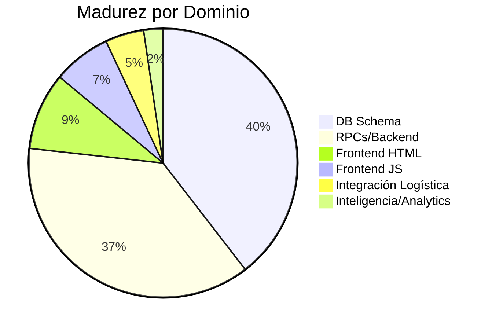
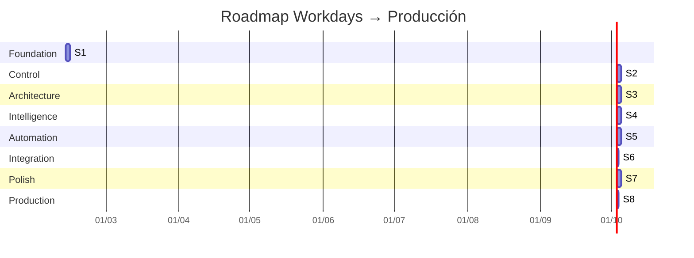

# 🗺️ Workdays: Roadmap a Producción

> **Estado actual**: Backend migrado (4 estados, 5 RPCs, vistas corregidas). Frontend desalineado.
> **Meta**: Módulo Workdays funcionando end-to-end con flujo operativo + logístico integrado.
> **Fecha objetivo**: Producción en 8 sprints (1 sprint = 1 sesión de trabajo).

---

## Estado del Ecosistema



| Capa | Estado | Blocker |
|------|--------|---------|
| ✅ DB Schema | 4 estados + 3 cols + constraints + indexes | — |
| ✅ RPCs | 5 RPCs con guards de lifecycle | — |
| ✅ Vistas | 8 vistas corregidas (ACTIVE/CLOSED) | — |
| ❌ HTML | 4 tabs legacy, cierre separado | Sprint 1 |
| ❌ JS | Status lowercase, INSERT directo, 67 funciones | Sprint 1-2 |
| ❌ Flujos | Supply chain desconectado, sin pre-flight | Sprint 3-5 |
| ❌ Analytics | Sin P&L, sin benchmarks, sin health score | Sprint 4-6 |

---

## Sprint 1: Foundation — Alinear Frontend con Backend

> **Objetivo**: Que el frontend hable el mismo idioma que el backend.

### 1.1 HTML: Reestructurar tabs (4→3)

#### [MODIFY] [admin-workdays.html](file:///c:/Users/siste/Documents/GitHub/tester_3.0/admin-workdays.html)

| Antes | Después |
|-------|---------|
| Tab 1: Planificación | Tab 1: **PLANNER** |
| Tab 2: Evento | ↗ Absorbido en PLANNER (event config) |
| Tab 3: Stock Audit | Tab 3: **REPORT** (incluye stock) |
| Tab 4: Histórico | ↗ Absorbido en REPORT |
| — | Tab 2: **NIGHT CHIEF** (nuevo, absorbe cierre) |

- Zona PLANNER: Jornada config + Staff planning + Costos fijos + Countdown toggle
- Zona NIGHT CHIEF: KPIs + Terminal reconciliation + Import bar + Cierre section
- Zona REPORT: Histórico table + Stock audit + Staff performance

#### [DELETE] [admin-cierre.html](file:///c:/Users/siste/Documents/GitHub/tester_3.0/admin-cierre.html)
#### [DELETE] [admin-cierre.js](file:///c:/Users/siste/Documents/GitHub/tester_3.0/js/admin-cierre.js)

Funcionalidad embebida en NIGHT CHIEF.

### 1.2 JS: Status machine upgrade

#### [MODIFY] [admin-workdays.js](file:///c:/Users/siste/Documents/GitHub/tester_3.0/js/admin-workdays.js)

```diff
- const STATUS_OPEN = 'open';
- const STATUS_CLOSED = 'closed';
+ const STATUS = { DRAFT: 'DRAFT', PLANNED: 'PLANNED', ACTIVE: 'ACTIVE', CLOSED: 'CLOSED' };

- if (day.status === 'open') {
+ if (day.status === STATUS.ACTIVE) {

- await supabase.from('work_days').insert({ status: 'planning' });
+ await supabase.rpc('rpc_create_work_day', { p_work_date: date });
```

**Cambios clave**:
- Reemplazar 15+ comparaciones hardcodeadas `'open'`/`'closed'` por constantes
- `handleCreate()` → usa `rpc_create_work_day`
- Nuevo: `handleConfirm()` → `rpc_confirm_work_day`
- Nuevo: `handleRevert()` → `rpc_revert_work_day`
- `handleOpen()` → usa `rpc_open_work_day` (ya existe, actualizar guard)
- `handleClose()` → usa `rpc_close_work_day` (ya existe)
- Tab switching: 3 tabs con visibility rules por status
- Countdown toggle: write/read `work_days.countdown_active`

### 1.3 Verificación Sprint 1

```
□ 3 tabs visibles y switcheables
□ Crear jornada DRAFT via RPC
□ Confirmar → PLANNED via RPC
□ Revertir → DRAFT via RPC
□ Abrir → ACTIVE via RPC (guard: no otra ACTIVE)
□ Cerrar → CLOSED via RPC (guard: solo desde ACTIVE)
□ Countdown toggle escribe a DB
□ admin-cierre.html eliminado, lógica embebida en Night Chief
□ No hay referencias a 'open'/'closed' lowercase en JS
```

---

## Sprint 2: Control Operativo — Pre-Flight + Cierre Robusto

> **Objetivo**: No abrir sin verificar. No cerrar sin completar.

### 2.1 DB: Pre-Flight Checks

#### Migration: `workdays_preflight_and_health`

```sql
-- Pre-flight: verificar condiciones antes de abrir
CREATE OR REPLACE FUNCTION public.rpc_open_work_day(p_work_day_id uuid)
RETURNS jsonb  -- ahora retorna resultado con detalles
LANGUAGE plpgsql SECURITY DEFINER AS $$
DECLARE
  checks jsonb;
  all_pass boolean;
BEGIN
  -- Guard: solo desde PLANNED
  IF NOT EXISTS (SELECT 1 FROM work_days WHERE id = p_work_day_id AND status = 'PLANNED') THEN
    RAISE EXCEPTION 'Solo se puede abrir una jornada en estado PLANNED.';
  END IF;

  -- Guard: no otra ACTIVE
  IF EXISTS (SELECT 1 FROM work_days WHERE status = 'ACTIVE' AND id <> p_work_day_id) THEN
    RAISE EXCEPTION 'Ya existe una jornada activa.';
  END IF;

  -- Pre-flight checks (informativo, no bloqueante por default)
  SELECT jsonb_build_object(
    'event_linked', (SELECT event_id IS NOT NULL FROM work_days WHERE id = p_work_day_id),
    'staff_confirmed', (SELECT COUNT(*) > 0 FROM staff_convocations 
                        WHERE work_day_id = p_work_day_id AND status = 'confirmed'),
    'costs_registered', (SELECT COUNT(*) > 0 FROM accounts_payable 
                         WHERE work_day_id = p_work_day_id),
    'stock_loaded', (SELECT COUNT(*) > 0 FROM bar_sessions bs 
                     JOIN bar_stock_snapshots bss ON bss.session_id = bs.id 
                     WHERE bs.work_day_id = p_work_day_id)
  ) INTO checks;

  -- Abrir
  UPDATE work_days
  SET status = 'ACTIVE', opened_at = now(), opened_by = auth.uid()
  WHERE id = p_work_day_id;

  RETURN checks;
END;
$$;

-- Health Score: columna para almacenar score al cerrar
ALTER TABLE work_days ADD COLUMN IF NOT EXISTS health_score integer;
ALTER TABLE work_days ADD COLUMN IF NOT EXISTS net_result numeric;
COMMENT ON COLUMN work_days.health_score IS '0-100 score calculado al cerrar la noche';
COMMENT ON COLUMN work_days.net_result IS 'Resultado neto (ingresos - egresos) de la noche';
```

### 2.2 JS: Pre-Flight UI

```
handleOpen() →
  1. Llama rpc_open_work_day → recibe checks
  2. Si algún check = false → muestra modal Pre-Flight con ✅/❌ por ítem
  3. Admin decide: "Abrir de todos modos" (override) o "Volver a preparar"
  4. Si todo ✅ → abre directo sin modal
```

### 2.3 JS: Close con P&L preview

```
handleClose() →
  1. Fetch vw_night_snapshot para la jornada actual
  2. Calcular P&L:
     revenue = cash_system + qr_system + bar_sales_system
     expenses = staff_cost + sum(accounts_payable) + stock_cost_theoretical
     net = revenue - expenses
     margin = net / revenue × 100
  3. Mostrar modal de confirmación con resumen
  4. Al confirmar → rpc_close_work_day + UPDATE health_score + net_result
```

### 2.4 Verificación Sprint 2

```
□ Pre-flight checklist aparece al intentar abrir
□ Checks correctos (event, staff, costs, stock)
□ Override funciona con confirmación
□ Modal de cierre muestra P&L
□ health_score y net_result se guardan al cerrar
□ Report muestra health_score badge (🟢/🟡/🔴)
```

---

## Sprint 3: Architectural Fixes — Cerrar Puntos Ciegos

> **Objetivo**: Eliminar desconexiones estructurales.

### 3.1 DB: 4 Migrations

#### Migration: `fix_supply_chain_workday_link`
```sql
-- Punto ciego #1: Supply chain ↔ Workday
ALTER TABLE replenishment_requests 
  ADD COLUMN IF NOT EXISTS target_work_day_id uuid REFERENCES work_days(id);
COMMENT ON COLUMN replenishment_requests.target_work_day_id 
  IS 'Opcional: jornada objetivo para este pedido de reposición';
```

#### Migration: `fix_accounts_payable_category`
```sql
-- Punto ciego #2: Gastos sin tipificar
ALTER TABLE accounts_payable 
  ADD COLUMN IF NOT EXISTS category text DEFAULT 'other';
ALTER TABLE accounts_payable 
  ADD CONSTRAINT accounts_payable_category_check 
  CHECK (category IN ('transport','technical','supplies','entertainment','staff','venue','other'));
```

#### Migration: `fix_revenue_reports_workday_link`
```sql
-- Punto ciego #6: Revenue reports sin contexto
ALTER TABLE revenue_reports 
  ADD COLUMN IF NOT EXISTS work_day_id uuid REFERENCES work_days(id);
```

#### Migration: `fix_accruals_attendance_guard`
```sql
-- Punto ciego #4: Accruals sin validar attendance
CREATE OR REPLACE FUNCTION public.admin_generate_workday_accruals(p_work_day_id uuid)
RETURNS integer
LANGUAGE plpgsql SECURITY DEFINER AS $$
DECLARE
  generated integer := 0;
BEGIN
  -- Solo generar accruals para staff con status 'confirmed'
  INSERT INTO staff_accruals (work_day_id, user_id, role_id, amount, status)
  SELECT sc.work_day_id, sc.user_id, sc.role_id, 
         COALESCE(wdsp.approved_budget, 0), 'pending'
  FROM staff_convocations sc
  LEFT JOIN work_day_staff_planning wdsp 
    ON wdsp.work_day_id = sc.work_day_id AND wdsp.role_id = sc.role_id
  WHERE sc.work_day_id = p_work_day_id 
    AND sc.status = 'confirmed'  -- ← GUARD: solo confirmados
    AND NOT EXISTS (
      SELECT 1 FROM staff_accruals sa 
      WHERE sa.work_day_id = sc.work_day_id AND sa.user_id = sc.user_id
    );
  
  GET DIAGNOSTICS generated = ROW_COUNT;
  RETURN generated;
END;
$$;
```

### 3.2 Vista nueva: Revenue Per Capita

```sql
-- Punto ciego #3: QR × Revenue
CREATE OR REPLACE VIEW vw_per_capita_revenue AS
SELECT 
  wd.id AS work_day_id,
  wd.work_date,
  COALESCE(wd.event_name, ev.name) AS event_name,
  ns.total_income,
  (SELECT COUNT(*) FROM qr_checkins qc 
   JOIN qr_codes q ON q.id = qc.code_id 
   WHERE q.work_day_id = wd.id AND qc.check_type = 'entry') AS total_entries,
  CASE WHEN (SELECT COUNT(*) FROM qr_checkins qc 
   JOIN qr_codes q ON q.id = qc.code_id 
   WHERE q.work_day_id = wd.id AND qc.check_type = 'entry') > 0
  THEN ns.total_income / (SELECT COUNT(*) FROM qr_checkins qc 
   JOIN qr_codes q ON q.id = qc.code_id 
   WHERE q.work_day_id = wd.id AND qc.check_type = 'entry')
  ELSE 0 END AS revenue_per_capita
FROM work_days wd
LEFT JOIN events ev ON ev.id = wd.event_id
LEFT JOIN vw_night_snapshot ns ON ns.work_day_id = wd.id
WHERE wd.status IN ('ACTIVE', 'CLOSED');
```

### 3.3 Verificación Sprint 3

```
□ replenishment_requests acepta target_work_day_id
□ accounts_payable acepta category con CHECK
□ revenue_reports acepta work_day_id
□ Accruals solo se generan para status='confirmed'
□ vw_per_capita_revenue retorna datos correctos
□ Todas las FK tienen ON DELETE SET NULL o CASCADE apropiado
```

---

## Sprint 4: Inteligencia — Templates + Break-Even + Benchmarks

> **Objetivo**: El admin toma decisiones con datos, no con intuición.

### 4.1 DB: Event Templates

```sql
CREATE TABLE IF NOT EXISTS work_day_templates (
  id uuid PRIMARY KEY DEFAULT gen_random_uuid(),
  name text NOT NULL UNIQUE,
  staff_config jsonb DEFAULT '[]',
  cost_ids uuid[] DEFAULT '{}',
  default_event_name text,
  default_event_time time,
  countdown_active boolean DEFAULT false,
  avg_revenue numeric,
  avg_attendance integer,
  usage_count integer DEFAULT 0,
  created_at timestamptz DEFAULT now(),
  updated_at timestamptz DEFAULT now()
);

COMMENT ON TABLE work_day_templates IS 'Templates reutilizables para crear jornadas: Sábado Standard, Viernes VIP, Evento Especial';
```

### 4.2 DB: Benchmarking View

```sql
CREATE OR REPLACE VIEW vw_workday_benchmarks AS
SELECT
  EXTRACT(DOW FROM wd.work_date)::integer AS day_of_week,
  COALESCE(wd.event_name, 'Sin evento') AS event_type,
  COUNT(*) AS total_nights,
  ROUND(AVG(ns.total_income)) AS avg_income,
  ROUND(MAX(ns.total_income)) AS max_income,
  ROUND(MIN(ns.total_income)) AS min_income,
  ROUND(AVG(wd.health_score)) AS avg_health_score,
  ROUND(AVG(wd.net_result)) AS avg_net_result,
  ROUND(AVG(ns.staff_cost)) AS avg_staff_cost,
  ROUND(AVG(
    CASE WHEN ns.total_income > 0 
    THEN (ns.total_income - COALESCE(ns.staff_cost,0) - COALESCE(ns.stock_cost_theoretical,0)) 
         / ns.total_income * 100 
    ELSE 0 END
  ), 1) AS avg_margin_pct
FROM work_days wd
LEFT JOIN vw_night_snapshot ns ON ns.work_day_id = wd.id
WHERE wd.status = 'CLOSED'
GROUP BY EXTRACT(DOW FROM wd.work_date), COALESCE(wd.event_name, 'Sin evento');
```

### 4.3 JS: PLANNER enriquecido

```
Al crear jornada:
  1. Dropdown "Usar template" → auto-fill staff + costs + event config
  2. Break-Even Card:
     costos_fijos + staff_cost + stock_estimado = punto_equilibrio
     Fetch desde cost_definitions + staff_planning + vw_workday_benchmarks
  3. Benchmark Pill:
     "Promedio sábados: $650K | Mejor: $1.2M"
     Fetch desde vw_workday_benchmarks WHERE day_of_week = X

Durante ACTIVE:
  4. Break-Even Progress Bar:
     ingreso_actual / punto_equilibrio × 100
     Actualizar cada 60s via polling o realtime
```

### 4.4 Verificación Sprint 4

```
□ Template CRUD funciona (crear, editar, eliminar)
□ Crear jornada desde template auto-rellena
□ Break-even se calcula correctamente
□ Benchmark muestra datos para sábados con ≥2 noches cerradas
□ Progress bar avanza durante noche ACTIVE
□ P&L en Report usa misma fórmula que Break-Even
```

---

## Sprint 5: Auto P&L + Post-Mortem + Night Chief Live

> **Objetivo**: Cierre automático inteligente y Night Chief como cockpit activo.

### 5.1 DB: P&L View

```sql
CREATE OR REPLACE VIEW vw_workday_pnl AS
SELECT
  wd.id AS work_day_id,
  wd.work_date,
  wd.event_name,
  -- INGRESOS
  COALESCE(ns.cash_system, 0) AS income_cash,
  COALESCE(ns.qr_system, 0) AS income_qr,
  COALESCE(ns.bar_sales_system, 0) AS income_bar,
  COALESCE(ns.total_income, 0) AS income_total,
  -- EGRESOS
  COALESCE(ns.staff_cost, 0) AS expense_staff,
  COALESCE(ns.stock_cost_theoretical, 0) AS expense_stock,
  COALESCE((SELECT SUM(amount) FROM accounts_payable WHERE work_day_id = wd.id), 0) AS expense_extras,
  -- RESULTADO
  COALESCE(ns.total_income, 0) 
    - COALESCE(ns.staff_cost, 0) 
    - COALESCE(ns.stock_cost_theoretical, 0)
    - COALESCE((SELECT SUM(amount) FROM accounts_payable WHERE work_day_id = wd.id), 0) 
    AS net_result,
  -- MARGEN
  CASE WHEN COALESCE(ns.total_income, 0) > 0
  THEN ROUND(
    (COALESCE(ns.total_income, 0) 
     - COALESCE(ns.staff_cost, 0) 
     - COALESCE(ns.stock_cost_theoretical, 0)
     - COALESCE((SELECT SUM(amount) FROM accounts_payable WHERE work_day_id = wd.id), 0))
    / ns.total_income * 100, 1)
  ELSE 0 END AS margin_pct
FROM work_days wd
LEFT JOIN vw_night_snapshot ns ON ns.work_day_id = wd.id;
```

### 5.2 JS: Night Chief Live Cockpit

```
NIGHT CHIEF (solo visible cuando status = ACTIVE):
  - KPI cards con polling cada 60s
  - Break-even progress bar en header
  - Anomaly alerts:
    * |cash_diff| > threshold → alert roja
    * stock_variance > 15% → alert amarilla
    * staff_confirmed < 80% → alert naranja
  - Import actions bar (Retiros, GBOL, Passline, Terminales)
  - Cierre section con P&L preview
```

### 5.3 Health Score Calculator (RPC)

```sql
CREATE OR REPLACE FUNCTION calculate_health_score(p_work_day_id uuid)
RETURNS integer LANGUAGE plpgsql AS $$
DECLARE
  score integer := 0;
  cash_diff_pct numeric;
  stock_eff numeric;
  staff_rate numeric;
BEGIN
  -- Cash conciliation (30pts)
  SELECT ABS(COALESCE(conciliacion_diff, 0)) / NULLIF(total_income, 0) * 100
  INTO cash_diff_pct FROM vw_night_snapshot WHERE work_day_id = p_work_day_id;
  score := score + GREATEST(0, 30 - COALESCE(cash_diff_pct, 0) * 10)::integer;

  -- Stock efficiency (25pts)
  SELECT COALESCE(AVG(efficiency_pct), 100) INTO stock_eff
  FROM vw_bar_efficiency WHERE work_day_id = p_work_day_id;
  score := score + LEAST(25, (stock_eff / 4))::integer;

  -- Staff compliance (20pts)
  SELECT COUNT(*) FILTER (WHERE status='confirmed')::numeric / NULLIF(COUNT(*), 0) * 20
  INTO staff_rate FROM staff_convocations WHERE work_day_id = p_work_day_id;
  score := score + COALESCE(staff_rate, 20)::integer;

  -- Revenue vs benchmark (15pts)
  score := score + 15; -- TODO: comparar con vw_workday_benchmarks

  -- Base points (10pts)
  score := score + 10;

  RETURN LEAST(100, GREATEST(0, score));
END;
$$;
```

### 5.4 Verificación Sprint 5

```
□ vw_workday_pnl retorna P&L correcto para noches cerradas
□ Night Chief muestra KPIs live con polling
□ Break-even bar avanza correctamente
□ Health score se calcula al cerrar (> 0 para noches con datos)
□ Modal de cierre muestra P&L + health preview
□ REPORT muestra health badge por jornada
```

---

## Sprint 6: Supply Chain Integration

> **Objetivo**: Que la reposición hable con el workday.

### 6.1 PLANNER → Stock Alert

```
Al crear/editar jornada:
  1. Fetch vw_workday_benchmarks para el tipo de evento
  2. Fetch inventory_stock actual
  3. Comparar: stock_actual vs avg_consumption_para_este_tipo
  4. Si stock < estimado → ALERT:
     "⚠️ Fernet: Tenés 5, necesitás ~12 para un sábado. Diferencia: -7"
  5. Botón "Crear Pedido" → pre-llena replenishment_request con target_work_day_id
```

### 6.2 REPORT → Consumption Trends

```
Post-cierre:
  1. Actualizar vw_consumo_teorico data points
  2. Mostrar tendencia de consumo últimas 4 noches por SKU
  3. Flag SKUs con varianza creciente
```

### 6.3 Verificación Sprint 6

```
□ PLANNER muestra stock alerts cuando hay déficit
□ "Crear Pedido" linkea al workday con target_work_day_id
□ Consumo trends visible en REPORT
```

---

## Sprint 7: Polish + Edge Cases

> **Objetivo**: Cubrir casos borde, UX, responsive.

### 7.1 Edge Cases por Estado

| Estado | Edge Case | Handled? |
|--------|----------|----------|
| DRAFT | Eliminar jornada sin hijos | □ |
| DRAFT | 2 DRAFTs para misma fecha | □ (RPC guard) |
| PLANNED | Revertir con staff ya confirmado | □ (¿notificar?) |
| ACTIVE | Cerrar navegador durante import | □ (retry mechanism) |
| ACTIVE | 2 admins operando Night Chief | □ (last-write-wins?) |
| CLOSED | Intentar reabrir | □ (prohibido por RPC) |
| CLOSED | Recalcular health score | □ (botón admin) |

### 7.2 UX Polish

```
□ Tab icons + colors por estado (gray/blue/green/red)
□ Status badge anclado en header con pill animada
□ Skeleton loaders en lugar de spinners
□ Empty states con ilustraciones para tablas sin datos
□ Confirmación de cierre: modal premium con resumen visual
□ Responsive: tabs → accordion en mobile
□ Keyboard shortcuts: Ctrl+1/2/3 para tabs
```

### 7.3 Verificación Sprint 7

```
□ Todos los edge cases tienen respuesta del sistema
□ No hay errores de consola en ningún flujo
□ Responsive funciona en tablet (1024px)
□ Empty states visibles para tablas vacías
```

---

## Sprint 8: Production Deploy

> **Objetivo**: Deploy seguro con rollback planificado.

### 8.1 Pre-deploy Checklist

```
□ Backup DB completo (pg_dump)
□ Todas las migraciones aplicadas en orden
□ JS minificado y testeado (no hay 'open'/'closed' lowercase)
□ admin-cierre.html eliminado + redirects configurados
□ RLS policies verificadas para nuevas tablas/vistas
□ 5 RPCs testeados con datos reales
□ Health score calculado retroactivamente para noches existentes
□ Templates seed data cargado (Sábado Standard, Viernes VIP)
```

### 8.2 Deploy Sequence

```
1. [DB] Aplicar migraciones pendientes (si hay)
2. [DB] Verificar constraints, indexes, views
3. [FILES] Deploy HTML + JS + CSS actualizados
4. [VERIFY] Smoke test:
   - Crear DRAFT → Confirmar → Abrir → Cerrar (flujo completo)
   - Verificar Pre-Flight Checklist
   - Verificar P&L en cierre
   - Verificar REPORT con histórico
5. [MONITOR] Observar logs de errores durante 1ra noche
6. [ROLLBACK PLAN]:
   - JS: revert branch → redeploy
   - DB: migraciones son aditivas, no destructivas → safe
```

### 8.3 Post-deploy: Primera Noche Real

```
□ Admin crea jornada con template
□ Pre-flight checklist despliega correctamente
□ Night Chief recibe datos reales
□ Break-even se cruza durante la noche
□ Cierre genera P&L + health_score correcto
□ REPORT muestra la noche junto al histórico
□ No hay errores en Supabase logs
```

---

## Resumen Visual


