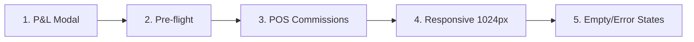

# Sprint 3 — Frontend Polish: Robustez y Responsividad

Sprint 3 es 100% frontend. El backend (Sprints 1-5 del roadmap) ya está completo: 8 de 8 checkpoints verificados en producción (columnas, vistas, RPCs, templates, benchmarks, P&L).

---

## Estado Actual del Módulo

| Capa | Archivo | Estado |
|:-----|:--------|:-------|
| HTML | [admin-workdays.html](file:///c:/Users/siste/Documents/GitHub/tester_3.0/pages/admin/admin-workdays.html) | 962 líneas, 3 tabs, 5 modals |
| JS   | [admin-workdays.js](file:///c:/Users/siste/Documents/GitHub/tester_3.0/assets/js/modules/admin/admin-workdays.js) | 1966 líneas, 79 funciones |
| CSS  | [components.css](file:///c:/Users/siste/Documents/GitHub/tester_3.0/assets/css/components.css) | ~7200 líneas, workdays section ~L3950 |
| DB   | `vw_workday_pnl` | 15 cols (income_cash/qr/bar, expense_staff/stock/extras, net_result, margin_pct) |

---

## Proposed Changes

### 1. P&L Summary en Close Flow
**Prioridad:** Alta — El cierre de noche necesita un resumen financiero antes de confirmar.

> [!IMPORTANT]
> El modal de cierre actual (`closeNightModal`, L851-869) solo muestra "Diferencia Total". Necesita componente completo de P&L.

#### [MODIFY] [admin-workdays.html](file:///c:/Users/siste/Documents/GitHub/tester_3.0/pages/admin/admin-workdays.html)
- Reemplazar modal `closeNightModal` (L851-869) con layout extendido:
  - **P&L Summary Card**: Ingresos (cash + QR + bar) | Egresos (staff + stock + extras) | Neto
  - **Health Score Badge**: rating de `calculate_health_score` con color semáforo
  - **Break-even progress bar** visual
  - La diferencia de caja queda como sub-sección

#### [MODIFY] [admin-workdays.js](file:///c:/Users/siste/Documents/GitHub/tester_3.0/assets/js/modules/admin/admin-workdays.js)
- `openCloseNightModal()` (L1347): agregar fetch a `vw_workday_pnl` + `calculate_health_score`
- Poblar P&L card antes de mostrar modal
- El botón "Confirmar Cierre" ya existe (L866)

---

### 2. Pre-flight Checklist Modal
**Prioridad:** Alta — Evitar abrir jornadas sin requisitos mínimos.

#### [MODIFY] [admin-workdays.html](file:///c:/Users/siste/Documents/GitHub/tester_3.0/pages/admin/admin-workdays.html)
- Nuevo modal `preFlightModal` (insertar después de L928):
  - Checklist visual con ✅/❌ por cada verificación
  - Items: Staff mínimo convocado, Costos de apertura cargados, Stock pre-carga completado, Evento vinculado (opcional)
  - Botón "Abrir Jornada" activo solo si todos los checks obligatorios pasan

#### [MODIFY] [admin-workdays.js](file:///c:/Users/siste/Documents/GitHub/tester_3.0/assets/js/modules/admin/admin-workdays.js)
- `handleOpen()` (L874-894): interceptar con pre-flight modal antes del RPC
- Nueva función `runPreFlightChecks()` que ejecuta validaciones locales (sin RPC extra, todo disponible en `state`)
- Si pasan → mostrar modal verde y habilitar "Abrir"
- Si falla → mostrar modal con warnings y forzar confirmación explícita

---

### 3. Comisiones POS en P&L
**Prioridad:** Media — `vw_workday_pnl` ya tiene los datos, solo falta UI.

#### [MODIFY] [admin-workdays.html](file:///c:/Users/siste/Documents/GitHub/tester_3.0/pages/admin/admin-workdays.html)
- Tab Report (L749-787): agregar columnas `Net Result` y `Margin %` a la tabla histórica
- Alternativa: agregar P&L mini-card en la sección KPIs del Planner (L196-217)

#### [MODIFY] [admin-workdays.js](file:///c:/Users/siste/Documents/GitHub/tester_3.0/assets/js/modules/admin/admin-workdays.js)
- `renderHistoryAsync()` (L1881-1960): agregar cols de `vw_workday_pnl`
- KPI card actualizado con net_result cuando status = `closed`

---

### 4. Responsive Design (1024px Tablet)
**Prioridad:** Media — Admin usa tablet en situaciones de campo.

#### [MODIFY] [components.css](file:///c:/Users/siste/Documents/GitHub/tester_3.0/assets/css/components.css)
- Media query `@media (max-width: 1024px)`:
  - `.planner-layout` → stack vertical (sidebar full-width on top)
  - `.reconcile-grid` → single column
  - `.stats-grid-4col` → 2-col
  - `.planning-grid` → 2-col wrap
  - Tab bar → scroll horizontal si overflow
  - Tables → `table-viewport` con scroll horizontal

> [!NOTE]
> No toca breakpoint 768px (mobile). Solo tablet landscape 1024px para uso operativo.

---

### 5. Empty & Error States
**Prioridad:** Media-Baja — Actualmente solo texto plano sin estilo premium.

#### [MODIFY] [admin-workdays.html](file:///c:/Users/siste/Documents/GitHub/tester_3.0/pages/admin/admin-workdays.html)
- Revisar y mejorar estados existentes:
  - Loading (L111-117): OK, tiene spinner + loader
  - Empty (L120-126): OK básico, agregar ilustración/icono SVG
  - Night Chief empty states (L374-377, L656-658, L700-705, L734-738): placeholder text → `state-block` component
  
#### [MODIFY] [admin-workdays.js](file:///c:/Users/siste/Documents/GitHub/tester_3.0/assets/js/modules/admin/admin-workdays.js)
- Error catches actuales (try/catch) usan solo `Toast.error()` — agregar inline error state para fallos de carga críticos (historial, cierre)
- Pattern: `

Error

{msg}
<button class="btn-sm">Reintentar</button>
`

---

## Orden de Ejecución Propuesto

> [!TIP]
> Items 1 y 2 son los de mayor impacto operativo. 4 y 5 son polish que puede ir en paralelo.

## User Review Required

> [!WARNING]
> **Decisión de scope**: Los items 1-3 son cambios funcionales (JS + HTML). Items 4-5 son CSS + markup. ¿Quieres ejecutar el sprint completo, o priorizar solo 1+2 en esta sesión?

## Verification Plan

### Automated
- Abrir en browser a 1024px → verificar layout no overflow
- Navegar tabs → verificar estados vacíos y error
- Flujo completo: crear draft → confirmar → abrir (pre-flight) → cerrar (P&L modal)

### Manual
- Comparar P&L modal con datos reales de `vw_workday_pnl`
- Verificar health score badge colores vs thresholds
