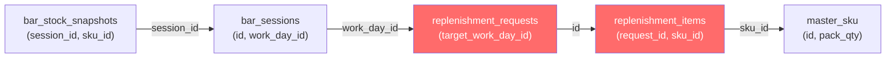

# Plan de Corrección: Auditoría de Botellas y Varianza de Stock

**Fecha:** 2026-02-16  
**Autor:** Orquestador (Deep Research Mode — Solo Lectura)  
**Estado:** 🟡 PROPUESTA — Pendiente aprobación del Arquitecto

---

## 1. Diagnóstico del Problema

### 1.1 El Síntoma

Las varianzas de stock en la auditoría de barras dan **siempre negativas** (consumo real > consumo teórico), sugiriendo "pérdidas fantasma" que no corresponden a la realidad operativa.

### 1.2 La Causa Raíz

> [!CAUTION]
> **Ambas vistas de auditoría (`vw_bar_audit_variance` y `vw_bar_efficiency`) ignoran completamente las reposiciones intermedias.**

El CTE compartido `stock_movements` solo considera dos tipos de snapshot:

```sql
-- CTE ACTUAL (defectuoso)
stock_movements AS (
    SELECT bss.session_id, bss.sku_id,
        SUM(CASE WHEN bss.type = 'opening' THEN bss.quantity ELSE 0 END) AS stock_opening,
        SUM(CASE WHEN bss.type = 'closing' THEN bss.quantity ELSE 0 END) AS stock_closing
    FROM bar_stock_snapshots bss
    GROUP BY bss.session_id, bss.sku_id
)
```

**Y luego calcula:**

```
consumo_real = stock_opening - stock_closing
```

### 1.3 Visualización del Error

```
EJEMPLO: Vodka Absolut — Barra Principal — Noche 2026-02-15

┌─ Opening ─────────────────────┐   ┌─ Closing ────────────────────┐
│  Snapshot: 5 botellas          │   │  Snapshot: 4 botellas         │
└───────────────────────────────┘   └──────────────────────────────┘

                 ⬇ A mitad de noche se reponen 3 botellas (INVISIBLE para la vista)

Vista ACTUAL:    consumo_real = 5 - 4 = 1 botella
Realidad:        consumo_real = 5 + 3 - 4 = 4 botellas ← con reposiciones
Teórico (GBOL):  consumo_sistema = 4 botellas

Resultado ACTUAL:   diferencia = 1 - 4 = -3 (falso "error de registro")
Resultado CORRECTO: diferencia = 4 - 4 =  0 (DENTRO_DE_RANGO ✅)
```

### 1.4 Las Tablas Involucradas

| Tabla                    | Rol                          | Columnas Clave                                                                    |
| ------------------------ | ---------------------------- | --------------------------------------------------------------------------------- |
| `bar_stock_snapshots`    | Snapshots de apertura/cierre | `session_id`, `sku_id`, `quantity`, `type` (`opening`/`closing`)                  |
| `bar_sessions`           | Sesiones de barra            | `id`, `work_day_id`, `location`, `status`                                         |
| `replenishment_requests` | Pedidos de reposición        | `id`, `target_work_day_id`, `status`, `user_id`                                   |
| `replenishment_items`    | Líneas de cada reposición    | `request_id`, `sku_id`, `requested_packs`, `adjust_packs`, `status`, `is_deleted` |
| `master_sku`             | Catálogo de productos        | `id`, `pack_qty`, `costo`                                                         |

### 1.5 El Enlace Faltante



> [!IMPORTANT]
> **No existe `session_id` en `replenishment_requests`.** La vinculación es por `work_day_id`. Las reposiciones se distribuyen a **toda la jornada**, no a una sesión específica.

---

## 2. El Algoritmo Correcto

### 2.1 Fuente Canónica

De `synthesis-report.md`, Sección 3.3 (L88):

> _"Apertura de Sesión: El stock inicial de una sesión de barra se basa en: **Cierre de la Sesión Anterior + Reposiciones Intermedias**"_

> _"Auditoría: El sistema compara el **Consumo Real** (`Apertura - Cierre`) con el **Consumo Teórico** (calculado por las recetas de los productos vendidos en el POS)"_

### 2.2 La Fórmula Matemática

```
Stock Efectivo = Stock_Opening + Unidades_Repuestas

Donde:    Unidades_Repuestas = SUM(requested_packs * pack_qty)
          para el mismo work_day_id y sku_id
          donde is_deleted = false

Consumo Real Corregido = Stock_Efectivo - Stock_Cierre

Diferencia = Consumo_Real_Corregido - Consumo_Sistema(GBOL)
```

### 2.3 Consideración: Unidades vs Packs

| Tabla                                 | Columna                                      | Unidad |
| ------------------------------------- | -------------------------------------------- | ------ |
| `bar_stock_snapshots.quantity`        | **Unidades** (botellas individuales)         |
| `replenishment_items.requested_packs` | **Packs** (cajas/sixpacks)                   |
| `master_sku.pack_qty`                 | **Factor de conversión** (unidades por pack) |

La conversión es: `unidades_repuestas = requested_packs × pack_qty`

### 2.4 Consideración: Status del Pedido

Actualmente solo existe el status `draft` en `replenishment_requests`. Cuando se implemente el flujo completo de aprobación, el filtro deberá ser:

```sql
WHERE rr.status IN ('approved', 'delivered', 'completed')
  AND ri.is_deleted = false
```

> [!WARNING]
> **Decisión requerida del Arquitecto:** ¿Se suman las `requested_packs` o las `adjust_packs`? Si `adjust_packs` es el valor real entregado (post-ajuste), se debe usar `COALESCE(ri.adjust_packs, ri.requested_packs)` como cantidad efectiva. Si `adjust_packs` es solo una corrección parcial, se usa `requested_packs` directamente.

---

## 3. Propuesta SQL — El Core

### 3.1 Vista Corregida: `vw_bar_audit_variance`

```sql
CREATE OR REPLACE VIEW vw_bar_audit_variance AS
WITH stock_movements AS (
    SELECT bss.session_id,
        bss.sku_id,
        SUM(CASE WHEN bss.type = 'opening' THEN bss.quantity ELSE 0 END) AS stock_opening,
        SUM(CASE WHEN bss.type = 'closing' THEN bss.quantity ELSE 0 END) AS stock_closing
    FROM bar_stock_snapshots bss
    GROUP BY bss.session_id, bss.sku_id
),
-- ════════════════════════════════════════════════════════════════
-- NUEVO CTE: Reposiciones intermedias por work_day y sku
-- Convierte packs → unidades usando master_sku.pack_qty
-- ════════════════════════════════════════════════════════════════
replenished AS (
    SELECT
        rr.target_work_day_id AS work_day_id,
        ri.sku_id,
        SUM(
            COALESCE(ri.adjust_packs, ri.requested_packs)
            * COALESCE(ms.pack_qty, 1)
        ) AS units_replenished
    FROM replenishment_requests rr
    JOIN replenishment_items ri ON ri.request_id = rr.id
    LEFT JOIN master_sku ms ON ms.id = ri.sku_id
    WHERE ri.is_deleted = false
      -- Cuando existan más statuses, descomentar:
      -- AND rr.status IN ('approved', 'delivered', 'completed')
    GROUP BY rr.target_work_day_id, ri.sku_id
),
physical_consumption AS (
    SELECT sm.session_id,
        sm.sku_id,
        sm.stock_opening,
        sm.stock_closing,
        -- ═══ CORRECCIÓN: sumar reposiciones al stock efectivo ═══
        sm.stock_opening + COALESCE(rep.units_replenished, 0) AS stock_effective,
        (sm.stock_opening + COALESCE(rep.units_replenished, 0)) - sm.stock_closing AS consumo_real,
        ((sm.stock_opening + COALESCE(rep.units_replenished, 0)) - sm.stock_closing) * COALESCE(ms.costo, 0) AS costo_real
    FROM stock_movements sm
    LEFT JOIN bar_sessions bs_link ON bs_link.id = sm.session_id
    LEFT JOIN replenished rep ON rep.work_day_id = bs_link.work_day_id
                              AND rep.sku_id = sm.sku_id
    LEFT JOIN master_sku ms ON ms.id = sm.sku_id
),
theoretical_consumption AS (
    SELECT bss.session_id,
        (rec_item.value ->> 'sku_id')::uuid AS sku_id,
        SUM(
            COALESCE(
                (rec_item.value ->> 'qty')::numeric,
                (rec_item.value ->> 'quantity')::numeric,
                0
            ) * bss.quantity
        ) AS consumo_sistema,
        SUM(
            COALESCE(
                (rec_item.value ->> 'qty')::numeric,
                (rec_item.value ->> 'quantity')::numeric,
                0
            ) * bss.quantity * COALESCE(ms.costo, 0)
        ) AS costo_sistema
    FROM bar_session_sales bss
    LEFT JOIN master_recipes mr ON mr.external_id = bss.external_id
    CROSS JOIN LATERAL jsonb_array_elements(mr.ingredients) rec_item(value)
    LEFT JOIN master_sku ms ON ms.id = (rec_item.value ->> 'sku_id')::uuid
    WHERE mr.id IS NOT NULL
    GROUP BY bss.session_id, (rec_item.value ->> 'sku_id')::uuid
)
SELECT bs.id AS session_id,
    bs.work_day_id,
    wd.work_date,
    bs.location,
    COALESCE(pc.sku_id, tc.sku_id) AS sku_id,
    ms.nombre AS sku_nombre,
    mc.nombre AS categoria,
    -- Columnas originales preservadas para no romper frontend
    COALESCE(pc.stock_opening, 0) AS stock_apertura,
    COALESCE(pc.stock_closing, 0) AS stock_cierre,
    COALESCE(pc.consumo_real, 0) AS consumo_real,
    COALESCE(tc.consumo_sistema, 0) AS consumo_sistema,
    COALESCE(pc.consumo_real, 0) - COALESCE(tc.consumo_sistema, 0) AS diferencia,
    COALESCE(pc.costo_real, 0) AS costo_real,
    COALESCE(tc.costo_sistema, 0) AS costo_sistema,
    COALESCE(pc.costo_real, 0) - COALESCE(tc.costo_sistema, 0) AS costo_diferencia,
    CASE
        WHEN COALESCE(pc.consumo_real, 0) > 0
            THEN ROUND((COALESCE(pc.consumo_real, 0) - COALESCE(tc.consumo_sistema, 0)) / pc.consumo_real * 100, 2)
        ELSE 0
    END AS varianza_pct,
    CASE
        WHEN COALESCE(pc.consumo_real, 0) = 0 AND COALESCE(tc.consumo_sistema, 0) = 0 THEN 'SIN_MOVIMIENTO'
        WHEN COALESCE(pc.consumo_real, 0) = 0 THEN 'ERROR_REGISTRO'
        WHEN ABS((COALESCE(pc.consumo_real, 0) - COALESCE(tc.consumo_sistema, 0)) / NULLIF(pc.consumo_real, 0) * 100) <= 5 THEN 'DENTRO_DE_RANGO'
        WHEN (COALESCE(pc.consumo_real, 0) - COALESCE(tc.consumo_sistema, 0)) > 0 THEN 'ALERTA_PERDIDA'
        ELSE 'ERROR_REGISTRO'
    END AS clasificacion,
    -- ═══ NUEVAS COLUMNAS (aditivas, no rompen frontend) ═══
    COALESCE(pc.stock_effective, COALESCE(pc.stock_opening, 0)) AS stock_efectivo,
    COALESCE(
        (SELECT rep.units_replenished FROM replenished rep
         WHERE rep.work_day_id = bs.work_day_id AND rep.sku_id = COALESCE(pc.sku_id, tc.sku_id)),
        0
    ) AS unidades_repuestas,
    bs.status AS session_status,
    opened_by.full_name AS opened_by_name,
    closed_by.full_name AS closed_by_name,
    bs.opened_at,
    bs.closed_at
FROM bar_sessions bs
JOIN work_days wd ON wd.id = bs.work_day_id
LEFT JOIN physical_consumption pc ON pc.session_id = bs.id
FULL JOIN theoretical_consumption tc ON tc.session_id = bs.id AND tc.sku_id = pc.sku_id
LEFT JOIN master_sku ms ON ms.id = COALESCE(pc.sku_id, tc.sku_id)
LEFT JOIN master_categories mc ON mc.id = ms.categoria_id
LEFT JOIN profiles opened_by ON opened_by.id = bs.opened_by
LEFT JOIN profiles closed_by ON closed_by.id = bs.closed_by
WHERE bs.status = 'closed';
```

### 3.2 Vista Corregida: `vw_bar_efficiency`

Requiere el mismo parche en su CTE `stock_movements` → `physical_consumption`. La lógica es idéntica: sumar `replenished.units_replenished` al `stock_opening` antes de calcular `physical_qty`.

> El SQL completo de `vw_bar_efficiency` sigue la misma estructura. Se genera en la migración junto con `vw_bar_audit_variance`.

---

## 4. Propuesta JS (Frontend)

> [!NOTE]
> **No se requieren cambios en el frontend.**

El JS (`admin-workdays.js`) es 100% "Frontend Bobo":

| Función                 | Líneas    | Comportamiento                                                               |
| ----------------------- | --------- | ---------------------------------------------------------------------------- |
| `loadStockAuditData()`  | 2043-2089 | `SELECT * FROM vw_bar_audit_variance WHERE work_day_id = ?` — solo lectura   |
| `renderVarianceTable()` | 2122-2152 | Renderiza `r.consumo_real`, `r.diferencia`, `r.clasificacion` — sin cálculos |
| `renderSessionsTable()` | 2099-2119 | Renderiza `s.cost_physical`, `s.loss_amount` — sin cálculos                  |

**Todo el cálculo de consumo, varianza y clasificación se resuelve en SQL.** El frontend solo mapea datos a celdas de tabla. Al corregir las vistas, el frontend se autocorrige.

### 4.1 Oportunidad Futura (No Bloqueante)

Si se quiere **mostrar** las columnas nuevas (`stock_efectivo`, `unidades_repuestas`) en la tabla de varianza, se necesitaría un cambio menor en `renderVarianceTable()` para agregar 1-2 columnas extra al `<tr>`. Pero esto es cosmético y no afecta la corrección del cálculo.

---

## 5. Riesgos y Consideraciones

| Riesgo                                                                                                              | Mitigación                                                                                                                                                                                                                             |
| ------------------------------------------------------------------------------------------------------------------- | -------------------------------------------------------------------------------------------------------------------------------------------------------------------------------------------------------------------------------------- |
| `pack_qty` nulo en algún SKU → multiplicación por NULL                                                              | `COALESCE(ms.pack_qty, 1)` — asume 1 unidad por pack                                                                                                                                                                                   |
| Solo status `draft` existe hoy → sin filtro de aprobación                                                           | Filtro comentado en SQL, activar cuando flujo de aprobación exista                                                                                                                                                                     |
| Reposición distribuida a level de `work_day_id`, no `session_id` → si hay 2 barras, ambas suman la misma reposición | Requiere decisión: ¿distribuir proporcionalmente entre sesiones, o asignar toda la reposición a una barra? Propuesta: dejar a nivel work_day (es lo correcto operativamente — las reposiciones son para "la noche", no para una barra) |
| `adjust_packs` vs `requested_packs` — ¿cuál es la cantidad real?                                                    | Usar `COALESCE(adjust_packs, requested_packs)` — si hubo ajuste, prevalece                                                                                                                                                             |
| Las columnas nuevas (`stock_efectivo`, `unidades_repuestas`) podrían confundir queries existentes                   | Son aditivas, no reemplazan las existentes. Frontend las ignora si no las pide                                                                                                                                                         |

---

## 6. Decisiones Pendientes del Arquitecto

1. **¿`requested_packs` o `COALESCE(adjust_packs, requested_packs)`?** — ¿El ajuste reemplaza al pedido?
2. **¿Filtrar por `rr.status`?** — Hoy solo hay `draft`. ¿Se suman todas las reposiciones o solo las aprobadas?
3. **¿Distribución multi-barra?** — Si hay 2+ sesiones en la misma noche, ¿cada una suma todas las reposiciones del work_day? (Propuesta: sí, porque las reposiciones son a nivel noche)
4. **¿Parchear `vw_bar_efficiency` en la misma migración?** — Recomendado (mismo bug)

---

## 7. Resumen Ejecutivo

```
┌──────────────────────────────────────────────────────────────┐
│  DIAGNÓSTICO: Las vistas de auditoría no suman reposiciones │
│  IMPACTO: Toda varianza aparece inflada (pérdidas fantasma) │
│  FIX: 1 CTE nuevo (replenished) + 1 JOIN en cada vista     │
│  FRONTEND: Zero cambios necesarios                          │
│  RIESGO: Bajo (zero ALTER, zero DROP, solo CREATE OR REPLACE)│
└──────────────────────────────────────────────────────────────┘
```
