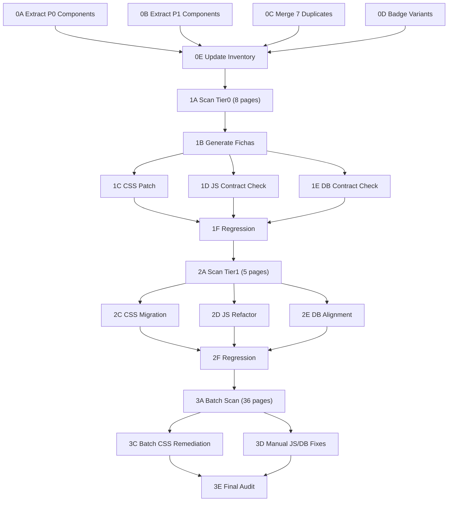

# Plan Maestro — Page-by-Page Design & Build

> Generado: 2026-02-19 05:10 ART | Orchestrator Wake-up

---

## 1. Reporte de Estado (Wake-up)

### 1.1 Design System

| Asset                       | Estado                 | Observaciones                                                                                                                                                             |
| --------------------------- | ---------------------- | ------------------------------------------------------------------------------------------------------------------------------------------------------------------------- |
| `tokens.css`                | ✅ 265 líneas, 5 capas | Primitivos → Semánticos → Componentes → Chart → Print/QR. Incluye shorthand aliases (59+ refs `--text-1`, 88 refs `--border-1`). Legacy aurora-red aliases aún presentes. |
| `swiss-style.css`           | ⚠️ 445 líneas          | 14 componentes production-ready. Faltan: Toggle, Checkbox, Progress, Tooltips, Dropdowns, Alerts.                                                                         |
| `COMPONENT-INVENTORY.md`    | ✅ Actualizado         | 34 secciones. 14 ✅, 12 🟡 (visual-only), 7 🔁 (overlaps), 1 🔴 (faltante: Alerts).                                                                                       |
| `design-system-visual.html` | ✅ Referencia          | 2400 líneas. Fuente de estilos visuales sin extraer. NO es source of truth (R2).                                                                                          |

### 1.2 Deuda de DS Crítica (bloqueante para pages)

| Prioridad | Componente                       | Problema                              | Impacto                           |
| --------- | -------------------------------- | ------------------------------------- | --------------------------------- |
| P0        | Toggle Switch (§12)              | Solo en `visual.html`                 | `admin-config.html` lo necesita   |
| P0        | Dropdowns (§17)                  | Solo en `visual.html`                 | Múltiples páginas admin/operativo |
| P1        | Progress Bars (§15)              | Solo en `visual.html`                 | stock, workday                    |
| P1        | Tooltips (§16)                   | Solo en `visual.html`                 | data tables                       |
| P1        | Alerts/P&L (§31)                 | No existe                             | Dashboard alertas financieras     |
| P2        | Badge variants                   | Faltan `.badge-danger`, `.badge-info` | Indicadores de estado             |
| P2        | Overlaps (§18-21, §24, §26, §30) | 7 secciones duplicadas                | Confusión de qué clase usar       |

### 1.3 Páginas — Inventario por Tier

#### Tier 0 — Parche mínimo, NO renombrar IDs/attrs (8 páginas)

| #    | Página                       | Directorio  | Rol             | Dominio principal  |
| ---- | ---------------------------- | ----------- | --------------- | ------------------ |
| T0-1 | `admin-workdays.html`        | admin/      | admin           | Jornadas laborales |
| T0-2 | `admin-central-stock.html`   | admin/      | admin           | Stock central      |
| T0-3 | `admin-pagos.html`           | admin/      | admin           | Pagos/finanzas     |
| T0-4 | `admin-solicitudes.html`     | admin/      | admin           | Solicitudes        |
| T0-5 | `staff-caja-index.html`      | staff/      | staff_caja      | Caja operativa     |
| T0-6 | `staff-barra-index.html`     | staff/      | staff_barra     | Barra operativa    |
| T0-7 | `encargado-caja-noche.html`  | encargados/ | encargado_caja  | Cierre caja        |
| T0-8 | `encargado-barra-noche.html` | encargados/ | encargado_barra | Cierre barra       |

#### Tier 1 — Refactor por capas con plan de regresión (5 páginas)

| #    | Página                        | Directorio  | Rol       |
| ---- | ----------------------------- | ----------- | --------- |
| T1-1 | `operativo-solicitudes.html`  | operativo/  | operativo |
| T1-2 | `logistica-distribucion.html` | logistica/  | logistico |
| T1-3 | `encargado-recepcion.html`    | encargados/ | encargado |
| T1-4 | `qr/monitor.html`             | admin/qr/   | manager   |
| T1-5 | `balance-semanal.html`        | gerencia/   | gerencia  |

#### Sin Tier — Migración completa permitida (36 páginas)

| Directorio  | Páginas     | Archivos                                                                                                                                                                          |
| ----------- | ----------- | --------------------------------------------------------------------------------------------------------------------------------------------------------------------------------- |
| admin/      | 9 restantes | `admin-index`, `admin-config`, `admin-master-*` (5), `admin-reportes`, `admin-semanal`, `test-devenciones`                                                                        |
| admin/qr/   | 2 restantes | `generator`, `index`                                                                                                                                                              |
| encargados/ | 5 restantes | `encargado-barra-index`, `encargado-barra-personal`, `encargado-caja-index`, `encargado-caja-personal`                                                                            |
| logistica/  | 4 restantes | `logistica-index`, `logistica-recepcion`, `logistica-seguimiento`, `logistica-stock`                                                                                              |
| members/    | 1           | `my-qr`                                                                                                                                                                           |
| operativo/  | 9 restantes | `cms-members`, `operativo-analisis`, `operativo-index`, `operativo-master-proveedores`, `operativo-master-sku`, `operativo-stock`, `operativo-workday`, `scanner-mock`, `scanner` |
| prototypes/ | 3           | `lab-balance-semanal`, `lab-workdays`, `lab-workdays-night`                                                                                                                       |
| root pages/ | 3           | `components_catalog`, `layout_patterns`, `module-audit`                                                                                                                           |

### 1.4 Tooling Disponible

| Script                     | Estado    | Verificado        |
| -------------------------- | --------- | ----------------- |
| `ui-component-scanner.ps1` | ✅ 28.7KB | Escaneo HTML→CSS  |
| `ds-pre-audit.ps1`         | ✅ 2.0KB  | Pre-auditoría     |
| `ds-fix-hex.ps1`           | ✅ 5.0KB  | Fix hex hardcoded |
| `batch-remediation.ps1`    | ✅ 11.0KB | Batch CSS remed.  |
| `db-batch-remediation.ps1` | ✅ 4.3KB  | Batch DB remed.   |
| `flow-tracer.ps1`          | ✅ 27.5KB | JS→DB flows       |
| `context-loader.ps1`       | ✅ 16.8KB | Context load      |
| `doc-mapper.ps1`           | ✅ 24.6KB | Doc mapping       |
| `ops-watchdog.ps1`         | ✅ 13.3KB | Ops monitor       |
| `ds-parallel-launch.ps1`   | ✅ 8.3KB  | Parallel DS tasks |

### 1.5 Database Schema

- `docs/architecture/scheme.md`: **1366 líneas**, **47+ tablas** documentadas.
- Última sync: 2026-02-16 contra Supabase real.
- Tablas críticas para cross-check JS↔DB: `bar_sessions`, `bar_stock_snapshots`, `cash_closings`, `closing_terminals`, `cost_config`, `inventory_movements`, `inventory_stock`, `master_sku`, `members`, `pos_terminals`, `profiles`, `supplier_orders`, `work_days`.

---

## 2. DAG de Dependencias — Plan Maestro

```
Step 0: DS Consolidation (PREREQUISITO GLOBAL)
├── 0A: Extract P0 components (Toggle, Dropdowns) → frontend
├── 0B: Extract P1 components (Progress, Tooltips, Alerts) → frontend
├── 0C: Merge 7 duplicated sections → frontend
├── 0D: Add missing badge variants → frontend
└── 0E: Update COMPONENT-INVENTORY.md → qa

Step 1: Tier0 Pages — Patch Only (depende de Step 0)
├── 1A: Scan all 8 Tier0 pages (CSS/JS/DB audit) → cli: ui-component-scanner.ps1 + flow-tracer.ps1
├── 1B: Generate per-page fichas with findings → orchestrator
├── 1C: CSS patch (swap orphan classes → swiss system) → frontend × 8
├── 1D: JS contract verification → logic × 8
├── 1E: DB contract verification → data × 8
└── 1F: Regression check → qa × 8

Step 2: Tier1 Pages — Layered Refactor (depende de Step 1F pass)
├── 2A: Scan all 5 Tier1 pages → cli
├── 2B: Per-page refactor plan with regression plan → orchestrator
├── 2C: CSS migration (full DS adoption) → frontend × 5
├── 2D: JS refactor (IIFE Async, window.sb) → logic × 5
├── 2E: DB alignment → data × 5
└── 2F: Regression test → qa × 5

Step 3: Remaining Pages — Full Migration (depende de Step 2F pass)
├── 3A: Batch scan 36 pages → cli: ds-parallel-launch.ps1
├── 3B: Group by similarity, create batch remediation configs → orchestrator
├── 3C: Run batch-remediation.ps1 for CSS → frontend (automated)
├── 3D: Manual JS/DB fixes per page → logic + data
└── 3E: Final audit → qa
```

### Dependencia Visual (Mermaid)



---

## 3. Fichas por Paso — Detalle

### Step 0: DS Consolidation

| Task | Agente     | Skill                      | Input                                | Output                                                  | Dependencia    |
| ---- | ---------- | -------------------------- | ------------------------------------ | ------------------------------------------------------- | -------------- |
| 0A   | `frontend` | `css-architect`            | `visual.html` §12, §17               | Toggle + Dropdown classes en `swiss-style.css`          | —              |
| 0B   | `frontend` | `css-architect`            | `visual.html` §15, §16, §31          | Progress + Tooltip + Alert classes en `swiss-style.css` | —              |
| 0C   | `frontend` | `design-system-architect`  | `COMPONENT-INVENTORY.md` merge table | Consolidated sections in `swiss-style.css`              | —              |
| 0D   | `frontend` | `css-architect`            | `tokens.css` semantic colors         | `.badge-danger`, `.badge-info` en `swiss-style.css`     | —              |
| 0E   | `qa`       | `module-coherence-auditor` | Updated `swiss-style.css`            | Updated `COMPONENT-INVENTORY.md`                        | 0A, 0B, 0C, 0D |

### Step 1: Tier0 Pages (per-page ficha template)

| Campo          | Descripción                                                                  |
| -------------- | ---------------------------------------------------------------------------- |
| **Página**     | `{filename}`                                                                 |
| **Tier**       | Tier0 — patch mínimo                                                         |
| **CSS ↔ HTML** | `{clases usadas}` vs `{clases disponibles en swiss-style.css}` → `{orphans}` |
| **JS ↔ HTML**  | IDs/data-attrs verificados contra `querySelector` patterns                   |
| **JS ↔ DB**    | Columnas/tablas verificadas contra `scheme.md`                               |
| **Agente CSS** | `frontend`                                                                   |
| **Agente JS**  | `logic`                                                                      |
| **Agente DB**  | `data`                                                                       |
| **Prioridad**  | P0                                                                           |
| **Estado**     | 🔲 Pendiente                                                                 |

> Las fichas individuales se generan en Step 1B después del scan automatizado (1A).

### Step 2 & 3: Same template, escalating refactor depth.

---

## 4. Reglas de Ejecución

1. **Un step a la vez** (R7): No ejecutar Step 1 hasta que Step 0 esté completo y aprobado.
2. **Paralelismo dentro de steps**: Tasks 0A-0D son independientes → se pueden ejecutar en paralelo. Tasks 1C/1D/1E dentro de una misma página se ejecutan en secuencia (CSS primero, luego JS, luego DB).
3. **Tier0 constraint**: NO renombrar IDs ni `data-*` attrs. Solo swap de CSS classes y verificación de contratos existentes.
4. **tokens.css inmutable** (R1): Cualquier cambio propuesto a tokens requiere aprobación explícita del usuario.
5. **Changelog**: Cada decisión se registra en `docs/_generated/orchestrator/CHANGELOG.md`.

---

## 5. Gate de Ejecución

> ⏸️ **ESPERANDO APROBACIÓN DEL USUARIO** para proceder con Step 0.
>
> Opciones:
>
> - **A) Aprobar plan completo** → Procedo con Step 0 (DS Consolidation)
> - **B) Ajustar prioridades** → Indicar qué cambiar
> - **C) Empezar solo con scan** → Ejecuto Step 1A (scan) sin tocar el DS para ver el estado real

---

## 6. Protocolo Handshake

Palabra clave: `handshake` — detiene toda planificación, presenta resumen de 3 líneas, ofrece opciones A (volver al plan) o B (integrar desvío).
