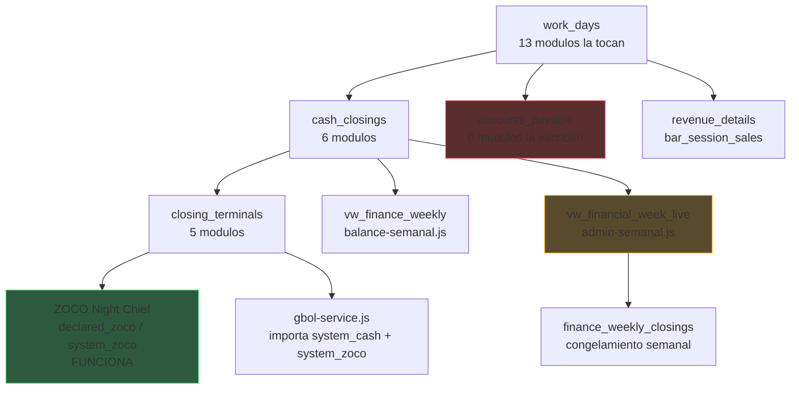

# Deep Cross-Module Verification — Workdays & Cashflow

> Generado: 2026-02-16 08:45 | Metodo: analisis estatico de 42 modulos JS + scheme.md

---

## 1. Mapa de Datos: Como Fluye la Plata



---

## 2. Modulos que Tocan `work_days` (13 total)

| Modulo                        | Rol             | Operaciones                      |
| :---------------------------- | :-------------- | :------------------------------- |
| `admin-workdays.js`           | Admin central   | CRUD completo, close via RPC     |
| `admin-index.js`              | Dashboard admin | Lee estado actual                |
| `admin-solicitudes.js`        | Solicitudes     | Lee work_day vinculado           |
| `admin-central-stock.js`      | Stock           | Lee work_day para contexto       |
| `operativo-workday.js`        | Vista operativa | Lee ACTIVE, gestiona links/staff |
| `scanner.js`                  | Scanner QR      | Lee work_day para validar        |
| `encargado-caja-noche.js`     | Night Chief     | Lee/actualiza work_day via RPC   |
| `encargado-caja-index.js`     | Dash encargado  | Lee estado                       |
| `encargado-caja-personal.js`  | Personal caja   | Lee work_days futuras            |
| `encargado-barra-personal.js` | Personal barra  | Lee work_days                    |
| `staff-caja-index.js`         | Staff caja      | Lee convocatorias con work_days  |
| `logistica-index.js`          | Logistica       | Lee work_day para despachos      |
| `work-day-helper.js`          | Helper core     | Query centralizado               |

---

## 3. Pipeline Financiero (Cashflow)

### Paso 1: Terminal → Cierre de Caja

```
Staff cierra terminal → closing_terminals (declared_cash, declared_zoco)
GBol Service importa → closing_terminals (system_cash, system_zoco)
Diferencia = system - declared → descalce por terminal
```

### Paso 2: Cierre de Noche → Cierre Semanal

```
Night Chief cierra la noche → cash_closings se actualiza
  └─ total_system, total_declared, total_difference
  └─ health_score, net_result (via RPC rpc_close_work_day)
  └─ work_days.status = 'CLOSED'
```

### Paso 3: Vista Semanal → Congelamiento

```
vw_financial_week_live → agrega work_days de la semana
  └─ income_white, income_black, expense_white, expense_black
admin-semanal.js → "Congelar Semana" → finance_weekly_closings (INSERT)

vw_finance_weekly → vista para gerencia (balance-semanal.js)
```

---

## 4. Hallazgos Criticos

### [ALERT] Vista fantasma: `vw_financial_week_live`

| Dato                         | Detalle                                                                  |
| :--------------------------- | :----------------------------------------------------------------------- |
| **Que es**                   | Vista usada por `admin-semanal.js` para datos en vivo                    |
| **Donde se usa**             | Lineas 68 y 97 de admin-semanal.js                                       |
| **Documentada en scheme.md** | **NO**                                                                   |
| **Riesgo**                   | Si esta vista no existe en Supabase, admin-semanal falla silenciosamente |
| **Accion**                   | Verificar en Supabase si existe, documentar en scheme.md                 |

### [ALERT] `accounts_payable` sin UI

| Dato                           | Detalle                                                        |
| :----------------------------- | :------------------------------------------------------------- |
| **Que es**                     | Tabla de gastos/cuentas por pagar                              |
| **Modulos JS que la escriben** | **CERO**                                                       |
| **Impacto**                    | Los gastos solo entran por importacion o DB directa, no por UI |
| **Relacion con Workdays**      | `accounts_payable.work_day_id` existe como FK                  |
| **Accion S8**                  | Agregar category 'guardarropas' al CHECK constraint            |

### [ALERT] 3 vistas no documentadas en scheme.md

| Vista                   | Usada en          | Existe en Supabase?             |
| :---------------------- | :---------------- | :------------------------------ |
| `vw_night_snapshot`     | admin-workdays.js | Probablemente si, falta en docs |
| `vw_bar_audit_variance` | admin-workdays.js | Probablemente si, falta en docs |
| `vw_fiscal_summary`     | admin-workdays.js | Probablemente si, falta en docs |

### [WARN] 2 RPCs desconectados

| RPC                   | Status                | Explicacion probable                       |
| :-------------------- | :-------------------- | :----------------------------------------- |
| `rpc_create_work_day` | No referenciado en JS | Work days se crean con INSERT directo      |
| `rpc_plan_work_day`   | No referenciado en JS | Estado PLANNED se setea con UPDATE directo |

### [WARN] 6 IDs huerfanos en JS

IDs que JS busca con `getElementById` pero no existen en HTML:

- `btn-back-list` — probablemente renombrado
- `panelEvento`, `panelHistorico`, `panelPlan`, `panelStockAudit` — paneles que se movieron o renombraron
- `stock-variance` — panel de varianza de stock (futuro Sprint 6?)

### [INFO] Gap #7 ZOCO confirmado

`vw_finance_weekly` no tiene columnas para desglose ZOCO neto. Los datos que llegan son:

- `zoco_system` y `zoco_declared` (terminal-level, funciona)
- Falta: aranceles, IVA, costo financiero, neto recibido, desfase temporal
- **Decisión diferida** hasta trabajar en Balance Semanal

---

## 5. Sorpresas Positivas

| Item                    | Esperado en       | Estado Real                           |
| :---------------------- | :---------------- | :------------------------------------ |
| `vw_workday_pnl`        | Sprint 5 (futuro) | Ya existe en scheme.md                |
| `vw_workday_benchmarks` | Sprint 4 (futuro) | Ya existe en scheme.md                |
| Break-even logic        | Sprint 4          | Parcialmente implementado en JS       |
| Health score            | Sprint 5          | Ya funciona via `rpc_close_work_day`  |
| Net result auto-write   | Sprint 5          | Ya funciona via RPC                   |
| Real-time updates       | Sprint 7          | Night Chief ya usa `postgres_changes` |

---

## 6. Dependencias entre Sprints (Revisado)

```
Sprint 4 (Templates + Break-Even)
  └─ Necesita: work_day_templates (table), template UI
  └─ Ya tiene: break-even parcial, benchmarks view

Sprint 5 (P&L + Health Score)  ← 75% LISTO
  └─ Necesita: live indicator badge
  └─ Ya tiene: health_score, net_result, vw_workday_pnl

Sprint 6 (Supply Chain)
  └─ Necesita: stock alerts, replenishment links
  └─ Depende de: logistica-index.js + inventory_ideal

Sprint 7 (Edge Cases + UX)
  └─ Necesita: tooltips, responsive, empty states
  └─ Independiente de datos

Sprint 8 (Guardarropas + Deploy)
  └─ Necesita: ALTER accounts_payable CHECK constraint
  └─ Necesita: input UI en Night Chief
```

---

## 7. Recomendacion de Orden Revisado

| Prioridad | Sprint         | Razon                                              |
| :-------- | :------------- | :------------------------------------------------- |
| 1         | **S5 primero** | 75% listo, solo falta live badge. Victoria rapida. |
| 2         | S4             | Templates + break-even. Necesita tabla nueva.      |
| 3         | S6             | Supply chain. Depende de stock module.             |
| 4         | S7             | UX polish. Sin dependencias.                       |
| 5         | S8             | Guardarropas. Necesita ALTER de constraint.        |

---

_Generado por Antigravity. Script: `workdays-verifier.ps1`. Datos: analisis estatico de 42 modulos JS._
