# 🗺️ Mapa de Pantallas - FormulaMid 4

> **Última Actualización**: 2026-02-16  
> **Total Pantallas**: 45 producción + 3 prototipos  
> **Documento**: Arquitectura de navegación y contextos de usuario

---

## 🎯 Propósito

Este documento visualiza la **topografía completa** del sistema FormulaMid 4, organizando las 45 pantallas por rol operativo y contexto funcional. Útil para:

- Desarrolladores que necesitan entender el flujo de navegación
- QA para validar cobertura de tests por módulo
- Stakeholders para comprender el alcance del sistema

---

## 🗺️ Visualización de Arquitectura

```mermaid
graph TD
    %% ═══════════════════════════════════════════════════════════════
    %% PORTAL CENTRAL
    %% ═══════════════════════════════════════════════════════════════
    Portal[🏠 Portal Central<br/><small><i>index.html</i></small>]

    Portal --> A_IDX
    Portal --> O_IDX
    Portal --> L_IDX
    Portal --> E_BAR
    Portal --> E_CAJ
    Portal --> S_BAR
    Portal --> G_BAL
    Portal --> M_QR

    %% ═══════════════════════════════════════════════════════════════
    %% ADMINISTRACIÓN (17 pantallas)
    %% ═══════════════════════════════════════════════════════════════
    subgraph FM4_ADM [🔵 ADMINISTRACIÓN · 17 pantallas]
        direction TB
        A_IDX[📊 Dashboard<br/><small><i>admin-index</i></small>]

        subgraph ADM_OPS [⚙️ Operaciones Diarias]
            A_WD[📅 Work Days<br/><small><i>admin-workdays</i></small>]
            A_SOL[📬 Solicitudes<br/><small><i>admin-solicitudes</i></small>]
            A_REP[📈 Reportes<br/><small><i>admin-reportes</i></small>]
            A_WKL[📊 Semanal<br/><small><i>admin-semanal</i></small>]
            A_CFG[⚙️ Config<br/><small><i>admin-config</i></small>]
        end

        subgraph ADM_STK [📦 Control de Inventario]
            A_CEN[🔍 Central Stock<br/><small><i>admin-central-stock</i></small>]
        end

        subgraph ADM_MST [🗃️ Maestros de Datos]
            A_PRV[🏢 Proveedores<br/><small><i>admin-master-proveedores</i></small>]
            A_CAT[📁 Categorías<br/><small><i>admin-master-categorias</i></small>]
            A_TAR[💰 Tarifario<br/><small><i>admin-master-tarifario</i></small>]
            A_NOM[👥 Nómina<br/><small><i>admin-master-nomina</i></small>]
            A_PAG[💳 Pagos<br/><small><i>admin-pagos</i></small>]
            A_POS[📟 Terminales POS<br/><small><i>admin-master-pos</i></small>]
        end

        subgraph ADM_BAR [🍸 Gestión de Barras]
            AB_IDX[🎯 Hub Barras<br/><small><i>barras/index</i></small>]
            AB_REC[📖 Recetas<br/><small><i>barras/recipes</i></small>]
            AB_SES[🌙 Sesiones<br/><small><i>barras/session</i></small>]
        end

        subgraph ADM_QR [📱 Sistema QR]
            QR_IDX[🎯 Hub QR<br/><small><i>qr/index</i></small>]
            QR_GEN[🔲 Generador<br/><small><i>qr/generator</i></small>]
            QR_MON[👁️ Monitor<br/><small><i>qr/monitor</i></small>]
        end
    end

    %% ═══════════════════════════════════════════════════════════════
    %% OPERATIVO (9 pantallas)
    %% ═══════════════════════════════════════════════════════════════
    subgraph FM4_OPE [🟢 OPERATIVO · 9 pantallas]
        direction TB
        O_IDX[📊 Dashboard<br/><small><i>operativo-index</i></small>]

        subgraph OPE_ERP [📋 ERP Operativo]
            O_STK[📦 Stock Real<br/><small><i>operativo-stock</i></small>]
            O_WD[📅 Work Day<br/><small><i>operativo-workday</i></small>]
            O_SOL[📬 Solicitudes<br/><small><i>operativo-solicitudes</i></small>]
            O_ANA[📊 Análisis<br/><small><i>operativo-analisis</i></small>]
            O_SCN[📷 Scanner<br/><small><i>scanner</i></small>]
        end

        subgraph OPE_CMS [👥 Comunidad]
            O_MEM[👤 Miembros<br/><small><i>cms-members</i></small>]
        end

        subgraph OPE_MST [🗃️ Maestros Op.]
            O_SKU[🏷️ SKUs<br/><small><i>operativo-master-sku</i></small>]
            O_PRV[🏢 Proveedores<br/><small><i>operativo-master-proveedores</i></small>]
        end
    end

    %% ═══════════════════════════════════════════════════════════════
    %% LOGÍSTICA (5 pantallas)
    %% ═══════════════════════════════════════════════════════════════
    subgraph FM4_LOG [📦 LOGÍSTICA · 5 pantallas]
        direction TB
        L_IDX[📊 Dashboard<br/><small><i>logistica-index</i></small>]
        L_STK[🏭 Stock Depósito<br/><small><i>logistica-stock</i></small>]
        L_DIS[🚚 Distribución<br/><small><i>logistica-distribucion</i></small>]
        L_REC[📥 Recepción<br/><small><i>logistica-recepcion</i></small>]
        L_SEG[🔎 Seguimiento<br/><small><i>logistica-seguimiento</i></small>]
    end

    %% ═══════════════════════════════════════════════════════════════
    %% ENCARGADOS (7 pantallas)
    %% ═══════════════════════════════════════════════════════════════
    subgraph FM4_ENC [🟠 ENCARGADOS · 7 pantallas]
        direction TB

        subgraph ENC_BAR [🍸 Encargado Barra]
            E_BAR[📊 Dashboard<br/><small><i>encargado-barra-index</i></small>]
            E_BNO[🌙 Cierre Noche<br/><small><i>encargado-barra-noche</i></small>]
            E_BPE[👥 Personal<br/><small><i>encargado-barra-personal</i></small>]
        end

        subgraph ENC_CAJ [💰 Encargado Caja]
            E_CAJ[📊 Dashboard<br/><small><i>encargado-caja-index</i></small>]
            E_CNO[🌙 Cierre Noche<br/><small><i>encargado-caja-noche</i></small>]
            E_CPE[👥 Personal<br/><small><i>encargado-caja-personal</i></small>]
        end

        E_REP[📥 Recepción<br/><small><i>encargado-recepcion</i></small>]
    end

    %% ═══════════════════════════════════════════════════════════════
    %% STAFF (2 pantallas)
    %% ═══════════════════════════════════════════════════════════════
    subgraph FM4_STA [🟡 STAFF · 2 pantallas]
        direction TB
        S_BAR[🍸 Staff Barra<br/><small><i>staff-barra-index</i></small>]
        S_CAJ[💰 Staff Caja<br/><small><i>staff-caja-index</i></small>]
    end

    %% ═══════════════════════════════════════════════════════════════
    %% GERENCIA (1 pantalla)
    %% ═══════════════════════════════════════════════════════════════
    subgraph FM4_GER [🟣 GERENCIA · 1 pantalla]
        direction TB
        G_BAL[📊 Balance Semanal<br/><small><i>balance-semanal</i></small>]
    end

    %% ═══════════════════════════════════════════════════════════════
    %% MEMBERS (1 pantalla)
    %% ═══════════════════════════════════════════════════════════════
    subgraph FM4_MEM [🔴 MEMBERS · 1 pantalla]
        direction TB
        M_QR[📱 Mi QR<br/><small><i>my-qr</i></small>]
    end

    %% ═══════════════════════════════════════════════════════════════
    %% CONEXIONES INTERNAS
    %% ═══════════════════════════════════════════════════════════════
    A_IDX --> ADM_OPS
    A_IDX --> ADM_STK
    A_IDX --> ADM_MST
    A_IDX --> ADM_BAR
    A_IDX --> ADM_QR

    O_IDX --> OPE_ERP
    O_IDX --> OPE_MST

    L_IDX --> L_STK
    L_IDX --> L_DIS
    L_IDX --> L_REC

    E_BAR --> E_BNO
    E_BAR --> E_BPE
    E_CAJ --> E_CNO
    E_CAJ --> E_CPE

    %% ═══════════════════════════════════════════════════════════════
    %% ESTILOS PREMIUM
    %% ═══════════════════════════════════════════════════════════════
    classDef default fill:#1a1b1e,stroke:#333,color:#a9b1d6,stroke-width:1px;
    classDef admin fill:#1e293b,stroke:#3b82f6,color:#eff6ff,stroke-width:2px;
    classDef operative fill:#1e293b,stroke:#10b981,color:#ecfdf5,stroke-width:2px;
    classDef logistics fill:#1e293b,stroke:#8b5cf6,color:#f5f3ff,stroke-width:2px;
    classDef supervisor fill:#1e293b,stroke:#f59e0b,color:#fffbeb,stroke-width:2px;
    classDef staff fill:#1e293b,stroke:#eab308,color:#fefce8,stroke-width:2px;
    classDef gerencia fill:#1e293b,stroke:#a855f7,color:#faf5ff,stroke-width:2px;
    classDef portal fill:#0f172a,stroke:#ef4444,color:#fff,stroke-width:3px;
    classDef members fill:#1e293b,stroke:#ef4444,color:#fee2e2,stroke-width:2px;

    class Portal portal;
    class A_IDX,A_WD,A_SOL,A_REP,A_WKL,A_CFG,A_CEN,A_PRV,A_CAT,A_TAR,A_NOM,A_PAG,A_POS,QR_IDX,QR_GEN,QR_MON admin;
    class O_IDX,O_STK,O_WD,O_SOL,O_ANA,O_SCN,O_MEM,O_SKU,O_PRV operative;
    class L_IDX,L_STK,L_DIS,L_REC,L_SEG logistics;
    class E_BAR,E_BNO,E_BPE,E_CAJ,E_CNO,E_CPE,E_REP supervisor;
    class S_BAR,S_CAJ staff;
    class G_BAL gerencia;
    class M_QR members;
```



---

## 📋 Resumen por Contexto

| Contexto             | Páginas | Directorio                    | Roles Permitidos                    |
| :------------------- | :-----: | :---------------------------- | :---------------------------------- |
| 🔵 **Admin**         |   17    | `pages/admin/*` (incl. `qr/`) | `admin`, `contable`                 |
| 🟢 **Operativo**     |    9    | `pages/operativo/*`           | `operativo`, `staff_operativo`      |
| 📦 **Logística**     |    5    | `pages/logistica/*`           | `logistico`, `admin`                |
| 🟠 **Encargados**    |    7    | `pages/encargados/*`          | `encargado_barra`, `encargado_caja` |
| 🟡 **Staff**         |    2    | `pages/staff/*`               | `staff_barra`, `staff_caja`         |
| 🟣 **Gerencia**      |    1    | `pages/gerencia/*`            | `gerencia`, `admin`                 |
| 🔴 **Members**       |    1    | `pages/members/*`             | `member`                            |
| 🛠️ **Dev Utilities** |    3    | `pages/*.html`                | —                                   |
| **TOTAL**            | **45**  | —                             | —                                   |

---

## 📂 Inventario Completo por Carpeta

### 🔵 Admin (17)

|  #  | Archivo                         | Propósito                                              | Tablas Principales                                      |
| :-: | :------------------------------ | :----------------------------------------------------- | :------------------------------------------------------ |
|  1  | `admin-index.html`              | Dashboard principal de administración                  | `work_days`, `profiles`, `qr_codes`                     |
|  2  | `admin-workdays.html`           | Gestión de jornadas laborales (+ Night Chief + Cierre) | `work_days`, `staff_convocations`, `cash_closings` + 8V |
|  3  | `admin-solicitudes.html`        | Centro de solicitudes de insumos                       | `replenishment_*`, `master_sku`, `vw_stock_global`      |
|  4  | `admin-reportes.html`           | Generación de reportes                                 | 5 vistas: `vw_bar_efficiency`, `vw_daily_sales_v2`…     |
|  5  | `admin-semanal.html`            | Cierre semanal y balance                               | `finance_weekly_closings`, `vw_financial_week_live`     |
|  6  | `admin-central-stock.html`      | Gestión centralizada: Stock, Recetas, Rentabilidad     | `master_sku`, `master_recipes`, `inventory_stock` + 2V  |
|  7  | `admin-master-proveedores.html` | Maestro de proveedores                                 | `master_proveedores`, `master_categories`               |
|  8  | `admin-master-categorias.html`  | Maestro de categorías                                  | `master_categories`                                     |
|  9  | `admin-master-tarifario.html`   | Tarifario de precios                                   | `master_staff_roles`                                    |
| 10  | `admin-master-nomina.html`      | Gestión de personal                                    | `profiles`, `master_staff_roles`                        |
| 11  | `admin-pagos.html`              | Control de pagos                                       | `finance_payments`, `cost_definitions`, `payment_*`     |
| 12  | `admin-master-pos.html`         | Terminales punto de venta                              | `pos_terminals`                                         |
| 13  | `admin-config.html`             | Configuración del sitio                                | `cost_config`, `master_sku`                             |
| 14  | `test-devenciones.html`         | Testing de devengados de nómina                        | `staff_accruals`                                        |
| 15  | `qr/index.html`                 | Hub del sistema QR                                     | `qr_batches`, `qr_checkins`, `qr_codes`                 |
| 16  | `qr/generator.html`             | Generador de códigos QR                                | `qr_batches`, `qr_codes`                                |
| 17  | `qr/monitor.html`               | Monitor de escaneos QR                                 | `qr_batches`, `qr_codes`                                |

### 🟢 Operativo (9)

|  #  | Archivo                             | Propósito                       | Tablas Principales                               |
| :-: | :---------------------------------- | :------------------------------ | :----------------------------------------------- |
|  1  | `operativo-index.html`              | Dashboard operativo             | `qr_codes`                                       |
|  2  | `operativo-stock.html`              | Control de stock en tiempo real | `vw_stock_global`                                |
|  3  | `operativo-workday.html`            | Jornada del día                 | `work_days`, `staff_convocations`, `site_config` |
|  4  | `operativo-solicitudes.html`        | Solicitudes operativas          | `replenishment_*`, `vw_stock_global`             |
|  5  | `operativo-analisis.html`           | Análisis de datos               | `consumption_reports`, `consumption_details`     |
|  6  | `scanner.html`                      | Scanner de códigos              | `qr_codes`, `members`, `qr_checkins`             |
|  7  | `cms-members.html`                  | Gestión de miembros             | `members`                                        |
|  8  | `operativo-master-sku.html`         | SKUs (vista operativa)          | `master_sku`, `sku_change_requests`              |
|  9  | `operativo-master-proveedores.html` | Proveedores (vista operativa)   | `master_proveedores`                             |

### 📦 Logística (5)

|  #  | Archivo                       | Propósito               | Tablas Principales                                        |
| :-: | :---------------------------- | :---------------------- | :-------------------------------------------------------- |
|  1  | `logistica-index.html`        | Dashboard de logística  | `profiles`, `work_days`                                   |
|  2  | `logistica-stock.html`        | Stock en depósito       | `inventory_stock`, `vw_stock_global`                      |
|  3  | `logistica-distribucion.html` | Órdenes de distribución | `replenishment_*`, `inventory_stock`, `vw_stock_global`   |
|  4  | `logistica-recepcion.html`    | Recepción de mercadería | `replenishment_receipts`, `inventory_stock`               |
|  5  | `logistica-seguimiento.html`  | Seguimiento de órdenes  | `replenishment_supplier_orders`, `replenishment_tracking` |

### 🟠 Encargados (7)

|  #  | Archivo                         | Propósito                 | Tablas Principales                                     |
| :-: | :------------------------------ | :------------------------ | :----------------------------------------------------- |
|  1  | `encargado-barra-index.html`    | Dashboard encargado barra | `profiles`, `vw_supplier_orders_encargado`             |
|  2  | `encargado-barra-noche.html`    | Cierre nocturno barra     | `bar_sessions`, `bar_stock_snapshots`, `master_sku`    |
|  3  | `encargado-barra-personal.html` | Personal de barra         | `staff_convocations`, `work_day_staff_planning`        |
|  4  | `encargado-caja-index.html`     | Dashboard encargado caja  | `profiles`, `work_days`                                |
|  5  | `encargado-caja-noche.html`     | Cierre nocturno caja      | `cash_closings`, `closing_terminals`, `cash_movements` |
|  6  | `encargado-caja-personal.html`  | Personal de caja          | `staff_convocations`, `work_day_staff_planning`        |
|  7  | `encargado-recepcion.html`      | Recepción de insumos      | `replenishment_items`, `vw_supplier_orders_encargado`  |

### 🟡 Staff (2)

|  #  | Archivo                  | Propósito            | Tablas Principales                                |
| :-: | :----------------------- | :------------------- | :------------------------------------------------ |
|  1  | `staff-barra-index.html` | Interfaz staff barra | `bar_sessions`, `bar_stock_snapshots`             |
|  2  | `staff-caja-index.html`  | Interfaz staff caja  | `cash_closings`, `closing_terminals`, `work_days` |

### 🟣 Gerencia (1)

|  #  | Archivo                | Propósito                   | Tablas Principales  |
| :-: | :--------------------- | :-------------------------- | :------------------ |
|  1  | `balance-semanal.html` | Balance consolidado semanal | `vw_finance_weekly` |

### 🔴 Members (1)

|  #  | Archivo      | Propósito                             | Tablas Principales    |
| :-: | :----------- | ------------------------------------- | :-------------------- |
|  1  | `my-qr.html` | Visualización QR personal del miembro | `qr_codes`, `members` |

---

## Conclusión Operativa

La arquitectura FM4 implementa una **separación clara por rol y contexto**:

| Patrón                      | Descripción                                                  |
| :-------------------------- | :----------------------------------------------------------- |
| **Jerarquía de Dashboards** | Cada contexto tiene un `*-index.html` como punto de entrada  |
| **Módulos Anidados**        | Admin agrupa Barras y QR como sub-sistemas                   |
| **Roles Exclusivos**        | Staff tiene interfaces simplificadas sin acceso a maestros   |
| **Duplicación Controlada**  | Operativo replica algunos maestros con vista de solo-lectura |

### 🔗 Flujos Críticos

```
Solicitud de Insumos:
operativo-solicitudes → admin-solicitudes → logistica-distribucion

Cierre de Jornada:
encargado-barra-noche → admin-workdays (Night Chief tab)

Gestión de Miembros:
cms-members → operativo-cms → admin-master-nomina
```

---

## 🛠️ Notas Técnicas

| Aspecto        | Implementación                                                                 |
| :------------- | :----------------------------------------------------------------------------- |
| **Auth**       | `data-allowed-roles` + `Auth.guardOrRedirect()`                                |
| **Navegación** | `data-go` con `admin-navigation.js`                                            |
| **Estado**     | `window.Utils.setPageState()` para loading/empty/ready                         |
| **Realtime**   | Supabase Channels en módulos de encargados                                     |
| **CSS**        | `tokens.css` + `components.css` + módulo-específicos (0 imports de `main.css`) |

### 📊 Distribución por Tipo

```
Dashboards (índices):    7 pantallas (15%)
Maestros de datos:       9 pantallas (19%)
Operaciones:            15 pantallas (31%)
Reportes/Análisis:       6 pantallas (12%)
Sistemas especiales:    11 pantallas (23%)
```

---

_Documento generado automáticamente por Antigravity Agent usando el skill `generating-screen-maps`._
