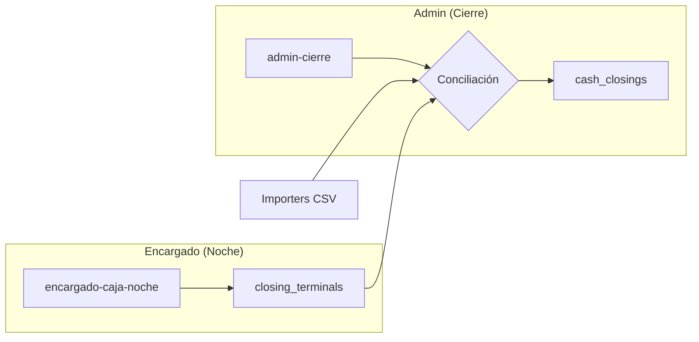

# Dejar Funcional el Módulo admin-cierre

Objetivo: Que el módulo de cierre de caja administrativo pueda conciliar datos de múltiples fuentes, mostrar diferencias y cerrar la noche.

---

## Estado Actual del Módulo

| Componente | Estado | Notas |
| :--------- | :----- | :---- |
| [admin-cierre.html](file:///Users/lucianopieve/Documents/tester_3.0/pages/admin/admin-cierre.html) | ✅ Completo | UI armada, modales funcionando |
| [admin-cierre.js](file:///Users/lucianopieve/Documents/tester_3.0/assets/js/modules/admin/admin-cierre.js) | ⚠️ Pendiente Verificación | Requiere auditoría de dependencias (encargado-caja-noche, cash_closing) |
| [Importers](file:///Users/lucianopieve/Documents/tester_3.0/assets/js/importers/) | ✅ Completo | 5 archivos: AFIP, Extracciones, GBol, Passline, Utils |
| Esquema DB | ✅ Completo | Tablas y staging tables documentadas |

---

## Dependencias Críticas

### Tablas Requeridas

| Tabla | Propósito | Estado |
| :---- | :-------- | :----- |
| `work_days` | Jornadas operativas | ✅ Existe |
| `cash_closings` | Cierres de caja | ✅ Existe |
| `closing_terminals` | Detalle por terminal | ✅ Existe |
| `pos_terminals` | Terminales POS | ✅ Existe |
| `pos_terminals_alias` | Mapeo nombres CSV | ✅ Existe |
| `cash_movements` | Movimientos de caja | ✅ Existe |
| `qr_codes` | Códigos QR acreditados | ✅ Existe |
| `qr_batches` | Lotes de QR | ✅ Existe |
| `bar_sessions` | Sesiones de barra | ✅ Existe |
| `bar_session_sales` | Ventas GBol | ✅ Existe |

> [!NOTE]
> **Independencia de Flujos**: `bar_sessions` y `cash_closing` son **independientes** entre sí. Ambos dependen únicamente de `work_day_id`. El módulo `importer-gbol` crea `bar_sessions` automáticamente si no existe, sin requerir `cash_closing`.

### Flujo de Datos Upstream

> [!IMPORTANT]
> **Para que admin-cierre funcione, el módulo `encargado-caja-noche` debe crear registros en `closing_terminals`** con los valores declarados por terminal.

---

## Funcionalidades a Verificar/Implementar

### 1. Flujo Principal

- [ ] **Iniciar Cash Closing automáticamente**: Cuando se abre una jornada, debe existir o crearse un `cash_closing`.
- [ ] **Carga de datos por fecha**: Verificar que `loadData()` funcione correctamente.
- [ ] **Renderizado de terminales**: Mostrar todos los terminales con datos declarados vs sistema.

### 2. Importers

| Importer | Función | Tabla Destino | Estado |
| :------- | :------ | :------------ | :----- |
| Terminales | Puntos de venta (CSV AFIP) | Solo análisis (modal) | ✅ |
| Extracciones | Retiros tesorería | `cash_movements` | ⚠️ Verificar |
| GBol | Ventas sistema | `bar_session_sales` | ⚠️ Verificar |
| Passline | Tickets acreditados | `qr_codes` | ⚠️ Verificar |

> [!WARNING]
> Los importers usan `window.sb` y tienen las siguientes dependencias:
> - **importer-extracciones**: requiere `cash_closing` existente
> - **importer-gbol**: crea `bar_session` automáticamente si no existe
> - **importer-passline**: requiere `qr_batch` existente (usa `ImporterUtils.getOrCreateQrBatch`)

### 3. Conciliación QR

- [ ] Verificar que `loadQrStats()` agrupe correctamente por `market_source`.
- [ ] Inputs de declarados para Passline y Boletería.

### 4. Cierre de Noche

- [ ] Botón "CERRAR NOCHE" actualiza `cash_closings.status = 'closed'`.
- [ ] Registro de `closed_at` y `closed_by`.

---

## Tareas de Implementación

### Fase 1: Verificación de Integridad ✅

#### [VERIFY] Módulo encargado-caja-noche ✅

- [x] Confirmar que crea `closing_terminals` por cada terminal → `submitOpenTerminal()` L531-541
- [x] Confirmar que llena `declared_cash` y `declared_zoco` → `doCloseTerminal()` L601-611

#### [VERIFY] Creación automática de cash_closing ✅

- [x] Al iniciar jornada en `admin-workdays`, se crea `cash_closing` asociado → `handleConfirm()` paso E
- [x] Fallback on-demand en `encargado-caja-noche` → `ensureClosingExists()` L290-318

### Fase 2: Ajustes JS ✅

#### [MODIFY] [admin-cierre.js](file:///Users/lucianopieve/Documents/tester_3.0/assets/js/modules/admin/admin-cierre.js) ✅

- [x] Implementado fallback on-demand en `loadData()` L306-332
- [x] Si no existe `cash_closing`, lo crea automáticamente con `status: 'open'`
- [x] Muestra Toast informativo al usuario

### Fase 3: Verificación de Importers

Cada importer debe probarse con un CSV de ejemplo:

| Importer | Archivo Test | Ubicación | Resultado Esperado |
| :------- | :----------- | :-------- | :----------------- |
| importer-extracciones | test_extracciones.csv | `.agent/data/` | Registros en `cash_movements` (retiros de tesorería) |
| importer-gbol | test_gbol.csv | `.agent/data/` | Registros en `bar_session_sales` (ventas de barra) |
| importer-passline | tickets_comprados_469307-2026-01-18_09-22.csv | `.agent/data/` | Registros en `qr_codes` (tickets de acceso) |

---

## Verificación

### Manual (Browser)

1. **Iniciar servidor**: `python3 -m http.server 8000`
2. **Navegar a**: `http://localhost:8000/pages/admin/admin-workdays.html`
3. **Crear jornada** para fecha actual (si no existe).
4. **Ir a admin-cierre**: Seleccionar misma fecha.
5. **Verificar**:
   - No debe mostrar "No hay Jornada".
   - La tabla de terminales debe cargar (aunque vacía).
   - Los importers deben estar habilitados.
6. **Probar cierre**: Click "CERRAR NOCHE" y confirmar.

### Verificación de Consola

- Sin errores JS en consola.
- Queries a Supabase exitosas (Network tab).

---

## Preguntas para el Usuario

> [!IMPORTANT]
> Antes de proceder, necesito confirmar:
>
> 1. ¿Existe un CSV de ejemplo para probar los importers (Retiros, GBol, Passline)?
> 2. ¿El módulo `encargado-caja-noche` ya está funcional y creando `closing_terminals`?
> 3. ¿La creación de `cash_closing` debe ser automática al abrir jornada, o on-demand en admin-cierre?
