# 🗺️ Mapa de Pantallas - FormulaMid 4

> **Última Actualización**: 2026-02-07  
> **Total Pantallas**: 45  
> **Documento**: Arquitectura de navegación y contextos de usuario

---

## 🎯 Propósito

Este documento visualiza la **topografía completa** del sistema FormulaMid 4, organizando las 47 pantallas por rol operativo y contexto funcional. Útil para:

- Desarrolladores que necesitan entender el flujo de navegación
- QA para validar cobertura de tests por módulo
- Stakeholders para comprender el alcance del sistema

---

## 🗺️ Visualización de Arquitectura

```mermaid
graph TD
    %% ═══════════════════════════════════════════════════════════════
    %% PORTAL CENTRAL
    %% ═══════════════════════════════════════════════════════════════
    Portal[🏠 Portal Central<br/><small><i>index.html</i></small>]
    
    Portal --> A_IDX
    Portal --> O_IDX
    Portal --> L_IDX
    Portal --> E_BAR
    Portal --> E_CAJ
    Portal --> S_BAR
    Portal --> G_BAL
    Portal --> M_QR

    %% ═══════════════════════════════════════════════════════════════
    %% ADMINISTRACIÓN (21 pantallas)
    %% ═══════════════════════════════════════════════════════════════
    subgraph FM4_ADM [🔵 ADMINISTRACIÓN · 21 pantallas]
        direction TB
        A_IDX[📊 Dashboard<br/><small><i>admin-index</i></small>]
        
        subgraph ADM_OPS [⚙️ Operaciones Diarias]
            A_WD[📅 Work Days<br/><small><i>admin-workdays</i></small>]
            A_SOL[📬 Solicitudes<br/><small><i>admin-solicitudes</i></small>]
            A_CIE[🔒 Cierres<br/><small><i>admin-cierre</i></small>]
            A_REP[📈 Reportes<br/><small><i>admin-reportes</i></small>]
            A_WKL[📊 Semanal<br/><small><i>admin-semanal</i></small>]
        end
        
        subgraph ADM_STK [📦 Control de Inventario]
            A_CEN[🔍 Central Stock<br/><small><i>admin-central-stock</i></small>]
        end
        
        subgraph ADM_MST [🗃️ Maestros de Datos]
            A_PRV[🏢 Proveedores<br/><small><i>admin-master-proveedores</i></small>]
            A_PRV[🏢 Proveedores<br/><small><i>admin-master-proveedores</i></small>]
            A_CAT[📁 Categorías<br/><small><i>admin-master-categorias</i></small>]
            A_TAR[💰 Tarifario<br/><small><i>admin-master-tarifario</i></small>]
            A_NOM[👥 Nómina<br/><small><i>admin-master-nomina</i></small>]
            A_PAG[💳 Pagos<br/><small><i>admin-pagos</i></small>]
            A_POS[📟 Terminales POS<br/><small><i>admin-master-pos</i></small>]
        end

        subgraph ADM_BAR [🍸 Gestión de Barras]
            AB_IDX[🎯 Hub Barras<br/><small><i>barras/index</i></small>]
            AB_REC[📖 Recetas<br/><small><i>barras/recipes</i></small>]
            AB_SES[🌙 Sesiones<br/><small><i>barras/session</i></small>]
        end

        subgraph ADM_QR [📱 Sistema QR]
            QR_IDX[🎯 Hub QR<br/><small><i>qr/index</i></small>]
            QR_GEN[🔲 Generador<br/><small><i>qr/generator</i></small>]
            QR_MON[👁️ Monitor<br/><small><i>qr/monitor</i></small>]
        end
    end

    %% ═══════════════════════════════════════════════════════════════
    %% OPERATIVO (11 pantallas)
    %% ═══════════════════════════════════════════════════════════════
    subgraph FM4_OPE [🟢 OPERATIVO · 11 pantallas]
        direction TB
        O_IDX[📊 Dashboard<br/><small><i>operativo-index</i></small>]
        
        subgraph OPE_ERP [📋 ERP Operativo]
            O_ERP[🏭 ERP Hub<br/><small><i>operativo-erp</i></small>]
            O_STK[📦 Stock Real<br/><small><i>operativo-stock</i></small>]
            O_WD[📅 Work Day<br/><small><i>operativo-workday</i></small>]
            O_SOL[📬 Solicitudes<br/><small><i>operativo-solicitudes</i></small>]
            O_ANA[📊 Análisis<br/><small><i>operativo-analisis</i></small>]
            O_SCN[📷 Scanner<br/><small><i>scanner</i></small>]
        end
        
        subgraph OPE_CMS [👥 Comunidad]
            O_CMS[🎪 CMS Hub<br/><small><i>operativo-cms</i></small>]
            O_MEM[👤 Miembros<br/><small><i>cms-members</i></small>]
        end
        
        subgraph OPE_MST [🗃️ Maestros Op.]
            O_SKU[🏷️ SKUs<br/><small><i>operativo-master-sku</i></small>]
            O_PRV[🏢 Proveedores<br/><small><i>operativo-master-proveedores</i></small>]
        end
    end

    %% ═══════════════════════════════════════════════════════════════
    %% LOGÍSTICA (4 pantallas)
    %% ═══════════════════════════════════════════════════════════════
    subgraph FM4_LOG [📦 LOGÍSTICA · 4 pantallas]
        direction TB
        L_IDX[📊 Dashboard<br/><small><i>logistica-index</i></small>]
        L_STK[🏭 Stock Depósito<br/><small><i>logistica-stock</i></small>]
        L_DIS[🚚 Distribución<br/><small><i>logistica-distribucion</i></small>]
        L_REC[📥 Recepción<br/><small><i>logistica-recepcion</i></small>]
    end

    %% ═══════════════════════════════════════════════════════════════
    %% ENCARGADOS (7 pantallas)
    %% ═══════════════════════════════════════════════════════════════
    subgraph FM4_ENC [🟠 ENCARGADOS · 7 pantallas]
        direction TB
        
        subgraph ENC_BAR [🍸 Encargado Barra]
            E_BAR[📊 Dashboard<br/><small><i>encargado-barra-index</i></small>]
            E_BNO[🌙 Cierre Noche<br/><small><i>encargado-barra-noche</i></small>]
            E_BPE[👥 Personal<br/><small><i>encargado-barra-personal</i></small>]
        end
        
        subgraph ENC_CAJ [💰 Encargado Caja]
            E_CAJ[📊 Dashboard<br/><small><i>encargado-caja-index</i></small>]
            E_CNO[🌙 Cierre Noche<br/><small><i>encargado-caja-noche</i></small>]
            E_CPE[👥 Personal<br/><small><i>encargado-caja-personal</i></small>]
        end
        
        E_REP[📥 Recepción<br/><small><i>encargado-recepcion</i></small>]
    end

    %% ═══════════════════════════════════════════════════════════════
    %% STAFF (2 pantallas)
    %% ═══════════════════════════════════════════════════════════════
    subgraph FM4_STA [🟡 STAFF · 2 pantallas]
        direction TB
        S_BAR[🍸 Staff Barra<br/><small><i>staff-barra-index</i></small>]
        S_CAJ[💰 Staff Caja<br/><small><i>staff-caja-index</i></small>]
    end

    %% ═══════════════════════════════════════════════════════════════
    %% GERENCIA (1 pantalla)
    %% ═══════════════════════════════════════════════════════════════
    subgraph FM4_GER [🟣 GERENCIA · 1 pantalla]
        direction TB
        G_BAL[📊 Balance Semanal<br/><small><i>balance-semanal</i></small>]
    end

    %% ═══════════════════════════════════════════════════════════════
    %% MEMBERS (1 pantalla)
    %% ═══════════════════════════════════════════════════════════════
    subgraph FM4_MEM [🔴 MEMBERS · 1 pantalla]
        direction TB
        M_QR[📱 Mi QR<br/><small><i>my-qr</i></small>]
    end

    %% ═══════════════════════════════════════════════════════════════
    %% CONEXIONES INTERNAS
    %% ═══════════════════════════════════════════════════════════════
    A_IDX --> ADM_OPS
    A_IDX --> ADM_STK
    A_IDX --> ADM_MST
    A_IDX --> ADM_BAR
    A_IDX --> ADM_QR
    
    O_IDX --> OPE_ERP
    O_IDX --> OPE_CMS
    O_IDX --> OPE_MST
    
    L_IDX --> L_STK
    L_IDX --> L_DIS
    L_IDX --> L_REC
    
    E_BAR --> E_BNO
    E_BAR --> E_BPE
    E_CAJ --> E_CNO
    E_CAJ --> E_CPE

    %% ═══════════════════════════════════════════════════════════════
    %% ESTILOS PREMIUM
    %% ═══════════════════════════════════════════════════════════════
    classDef default fill:#1a1b1e,stroke:#333,color:#a9b1d6,stroke-width:1px;
    classDef admin fill:#1e293b,stroke:#3b82f6,color:#eff6ff,stroke-width:2px;
    classDef operative fill:#1e293b,stroke:#10b981,color:#ecfdf5,stroke-width:2px;
    classDef logistics fill:#1e293b,stroke:#8b5cf6,color:#f5f3ff,stroke-width:2px;
    classDef supervisor fill:#1e293b,stroke:#f59e0b,color:#fffbeb,stroke-width:2px;
    classDef staff fill:#1e293b,stroke:#eab308,color:#fefce8,stroke-width:2px;
    classDef gerencia fill:#1e293b,stroke:#a855f7,color:#faf5ff,stroke-width:2px;
    classDef portal fill:#0f172a,stroke:#ef4444,color:#fff,stroke-width:3px;
    classDef members fill:#1e293b,stroke:#ef4444,color:#fee2e2,stroke-width:2px;

    class Portal portal;
    class A_IDX,A_WD,A_SOL,A_CIE,A_REP,A_WKL,A_CEN,A_PRV,A_CAT,A_TAR,A_NOM,A_PAG,A_POS,AB_IDX,AB_REC,AB_SES,QR_IDX,QR_GEN,QR_MON admin;
    class O_IDX,O_ERP,O_STK,O_WD,O_SOL,O_ANA,O_SCN,O_CMS,O_MEM,O_SKU,O_PRV operative;
    class L_IDX,L_STK,L_DIS,L_REC logistics;
    class E_BAR,E_BNO,E_BPE,E_CAJ,E_CNO,E_CPE,E_REP supervisor;
    class S_BAR,S_CAJ staff;
    class G_BAL gerencia;
    class M_QR members;
```



---

## 📋 Resumen por Contexto

| Contexto | Páginas | Directorio | Roles Permitidos |
|:---------|:-------:|:-----------|:-----------------|
| 🔵 **Admin** | 19 | `pages/admin/*` | `admin`, `contable` |
| 🟢 **Operativo** | 11 | `pages/operativo/*` | `operativo`, `staff_operativo` |
| 📦 **Logística** | 4 | `pages/logistica/*` | `logistico`, `admin` |
| 🟠 **Encargados** | 7 | `pages/encargados/*` | `encargado_barra`, `encargado_caja` |
| 🟡 **Staff** | 2 | `pages/staff/*` | `staff_barra`, `staff_caja` |
| 🟣 **Gerencia** | 1 | `pages/gerencia/*` | `gerencia`, `admin` |
| 🔴 **Members** | 1 | `pages/members/*` | `member` |
| **TOTAL** | **45** | — | — |

---

## 📂 Inventario Completo por Carpeta

### 🔵 Admin (21)
| # | Archivo | Propósito |
|:-:|:--------|:----------|
| 1 | `admin-index.html` | Dashboard principal de administración |
| 2 | `admin-workdays.html` | Gestión de jornadas laborales |
| 3 | `admin-solicitudes.html` | Centro de solicitudes de insumos |
| 4 | `admin-cierre.html` | Módulo de cierre de operaciones |
| 5 | `admin-reportes.html` | Generación de reportes |
| 6 | `admin-semanal.html` | Cierre semanal y balance |
| 7 | `admin-central-stock.html` | Gestión centralizada: Stock, Recetas, Rentabilidad |
| 8 | `admin-master-proveedores.html` | Maestro de proveedores |
| 9 | `admin-master-categorias.html` | Maestro de categorías |
| 10 | `admin-master-tarifario.html` | Tarifario de precios |
| 11 | `admin-master-nomina.html` | Gestión de personal |
| 12 | `admin-pagos.html` | Control de pagos |
| 13 | `admin-master-pos.html` | Terminales punto de venta |
| 14 | `barras/index.html` | Hub de gestión de barras |
| 15 | `barras/recipes.html` | Recetario de bebidas |
| 16 | `barras/session.html` | Sesiones de barra |
| 17 | `qr/index.html` | Hub del sistema QR |
| 18 | `qr/generator.html` | Generador de códigos QR |
| 19 | `qr/monitor.html` | Monitor de escaneos QR |

### 🟢 Operativo (11)
| # | Archivo | Propósito |
|:-:|:--------|:----------|
| 1 | `operativo-index.html` | Dashboard operativo |
| 2 | `operativo-erp.html` | Hub de ERP |
| 3 | `operativo-stock.html` | Control de stock en tiempo real |
| 4 | `operativo-workday.html` | Jornada del día |
| 5 | `operativo-solicitudes.html` | Solicitudes operativas |
| 6 | `operativo-analisis.html` | Análisis de datos |
| 7 | `scanner.html` | Scanner de códigos |
| 8 | `operativo-cms.html` | Hub de comunidad |
| 9 | `cms-members.html` | Gestión de miembros |
| 10 | `operativo-master-sku.html` | SKUs (vista operativa) |
| 11 | `operativo-master-proveedores.html` | Proveedores (vista operativa) |

### 📦 Logística (4)
| # | Archivo | Propósito |
|:-:|:--------|:----------|
| 1 | `logistica-index.html` | Dashboard de logística |
| 2 | `logistica-stock.html` | Stock en depósito |
| 3 | `logistica-distribucion.html` | Órdenes de distribución |
| 4 | `logistica-recepcion.html` | Recepción de mercadería |

### 🟠 Encargados (7)
| # | Archivo | Propósito |
|:-:|:--------|:----------|
| 1 | `encargado-barra-index.html` | Dashboard encargado barra |
| 2 | `encargado-barra-noche.html` | Cierre nocturno barra |
| 3 | `encargado-barra-personal.html` | Personal de barra |
| 4 | `encargado-caja-index.html` | Dashboard encargado caja |
| 5 | `encargado-caja-noche.html` | Cierre nocturno caja |
| 6 | `encargado-caja-personal.html` | Personal de caja |
| 7 | `encargado-recepcion.html` | Recepción de insumos |

### 🟡 Staff (2)
| # | Archivo | Propósito |
|:-:|:--------|:----------|
| 1 | `staff-barra-index.html` | Interfaz staff barra |
| 2 | `staff-caja-index.html` | Interfaz staff caja |

### 🟣 Gerencia (1)
| # | Archivo | Propósito |
|:-:|:-------|
| 1 | `balance-semanal.html` | Balance consolidado semanal |

### 🔴 Members (1)
| # | Archivo | Propósito |
|:-:|:-------|
| 1 | `my-qr.html` | Visualización QR personal del miembro |

---

##  Conclusión Operativa

La arquitectura FM4 implementa una **separación clara por rol y contexto**:

| Patrón | Descripción |
|:-------|:------------|
| **Jerarquía de Dashboards** | Cada contexto tiene un `*-index.html` como punto de entrada |
| **Módulos Anidados** | Admin agrupa Barras y QR como sub-sistemas |
| **Roles Exclusivos** | Staff tiene interfaces simplificadas sin acceso a maestros |
| **Duplicación Controlada** | Operativo replica algunos maestros con vista de solo-lectura |

### 🔗 Flujos Críticos

```
Solicitud de Insumos:
operativo-solicitudes → admin-solicitudes → logistica-distribucion

Cierre de Jornada:
encargado-barra-noche → admin-workdays → admin-cierre

Gestión de Miembros:
cms-members → operativo-cms → admin-master-nomina
```

---

## 🛠️ Notas Técnicas

| Aspecto | Implementación |
|:--------|:---------------|
| **Auth** | `data-allowed-roles` + `Auth.guardOrRedirect()` |
| **Navegación** | `data-go` con `admin-navigation.js` |
| **Estado** | `window.Utils.setPageState()` para loading/empty/ready |
| **Realtime** | Supabase Channels en módulos de encargados |
| **CSS** | Sistema en `main.css` + tokens en `:root` |

### 📊 Distribución por Tipo

```
Dashboards (índices):    7 pantallas (15%)
Maestros de datos:       9 pantallas (20%)
Operaciones:            14 pantallas (30%)
Reportes/Análisis:       6 pantallas (13%)
Sistemas especiales:    10 pantallas (22%)
```

---

_Documento generado automáticamente por Antigravity Agent usando el skill `generating-screen-maps`._
